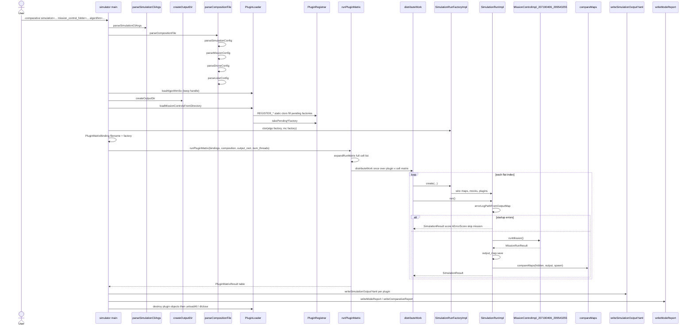
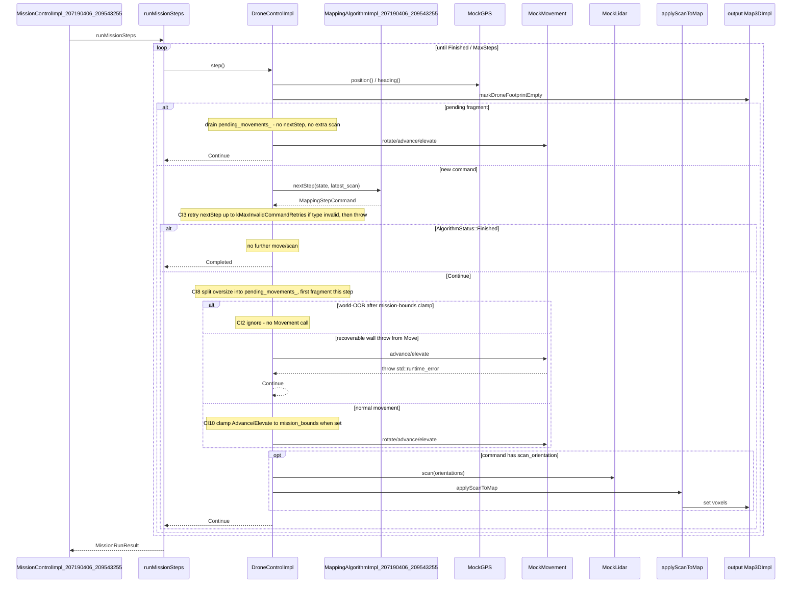

# Drone Mapper — Assignment 3 High-Level Design

**Authors:** Sagi Eisenberg (207190406), Yoav Naaman (209543255)

TAU Advanced Topics in Programming (2026B). Assignment 3 splits the ex2 monolithic
simulator into three separately built projects: a `simulator_207190406_209543255`
executable that `dlopen`s `Algorithm_207190406_209543255.so` and
`MissionControl_207190406_209543255.so`, then runs many missions in parallel under
`-comparative` or `-competition` mode.

| Artifact | Name |
|----------|------|
| Executable | `simulator_207190406_209543255` |
| Algorithm plugin | `Algorithm_207190406_209543255.so` |
| MissionControl plugin | `MissionControl_207190406_209543255.so` |

Plugin / UserCommon **namespaces** (code): `algorithm_207190406_209543255`,
`mission_control_207190406_209543255`, `user_common_207190406_209543255`.

## Folder responsibilities

| Folder | Role | Build artifact |
|--------|------|----------------|
| `common/` | Course-published interfaces used by more than one project. **Read-only — we do not modify it.** | none (INTERFACE lib `common::common`) |
| `Simulator/common_simulator/include/Simulator/` | Course-published interfaces used only by the Simulator | none |
| `Simulator/{include,src}/` | Our simulator implementation | `simulator_207190406_209543255` executable |
| `MissionControl/common_mission_control/include/MissionControl/` | Course-published `IDroneControl` | none |
| `MissionControl/{include,src}/` | Our mission control implementation | `MissionControl_207190406_209543255.so` |
| `Algorithm/{include,src}/` | Our mapping algorithm | `Algorithm_207190406_209543255.so` |
| `UserCommon/` | Our code needed by more than one project. No build file — sources compile into each consumer. | none |

The course staff placement rule: mocks and world simulation live in `Simulator/` because
they would be replaced by real hardware APIs in production; mission control and the
mapping algorithm live in their respective plugin projects. Shared cross-boundary
interfaces stay in `common/`; simulator-only interfaces stay in
`Simulator/common_simulator/`.

## Main components

- **`main` (`Simulator/src/main.cpp`)** — Parses CLI via `parseSimulationCliArgs`
  (`SimulationCliArgs`). Invalid argv returns `1` with no results directory.
  Then parses the composition YAML and `dlopen`s the **fixed** plugin
  (`algorithm=` / `mission_control=`) while keeping the handle open. Compose-parse
  or fixed-plugin load failure returns `1` with no directory. Only then
  `createOutputDir`, load folder plugins through `PluginLoader`, build one
  `SimulationRunFactoryImpl` per plugin binding, invoke
  `runPluginMatrix(bindings, composition, output_root, num_threads)` (`expandRunMatrix`
  runs inside that call), drop construction-throw plugins from `results_summary`
  into report `errors:`, write per-plugin `writeSimulationOutputYaml` then
  `writeModeReport` → `writeComparativeReport` / `writeCompetitiveReport`, then
  destroy plugin objects and call `PluginLoader::unloadAll()` before return.

- **`SimulationCli` / `SimulatorPaths` (`Simulator/io/SimulatorPaths.h`)** —
  `parseSimulationCliArgs` returns `SimulationCliArgs`. Path helpers:
  `createOutputDir` (fresh `comparative_results_<epoch_seconds>` /
  `competition_<epoch_seconds>` folder; digits-only stamp, incremented on collision) and
  `errorLogPathFromOutputMap` (derive `<plugin>_run_NNNN_error.log`).

- **`YamlConfigParsers` (`Simulator/io/YamlConfigParsers.h`)** — Five parsers:
  `parseCompositionFile`, `parseSimulationConfig`, `parseMissionConfig`,
  `parseDroneConfig`, `parseLidarConfig`. Each returns `ConfigParseResult<T>`.
  Parse failures are logged immediately through `RunErrorLog` / `IRunErrorLog`.
  A non-scalar `simulation_config` or a failed nested drone/lidar parse makes
  `parseCompositionFile` return `ok = false` (`COMPOSITION_INVALID`) instead of
  throwing or keeping a default-constructed config.

- **`SimulatorReports` (`Simulator/io/SimulatorReports.h`)** —
  `writeComparativeReport`, `writeCompetitiveReport`, `writeSimulationOutputYaml`.
  `writeModeReport` in `main.cpp` picks the mode writer.

- **`PluginLoader`** — `dlopen`s each `.so` once on the main thread
  (`loadAlgorithmSo`, `loadMissionControlsFromDirectory`, or the competitive-mode
  equivalents). Handles are `DlHandle` (`unique_ptr<void, DlCloser>`). After each
  successful load it takes the factory registered by the plugin's static constructor
  into a `LoadedAlgorithmPlugin` / `LoadedMissionControlPlugin`. Access is
  `algorithmCount` / `algorithmAt` (and the mission-control equivalents) — no
  `algorithms()` vector getter. Never reloads a path already held open.
  `unloadAll()` drops factories then `dlclose`s every handle.

- **`PluginRegistrar`** — Simulator-owned singleton. `MappingAlgorithmRegistration` /
  `MissionControlRegistration` objects (defined in registration headers, `.cpp` in
  Simulator only) call `setPendingAlgorithmFactory` /
  `setPendingMissionControlFactory` during `dlopen`; the loader immediately
  `takePending*Factory()` so each registration is consumed exactly once. Factory
  aliases are `MappingAlgorithmFactory` / `MissionControlFactory`.

- **`runPluginMatrix`** — Free-function module (`RunMatrixOrchestrator.h`). Expands a
  composition into a flat `MatrixCell` list via `expandRunMatrix` (simulation ×
  mission × drone × lidar) **inside**
  `runPluginMatrix(bindings, composition, output_root, num_threads)`, then runs every
  cell for every plugin binding. Pre-sizes the result table; each slot is written
  exactly once.

- **`distributeWork`** — Free-function scheduler. `num_threads` absent or `1` → main
  thread only. `N >= 2` → up to `N` worker threads (capped at cell count); main
  joins. Wraps per-cell work in `try`/`catch` so a plugin throw cannot terminate
  the process.

- **`SimulationRunFactoryImpl`** — Implements `simulator::ISimulationRunFactory`.
  Loads hidden and output `Map3DImpl` instances, constructs `MockGPS`, `MockLidar`,
  `MockMovement`, creates fresh plugin instances from the loaded factories, wires
  `MissionControlDependencies` / `MappingAlgorithmDependencies`, and returns a
  `SimulationRunImpl`.

- **`SimulationRunImpl`** — Implements `simulator::ISimulationRun`. Calls
  `missionControl->runMission()`, saves the output map, scores with
  `compareMaps(hidden, output, spawn)` against the hidden map, and returns
  `SimulationResult`. Per-run `RunErrorLog` path comes from
  `errorLogPathFromOutputMap`. Contains exceptions from `runMission()` so a single
  bad run scores `kErrorScore` (`-1`) without aborting the matrix.

- **Mocks + maps + scoring (`Simulator/src/`)** — `Map3DImpl` (hidden + output),
  `MockGPS`, `MockLidar`, `MockMovement` (holds the hidden map; throws on wall/boundary
  collision), `compareMaps`. `makeMap3D` is src-only (`Map3DNpy.h`).

- **`MissionControlImpl_207190406_209543255`** — Plugin entry point implementing
  `common::IMissionControl`. Creates `DroneControlImpl`; `runMission()` delegates
  to `runMissionSteps`, which loops `step()` until the mission finishes or hits
  max steps, then returns `MissionRunResult`.

- **`DroneControlImpl`** — Implements `mission_control::IDroneControl`. Each step
  carves the drone footprint (`markDroneFootprintEmpty`), then invokes `nextStep`
  once unless draining a split-oversize queue (`pending_movements_`). Fragment
  steps skip `nextStep` and skip an extra scan. `applyScanIfRequested` still
  runs after a recoverable `Continue` when the original command carries
  `scan_orientation`. Finished algorithm status skips move/scan. Oversize
  Advance/Elevate/Rotate is split into in-limit fragments. Unsupported types
  are retried then thrown (CI3), not returned as `Error`.

- **`MappingAlgorithmImpl_207190406_209543255`** — Plugin entry point implementing
  `common::IMappingAlgorithm`. Reads the world through `const common::IMap3D&` only.
  Uses `WavefrontPlanner`, which composes `MappingAlgorithmFrontier` and calls
  `PathShaping` / `ScanPlanning` to produce an `ExplorationPlan`, then emits
  movement plus a score-aware scan toward that cluster. Scan templates are
  `ConeTemplateCache` / `VoxelStamp`. `WavefrontPlanner` uses `LidarCone`;
  `PathShaping` / `ScanPlanning` / scan fusion use `BeamMath`.

- **`SimulationCoordUtil`** — Shared world/voxel helpers:
  `worldInitialDronePosition`, `forEachSphereSample`.

- **`TimeFormat`** — ISO-8601 UTC helpers (`currentUtcTimestamp`) for output
  directory names, report `generated_at_utc`, and error-log lines.

- **`ConfigParseResult<T>`** — `{ok, value, errors}` wrapper returned by every
  YAML parser.

- **`runMissionSteps`** — Free-function mission loop (`MissionRunLoop.h`).
  `MissionControlImpl::runMission()` forwards here.

- **`BeamMath` / `LidarCone`** — Shared beam geometry and cone FOV helpers in
  UserCommon. Compiled into each consumer; no cross-`.so` symbol dependency.

- **`SimulationImpl`** — Implements published `simulator::ISimulation`.
  Constructor takes one `ISimulationRunFactory&`, the plugin filename used
  in per-run map names, and `num_threads`. `run(composition, output_path)`
  delegates to `runPluginMatrix` for that single binding and returns
  `SimulationManagerReport`. Comparative/competitive CLI, plugin folders,
  and aggregate YAML still live in `main` — `ISimulation::run` cannot
  express mode or a plugin set.

## Class diagram

```mermaid
classDiagram
    direction TB

    class main {
      +writeModeReport()
    }

    class SimulationCli {
      <<module>>
      +parseSimulationCliArgs() SimulationCliArgs
    }

    class SimulatorPaths {
      <<module>>
      +createOutputDir()
      +errorLogPathFromOutputMap()
    }

    class YamlConfigParsers {
      <<module>>
      +parseCompositionFile()
      +parseSimulationConfig()
      +parseMissionConfig()
      +parseDroneConfig()
      +parseLidarConfig()
    }

    class SimulatorReports {
      <<module>>
      +writeComparativeReport()
      +writeCompetitiveReport()
      +writeSimulationOutputYaml()
    }

    class runPluginMatrix {
      <<module>>
      +runPluginMatrix(bindings, composition, output_root, num_threads)
      +expandRunMatrix()
    }

    class distributeWork {
      <<module>>
      +distributeWork()
    }

    class compareMaps {
      <<module>>
      +compareMaps(hidden, output, spawn)
    }

    class applyScanToMap {
      <<module>>
      +applyScanToMap()
    }

    class PluginLoader {
      +loadAlgorithmSo() LoadedAlgorithmPlugin
      +loadMissionControlSo() LoadedMissionControlPlugin
      +algorithmCount()
      +algorithmAt()
      +unloadAll()
    }

    class DlHandle {
      <<RAII>>
    }

    class PluginRegistrar {
      +setPendingAlgorithmFactory(factory)
      +setPendingMissionControlFactory(factory)
      +takePendingAlgorithmFactory()
      +takePendingMissionControlFactory()
    }

    class MappingAlgorithmRegistration
    class MissionControlRegistration
    class MappingAlgorithmFactory
    class MissionControlFactory
    class MappingAlgorithmDependencies
    class MissionControlDependencies
    class MatrixCell
    class LoadedAlgorithmPlugin
    class LoadedMissionControlPlugin

    class PluginMatrixBinding {
      +plugin_filename
      +factory
    }

    class PluginMatrixResult {
      +plugin_filename
      +results
    }

    class IRunErrorLog {
      +log(ErrorRef)
    }

    class RunErrorLog {
      +log(ErrorRef)
    }

    class SimulationCoordUtil {
      <<module>>
      +worldInitialDronePosition()
      +forEachSphereSample()
    }

    class TimeFormat {
      <<module>>
      +currentUtcTimestamp()
    }

    class ConfigParseResult {
      +ok
      +value
      +errors
    }

    class runMissionSteps {
      <<module>>
      +runMissionSteps()
    }

    class BeamMath {
      <<module>>
      +pointAlongBeam()
    }

    class LidarCone {
      <<module>>
    }

    class WavefrontPlanner
    class MappingAlgorithmFrontier
    class PathShaping {
      <<module>>
    }
    class ScanPlanning {
      <<module>>
    }
    class ExplorationPlan
    class ConeTemplateCache
    class VoxelStamp

    class SimulationRunFactoryImpl {
      +create(...) ISimulationRun
    }

    class SimulationRunImpl {
      +run() SimulationResult
    }

    class SimulationImpl {
      +run(composition, output_path) SimulationManagerReport
    }
    class ISimulation

    class Map3DImpl
    class MockGPS
    class MockLidar
    class MockMovement

    class MissionControlImpl_207190406_209543255 {
      +runMission() MissionRunResult
    }

    class DroneControlImpl {
      +step() DroneStepResult
      +state() DroneState
    }

    class MappingAlgorithmImpl_207190406_209543255 {
      +nextStep(state, scan) MappingStepCommand
    }

    class IMissionControl
    class IDroneControl
    class IMappingAlgorithm
    class IMap3D
    class IMutableMap3D
    class ILidar
    class IGPS
    class IDroneMovement
    class ISimulationRun
    class ISimulationRunFactory

    main --> SimulationCli
    main --> SimulatorPaths
    main --> YamlConfigParsers
    main --> PluginLoader
    main --> runPluginMatrix
    main --> SimulatorReports
    runPluginMatrix --> distributeWork
    runPluginMatrix --> SimulationRunFactoryImpl
    runPluginMatrix --> MatrixCell : expandRunMatrix
    runPluginMatrix --> PluginMatrixBinding
    runPluginMatrix --> PluginMatrixResult
    PluginMatrixBinding --> ISimulationRunFactory
    distributeWork --> SimulationRunFactoryImpl
    SimulationRunFactoryImpl ..|> ISimulationRunFactory
    SimulationRunFactoryImpl --> SimulationRunImpl
    SimulationRunFactoryImpl --> MappingAlgorithmFactory
    SimulationRunFactoryImpl --> MissionControlFactory
    SimulationRunFactoryImpl --> MappingAlgorithmDependencies
    SimulationRunFactoryImpl --> MissionControlDependencies
    SimulationRunImpl ..|> ISimulationRun
    SimulationRunImpl --> Map3DImpl
    SimulationRunImpl --> MockGPS
    SimulationRunImpl --> MockLidar
    SimulationRunImpl --> MockMovement
    SimulationRunImpl --> compareMaps
    SimulationRunImpl --> RunErrorLog
    SimulationRunImpl --> IMissionControl
    SimulationRunImpl --> IMappingAlgorithm
    SimulationImpl ..|> ISimulation
    SimulationImpl --> runPluginMatrix
    SimulationImpl --> ISimulationRunFactory
    PluginLoader --> DlHandle
    PluginLoader --> LoadedAlgorithmPlugin
    PluginLoader --> LoadedMissionControlPlugin
    PluginLoader ..> PluginRegistrar : registration ctors
    MappingAlgorithmRegistration --> PluginRegistrar : setPendingAlgorithmFactory
    MissionControlRegistration --> PluginRegistrar : setPendingMissionControlFactory
    LoadedAlgorithmPlugin --> MappingAlgorithmFactory
    LoadedMissionControlPlugin --> MissionControlFactory
    MappingAlgorithmFactory --> MappingAlgorithmDependencies
    MissionControlFactory --> MissionControlDependencies
    MissionControlImpl_207190406_209543255 ..|> IMissionControl
    MissionControlImpl_207190406_209543255 --> DroneControlImpl
    MissionControlImpl_207190406_209543255 --> runMissionSteps
    runMissionSteps --> DroneControlImpl
    DroneControlImpl ..|> IDroneControl
    DroneControlImpl --> IMappingAlgorithm
    DroneControlImpl --> ILidar
    DroneControlImpl --> IGPS
    DroneControlImpl --> IDroneMovement
    DroneControlImpl --> applyScanToMap
    applyScanToMap --> IMutableMap3D
    MappingAlgorithmImpl_207190406_209543255 ..|> IMappingAlgorithm
    MappingAlgorithmImpl_207190406_209543255 --> IMap3D
    MappingAlgorithmImpl_207190406_209543255 --> WavefrontPlanner
    MappingAlgorithmImpl_207190406_209543255 --> ExplorationPlan
    MappingAlgorithmImpl_207190406_209543255 --> ScanPlanning
    MappingAlgorithmImpl_207190406_209543255 --> ConeTemplateCache
    MappingAlgorithmImpl_207190406_209543255 --> VoxelStamp
    WavefrontPlanner *-- MappingAlgorithmFrontier : frontier_
    WavefrontPlanner --> PathShaping
    WavefrontPlanner --> ScanPlanning
    WavefrontPlanner --> ExplorationPlan
    WavefrontPlanner --> LidarCone
    LidarCone --> BeamMath
    PathShaping --> BeamMath
    ScanPlanning --> BeamMath
    applyScanToMap --> BeamMath
    Map3DImpl ..|> IMutableMap3D
    IMutableMap3D --|> IMap3D
    MockLidar ..|> ILidar
    MockGPS ..|> IGPS
    MockMovement ..|> IDroneMovement
    RunErrorLog ..|> IRunErrorLog
    SimulationCoordUtil ..> Map3DImpl : world spawn
    SimulatorPaths ..> RunErrorLog : errorLogPathFromOutputMap
    SimulatorPaths --> TimeFormat
    YamlConfigParsers ..> IRunErrorLog
    YamlConfigParsers --> ConfigParseResult
```

## Sequence: one comparative cell

Comparative mode fixes one algorithm `.so` and varies every `MissionControl` `.so` in a
folder. `main` parses CLI, creates the output dir, parses the composition (nested
`parseSimulationConfig` / `parseMissionConfig` / `parseDroneConfig` /
`parseLidarConfig`), loads plugins, takes pending factories, and builds one
`SimulationRunFactoryImpl` / `PluginMatrixBinding` per plugin. `runPluginMatrix`
expands the full cell list once, then one `distributeWork` call covers the whole
plugin × cell matrix. Per-run `RunErrorLog` is opened from
`errorLogPathFromOutputMap` before `runMission()`; startup errors skip the mission
and score `kErrorScore`. After `runMission()` the output map is saved **before**
`compareMaps`. Reports are `writeSimulationOutputYaml` per plugin, then
`writeModeReport` / `writeComparativeReport`.

Competition mode is the mirror image: one `MissionControl` `.so` is fixed and every
algorithm in a folder is varied; the same `runPluginMatrix` / factory / run path
applies (`writeCompetitiveReport` instead of `writeComparativeReport`).

## Sequence: DroneControl step loop

Inside `MissionControlImpl_207190406_209543255::runMission()`, `runMissionSteps`
loops `DroneControlImpl::step()`. Each step carves the drone footprint, then invokes
`nextStep` once unless draining a split-oversize queue. An unsupported movement
type is retried inside `step()` up to `kMaxInvalidCommandRetries` before any
Movement call; after N failures `step()` throws (`SimulationRunImpl` maps that
to `MISSION_EXCEPTION`). `AlgorithmStatus::Finished` returns `Completed` with no
move or scan. Oversize Advance/Elevate/Rotate is split into in-limit fragments
(`splitWithinLimits`); the first fragment runs on the `nextStep` step and the
rest drain from `pending_movements_` with no further `nextStep` and no extra
scan — an intentional exception to “one `nextStep` per `step()`”, only when the
algorithm exceeded drone max. Otherwise an optional movement runs, then at most
one scan if the command carries `scan_orientation` (including after a recoverable
`Continue`), matching the published movement → scan → fuse contract.
Advance/Elevate are clamped to `mission_bounds` when those bounds are set; if the
predicted center is still outside the world/map (`output_map_.isInBounds`), the
command is ignored and Movement is not called (clamp then ignore). A step `Error`
is pushed as `DRONE_STEP_FAILED` and the loop continues; it does not set
`MissionRunStatus::Error` by itself.

**Recoverable collision handling:** `MockMovement::advance` / `elevate` detect
wall/boundary collisions against the hidden map and **throw** `std::runtime_error`
(they never return a failed `MovementResult` for that case). Pre-throw limit
checks in `MockMovement` return `{false, message}` when a command exceeds
`max_rotate` / `max_advance` / `max_elevate`. `DroneControlImpl` catches the
exception and any failed `MovementResult` and returns
`DroneStepStatus::Continue`. `applyScanIfRequested` still runs after that
`Continue` when the command carried a `scan_orientation`.

**Backstop at the run boundary:** Non-recoverable exceptions propagate out of
`DroneControlImpl::step()` through `runMission()`. `SimulationRunImpl::run()` wraps
the entire `runMission()` call in `try`/`catch`, logs the error, still saves the partial
output map when possible, assigns score `kErrorScore` (`-1`), and lets the run matrix continue.

## Threading

| CLI | Behavior |
|-----|----------|
| `num_threads` absent | Main thread runs all cells |
| `num_threads=1` | Main thread runs all cells |
| `num_threads=N` (N >= 2) | Up to N worker threads plus the main thread (workers capped at cell count) |

All `.so` files are loaded on the main thread before workers start. Each matrix cell
creates fresh plugin instances via the stored factories — instances are never shared or
cached between runs. The result table is pre-allocated; workers write disjoint indices
with no mutex on the table itself. Aggregate YAML reports are written on the main thread
after all workers join. `.so` handles are not `dlclose`d from worker threads.

## Data and maps

Each run owns two `Map3DImpl` instances:

- **Hidden map** — Loaded from the simulation config `.npy`. Wired into `MockLidar` and
  `MockMovement` only. Never exposed to plugins.
- **Output map** — Created empty (or from mission resolution settings). Passed to
  `DroneControlImpl` as `IMutableMap3D`; mission control writes lidar fusion here.

The algorithm receives `const common::IMap3D&` through `MappingAlgorithmDependencies`
and reads voxel occupancy for planning only — it never mutates the map. All scan writes
go through `DroneControlImpl` → `applyScanToMap` → output `Map3DImpl`.

After the mission, `SimulationRunImpl` saves the output map then calls
`compareMaps(hidden, output, spawn)` to score it. World <-> voxel conversion and axis
offsets are centralized in `user_common_207190406_209543255::SimulationCoordUtil`
(`worldInitialDronePosition`, `forEachSphereSample`).
