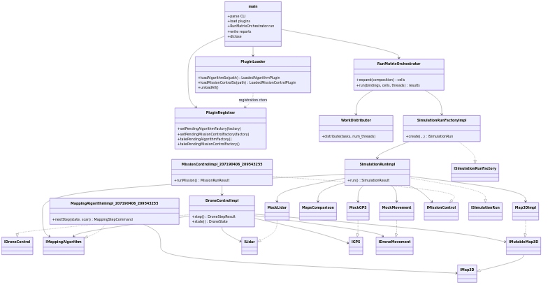
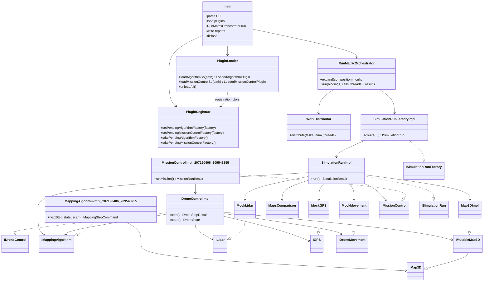
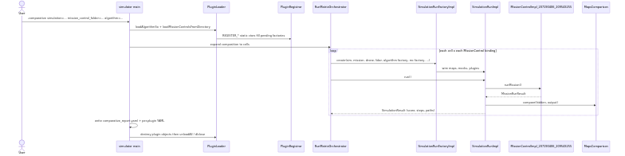
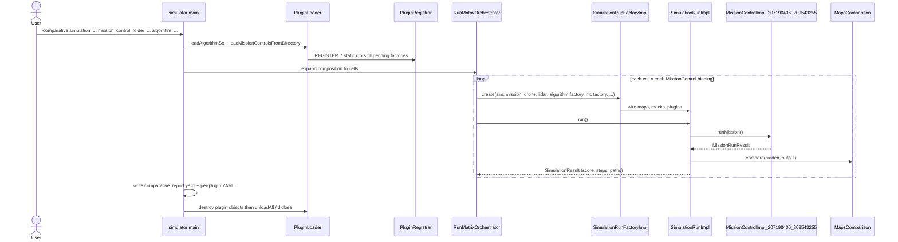
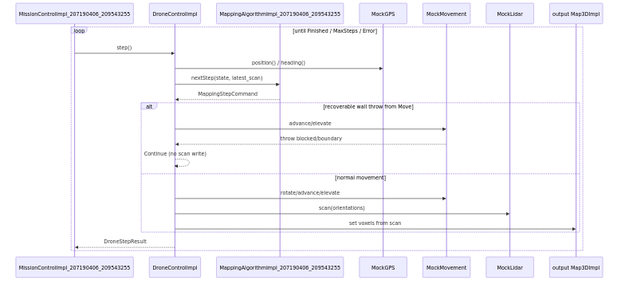
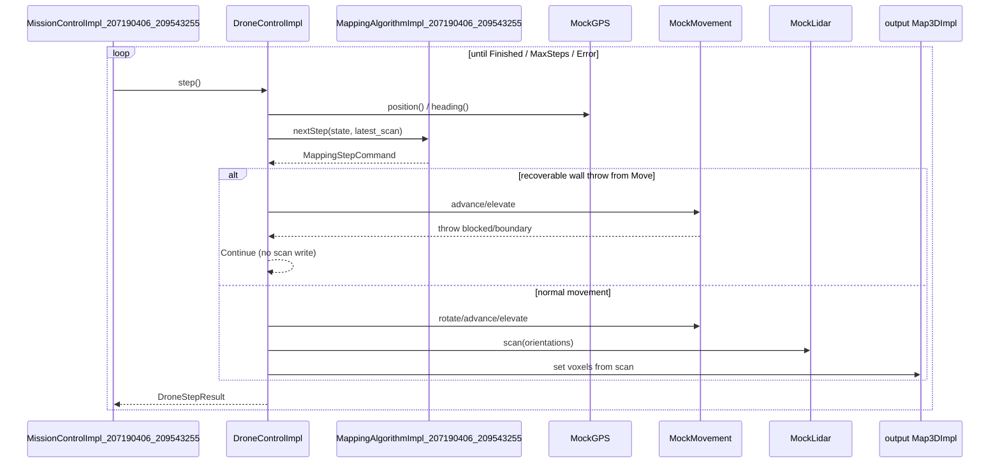

# Drone Mapper — Assignment 3 High-Level Design

**Authors:** Sagi Eisenberg (207190406), Yoav Naaman (209543255)

TAU Advanced Topics in Programming (2026B). Assignment 3 splits the ex2 monolithic
simulator into three separately built projects: a `simulator_207190406_209543255`
executable that `dlopen`s `Algorithm_207190406_209543255.so` and
`MissionControl_207190406_209543255.so`, then runs many missions in parallel under
`-comparative` or `-competition` mode.

| Artifact | Name |
|----------|------|
| Executable | `simulator_207190406_209543255` |
| Algorithm plugin | `Algorithm_207190406_209543255.so` |
| MissionControl plugin | `MissionControl_207190406_209543255.so` |

Plugin / UserCommon **namespaces** (code): `algorithm_207190406_209543255`,
`mission_control_207190406_209543255`, `user_common_207190406_209543255`.

## Folder responsibilities

| Folder | Role | Build artifact |
|--------|------|----------------|
| `common/` | Course-published interfaces used by more than one project. **Read-only — we do not modify it.** | none (INTERFACE lib `common::common`) |
| `Simulator/common_simulator/include/Simulator/` | Course-published interfaces used only by the Simulator | none |
| `Simulator/{include,src}/` | Our simulator implementation | `simulator_207190406_209543255` executable |
| `MissionControl/common_mission_control/include/MissionControl/` | Course-published `IDroneControl` | none |
| `MissionControl/{include,src}/` | Our mission control implementation | `MissionControl_207190406_209543255.so` |
| `Algorithm/{include,src}/` | Our mapping algorithm | `Algorithm_207190406_209543255.so` |
| `UserCommon/` | Our code needed by more than one project. No build file — sources compile into each consumer. | none |

The course staff placement rule: mocks and world simulation live in `Simulator/` because
they would be replaced by real hardware APIs in production; mission control and the
mapping algorithm live in their respective plugin projects. Shared cross-boundary
interfaces stay in `common/`; simulator-only interfaces stay in
`Simulator/common_simulator/`.

## Main components

- **`main` (`Simulator/src/main.cpp`)** — Parses CLI via `SimulationCli`, creates the
  timestamped output directory, loads the composition YAML, loads plugins through
  `PluginLoader`, builds one `SimulationRunFactoryImpl` per plugin binding, invokes
  `RunMatrixOrchestrator::run`, writes comparative/competitive reports and per-plugin
  simulation-output YAML, then calls `PluginLoader::unloadAll()` before return.

- **`PluginLoader`** — `dlopen`s each `.so` once on the main thread
  (`loadAlgorithmSo`, `loadMissionControlsFromDirectory`, or the competitive-mode
  equivalents). After each successful load it takes the factory registered by the
  plugin's static constructor. Never reloads a path already held open. `unloadAll()`
  drops factories then `dlclose`s every handle.

- **`PluginRegistrar`** — Simulator-owned singleton. `MappingAlgorithmRegistration` /
  `MissionControlRegistration` objects (defined in registration headers, `.cpp` in
  Simulator only) call `setPending*Factory` during `dlopen`; the loader immediately
  `takePending*Factory()` so each registration is consumed exactly once.

- **`RunMatrixOrchestrator`** — Expands a composition into a flat matrix of cells
  (simulation × mission × drone × lidar) and runs every cell for every plugin binding.
  Pre-sizes the result table; each slot is written exactly once.

- **`WorkDistributor`** — Schedules cell indices across threads. `num_threads` absent or
  `1` → main thread only. `N >= 2` → up to `N` worker threads (capped at cell count);
  main joins. Wraps per-cell work in `try`/`catch` so a plugin throw cannot terminate
  the process.

- **`SimulationRunFactoryImpl`** — Implements `simulator::ISimulationRunFactory`.
  Loads hidden and output `Map3DImpl` instances, constructs `MockGPS`, `MockLidar`,
  `MockMovement`, creates fresh plugin instances from the loaded factories, wires
  `MissionControlDependencies` / `MappingAlgorithmDependencies`, and returns a
  `SimulationRunImpl`.

- **`SimulationRunImpl`** — Implements `simulator::ISimulationRun`. Calls
  `missionControl->runMission()`, saves the output map, scores with `MapsComparison`
  against the hidden map, and returns `SimulationResult`. Contains exceptions from
  `runMission()` so a single bad run scores `-1` without aborting the matrix.

- **Mocks + maps + scoring (`Simulator/src/`)** — `Map3DImpl` (hidden + output),
  `MockGPS`, `MockLidar`, `MockMovement` (holds the hidden map; throws on wall/boundary
  collision), `MapsComparison`.

- **`MissionControlImpl_207190406_209543255`** — Plugin entry point implementing
  `common::IMissionControl`. Creates `DroneControlImpl`, loops `step()` until the
  mission finishes or hits max steps, returns `MissionRunResult`.

- **`DroneControlImpl`** — Implements `mission_control::IDroneControl`. Each step
  queries GPS, asks the algorithm for a `MappingStepCommand`, executes movement or lidar
  scan, and writes scan results into the output map via `ScanResultToVoxels`.

- **`MappingAlgorithmImpl_207190406_209543255`** — Plugin entry point implementing
  `common::IMappingAlgorithm`. Reads the world through `const common::IMap3D&` only.
  Uses an internal BFS frontier planner (`MappingAlgorithmFrontier`) to choose scan
  orientations and movement toward unexplored voxels.

**Note on `simulator::ISimulation`:** The course publishes
`Simulator/common_simulator/include/Simulator/ISimulation.h`, but we do **not**
implement it. Comparative/competitive orchestration, threading, and plugin loading live
in `main` + `RunMatrixOrchestrator` instead. There is no ex2-style `SimulationManager`
class — the executable entry point is the orchestrator.

## Class diagram

## Sequence: one comparative cell

Comparative mode fixes one algorithm `.so` and varies every `MissionControl` `.so` in a
folder. For each `(plugin binding × matrix cell)` the orchestrator creates a fresh run,
executes it, and collects scores.

Competition mode is the mirror image: one `MissionControl` `.so` is fixed and every
algorithm in a folder is varied; the same orchestrator/factory/run path applies.

## Sequence: DroneControl step loop

Inside `MissionControlImpl_207190406_209543255::runMission()`, each iteration calls
`DroneControlImpl::step()`. The algorithm may return scan commands (batched in one step)
or a movement command.

**Recoverable collision handling:** `MockMovement` detects wall/boundary collisions
against the hidden map and throws (or returns a failure message containing `blocked` or
`boundary`). `DroneControlImpl` catches these recoverable failures — both failed
`MovementResult` and thrown `std::exception` — and returns
`DroneStepStatus::Continue` without writing a scan for that step, allowing the algorithm
to replan on the next iteration.

**Backstop at the run boundary:** Non-recoverable exceptions propagate out of
`DroneControlImpl::step()` through `runMission()`. `SimulationRunImpl::run()` wraps
the entire `runMission()` call in `try`/`catch`, logs the error, still saves the partial
output map when possible, assigns score `-1`, and lets the run matrix continue.

## Threading

| CLI | Behavior |
|-----|----------|
| `num_threads` absent | Main thread runs all cells |
| `num_threads=1` | Main thread runs all cells |
| `num_threads=N` (N >= 2) | Up to N worker threads plus the main thread (workers capped at cell count) |

All `.so` files are loaded on the main thread before workers start. Each matrix cell
creates fresh plugin instances via the stored factories — instances are never shared or
cached between runs. The result table is pre-allocated; workers write disjoint indices
with no mutex on the table itself. Aggregate YAML reports are written on the main thread
after all workers join. `.so` handles are not `dlclose`d from worker threads.

## Data and maps

Each run owns two `Map3DImpl` instances:

- **Hidden map** — Loaded from the simulation config `.npy`. Wired into `MockLidar` and
  `MockMovement` only. Never exposed to plugins.
- **Output map** — Created empty (or from mission resolution settings). Passed to
  `DroneControlImpl` as `IMutableMap3D`; mission control writes lidar fusion here.

The algorithm receives `const common::IMap3D&` through `MappingAlgorithmDependencies`
and reads voxel occupancy for planning only — it never mutates the map. All scan writes
go through `DroneControlImpl` → `ScanResultToVoxels` → output `Map3DImpl`.

After the mission, `SimulationRunImpl` calls `MapsComparison` to score the output map
against the hidden map. World <-> voxel conversion and axis offsets are centralized in
`user_common_207190406_209543255::SimulationCoordUtil`.
