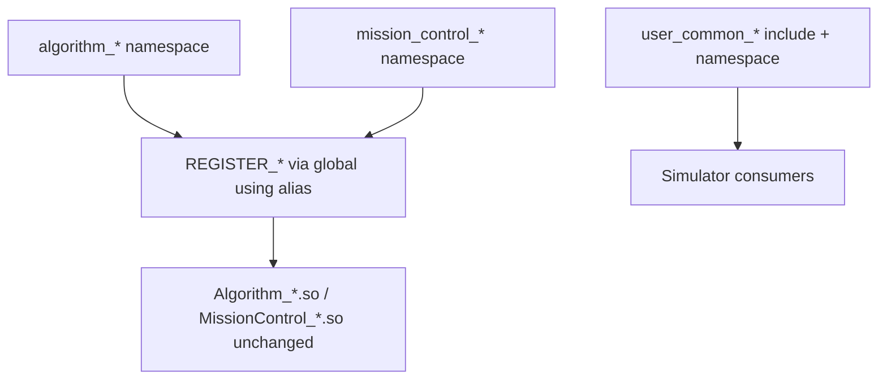

# Snake-case Plugin Namespaces Implementation Plan

> **For agentic workers:** REQUIRED SUB-SKILL: Use superpowers:subagent-driven-development (recommended) or superpowers:executing-plans to implement this plan task-by-task. Steps use checkbox (`- [ ]`) syntax for tracking. Before coding, create an isolated worktree via superpowers:using-git-worktrees. **First action after approval:** write this plan (verbatim) to [Drone-Mapper-ex3/docs/superpowers/plans/2026-08-26-snake-case-plugin-namespaces.md](Drone-Mapper-ex3/docs/superpowers/plans/2026-08-26-snake-case-plugin-namespaces.md).

**Goal:** Align C++ namespaces and the UserCommon include-path folder with the 2026-08-26 Assignment 3 forum update (`algorithm_` / `mission_control_` / `user_common_` + IDs) without changing artifact names or frozen headers.

**Architecture:** Mechanical rename only. CMake targets, `OUTPUT_NAME` / `PREFIX ""`, `.so` / exe names, and ID-suffixed **class** names stay PascalCase. The UserCommon include directory must match the namespace because includes are `#include <UserCommon_…/…>` today. `REGISTER_*` still uses a global `using` alias of the class name (macros cannot token-paste `::`).

**Tech Stack:** C++20, gtest, CMake presets, Docker image `drone-mapper-ex3-dev`.

## Global Constraints

- Never edit `common/`, `Simulator/common_simulator/`, or `MissionControl/common_mission_control/` ([frozen-interfaces.mdc](Drone-Mapper-ex3/.cursor/rules/frozen-interfaces.mdc)).
- Do **not** rename CMake targets, `.so` basenames, or `simulator_207190406_209543255`.
- Do **not** rename classes `MappingAlgorithmImpl_207190406_209543255` / `MissionControlImpl_207190406_209543255`.
- Project folders stay `Algorithm/`, `MissionControl/`, `UserCommon/` (5-folder layout).
- No `new`/`delete`; no `exit()`/`abort()`.
- Branch from updated `main`; kebab-case branch; propose each commit and wait for human approval ([git-workflow.mdc](Drone-Mapper-ex3/.cursor/rules/git-workflow.mdc)).
- Build and test **only in Docker** — never fall back to WSL/native.
- Out of scope: default-composition scoring (pickup item 1), README/HLD (item 3), Known Issues excel (item 4).

## Locked rename table

| Kind | Old | New |
|------|-----|-----|
| Algorithm namespace | `Algorithm_207190406_209543255` | `algorithm_207190406_209543255` |
| MissionControl namespace | `MissionControl_207190406_209543255` | `mission_control_207190406_209543255` |
| UserCommon namespace | `UserCommon_207190406_209543255` | `user_common_207190406_209543255` |
| UserCommon include dir | `UserCommon/include/UserCommon_207190406_209543255/` | `UserCommon/include/user_common_207190406_209543255/` |
| Include form | `#include <UserCommon_207190406_209543255/X.h>` | `#include <user_common_207190406_209543255/X.h>` |
| Algorithm `.so` / CMake target | `Algorithm_207190406_209543255` | **unchanged** |
| MissionControl `.so` / CMake target | `MissionControl_207190406_209543255` | **unchanged** |
| Simulator exe | `simulator_207190406_209543255` | **unchanged** |

## Frozen surfaces (do not touch)

Entire trees: `common/`, `Simulator/common_simulator/`, `MissionControl/common_mission_control/`.

After every code commit candidate, run:

```bash
git diff --name-status main -- common/ Simulator/common_simulator/ MissionControl/common_mission_control/
git status --porcelain -- common/ Simulator/common_simulator/ MissionControl/common_mission_control/
```

Empty on both = pass. Any line = revert.

## File map

**UserCommon (dir + namespace + consumers):**
- Rename dir: `UserCommon/include/UserCommon_207190406_209543255/` → `…/user_common_207190406_209543255/` (all 5 headers)
- Modify: all `UserCommon/src/*.cpp`, every Simulator `#include` / `namespace UC =` / qualified use (e.g. [main.cpp](Drone-Mapper-ex3/Simulator/src/main.cpp), [SimulationRunImpl.cpp](Drone-Mapper-ex3/Simulator/src/SimulationRunImpl.cpp), [SimulationRunFactoryImpl.cpp](Drone-Mapper-ex3/Simulator/src/SimulationRunFactoryImpl.cpp), [YamlConfigParsers.h](Drone-Mapper-ex3/Simulator/include/Simulator/io/YamlConfigParsers.h), `Simulator/src/io/*`, UserCommon unit tests)

**Algorithm namespace:**
- Modify: [MappingAlgorithmImpl.h](Drone-Mapper-ex3/Algorithm/include/Algorithm/MappingAlgorithmImpl.h), [MappingAlgorithmImpl.cpp](Drone-Mapper-ex3/Algorithm/src/MappingAlgorithmImpl.cpp) (namespace + `REGISTER` using alias), Frontier `.h`/`.cpp`, [test_mapping_algorithm.cpp](Drone-Mapper-ex3/Algorithm/tests/test_mapping_algorithm.cpp), [test_mapping_algorithm_frontier.cpp](Drone-Mapper-ex3/Algorithm/tests/test_mapping_algorithm_frontier.cpp)

**MissionControl namespace:**
- Modify: `MissionControl/include/MissionControl/*.h`, `MissionControl/src/*.{cpp,hpp}`, [MissionControlPluginRegistration.cpp](Drone-Mapper-ex3/MissionControl/src/MissionControlPluginRegistration.cpp), [test_mission_control.cpp](Drone-Mapper-ex3/MissionControl/tests/test_mission_control.cpp), [test_drone_control.cpp](Drone-Mapper-ex3/MissionControl/tests/test_drone_control.cpp)

**Docs/rules (pickup Must fix §2 + agent rules that would reintroduce PascalCase):**
- [docs/assignment3-checklist.md](Drone-Mapper-ex3/docs/assignment3-checklist.md), [docs/component-placement.md](Drone-Mapper-ex3/docs/component-placement.md), [.cursor/rules/project-context.mdc](Drone-Mapper-ex3/.cursor/rules/project-context.mdc), [.cursor/skills/pre-submission-review/SKILL.md](Drone-Mapper-ex3/.cursor/skills/pre-submission-review/SKILL.md)
- Also: [.cursor/rules/plugin-architecture.mdc](Drone-Mapper-ex3/.cursor/rules/plugin-architecture.mdc), [.cursor/skills/port-ex2-component/SKILL.md](Drone-Mapper-ex3/.cursor/skills/port-ex2-component/SKILL.md)
- Progress: [docs/assignment-compliance-pickup.md](Drone-Mapper-ex3/docs/assignment-compliance-pickup.md), [AGENTS.md](Drone-Mapper-ex3/AGENTS.md), compliance canvas

Do **not** rewrite historical narrative in `docs/workplan.md` line-by-line; only fix the checklist/placement/rules that agents still follow. Manual scripts that reference `.so` paths stay as-is (artifact names unchanged).



## Docker verify commands (reuse every task)

From `Drone-Mapper-ex3` on PowerShell (Docker Desktop required):

```powershell
docker run --rm -e VCPKG_ROOT=/usr/local/vcpkg -v "${PWD}:/work" -w /work drone-mapper-ex3-dev bash -lc 'cmake --preset default && cmake --build --preset default && ctest --test-dir build/default --output-on-failure'
```

Registration smoke (after Task 2 and Task 3):

```bash
nm -DC --undefined-only build/default/Algorithm/Algorithm_207190406_209543255.so | grep -i Registration
nm -DC --undefined-only build/default/MissionControl/MissionControl_207190406_209543255.so | grep -i Registration
ls build/default/Algorithm/Algorithm_207190406_209543255.so build/default/MissionControl/MissionControl_207190406_209543255.so build/default/Simulator/simulator_207190406_209543255
```

Expected: `Registration` lines present (undefined, resolved from exe); artifact basenames unchanged.

CLI load smoke (Task 3 end / Task 4):

```bash
# comparative + competition still start (reports may still be Error cells — that is pickup item 1, not this plan)
./build/default/Simulator/simulator_207190406_209543255 -comparative \
  simulation=inputs/sim_compose.yaml \
  mission_control_folder=/tmp/mc_one \
  algorithm=build/default/Algorithm/Algorithm_207190406_209543255.so
# where /tmp/mc_one contains a copy of MissionControl_*.so
```

Final grep gate (must be empty for **namespace** tokens; `.so` / CMake target PascalCase is OK):

```bash
rg -n 'namespace Algorithm_207190406_209543255|namespace MissionControl_207190406_209543255|namespace UserCommon_207190406_209543255' Algorithm MissionControl UserCommon Simulator
rg -n '#include <UserCommon_207190406_209543255/' .
rg -n 'namespace Algorithm_<id|namespace MissionControl_<id|namespace UserCommon_<id' docs/assignment3-checklist.md docs/component-placement.md .cursor/rules/project-context.mdc .cursor/skills/pre-submission-review/SKILL.md .cursor/rules/plugin-architecture.mdc
```

---

### Task 1: Rename UserCommon namespace + include folder

**Files:**
- Rename: `UserCommon/include/UserCommon_207190406_209543255/` → `UserCommon/include/user_common_207190406_209543255/`
- Modify: every file under `UserCommon/` plus all Simulator consumers/tests that `#include` or qualify `UserCommon_207190406_209543255`

**Interfaces:**
- Consumes: none
- Produces: namespace `user_common_207190406_209543255`; includes `<user_common_207190406_209543255/…>`

- [ ] **Step 1: Prove the new include path is required (failing compile)**

In [Simulator/tests/test_usercommon_config_parse_result.cpp](Drone-Mapper-ex3/Simulator/tests/test_usercommon_config_parse_result.cpp), temporarily change only the include to:

```cpp
#include <user_common_207190406_209543255/ConfigParseResult.h>
```

Leave the old folder name in place. Build in Docker:

```bash
docker run --rm -e VCPKG_ROOT=/usr/local/vcpkg -v "${PWD}:/work" -w /work drone-mapper-ex3-dev bash -lc 'cmake --preset default && cmake --build --preset default --target test_usercommon_config_parse_result'
```

Expected: FAIL — header not found (`user_common_…/ConfigParseResult.h`).

- [ ] **Step 2: Rename include directory with git**

```bash
git mv UserCommon/include/UserCommon_207190406_209543255 UserCommon/include/user_common_207190406_209543255
```

- [ ] **Step 3: Rewrite namespaces and includes (minimal implementation)**

In every UserCommon header/source and every consumer:

- `namespace UserCommon_207190406_209543255` → `namespace user_common_207190406_209543255`
- `} // namespace UserCommon_207190406_209543255` → matching close comment
- `#include <UserCommon_207190406_209543255/` → `#include <user_common_207190406_209543255/`
- `UserCommon_207190406_209543255::` → `user_common_207190406_209543255::`
- `namespace UC = UserCommon_207190406_209543255` → `namespace UC = user_common_207190406_209543255`
- `using namespace UserCommon_207190406_209543255` → `using namespace user_common_207190406_209543255`

Do not touch CMake `UserCommon/include` roots (parent path unchanged).

- [ ] **Step 4: Build and run UserCommon-related tests**

```bash
docker run --rm -e VCPKG_ROOT=/usr/local/vcpkg -v "${PWD}:/work" -w /work drone-mapper-ex3-dev bash -lc 'cmake --preset default && cmake --build --preset default && ctest --test-dir build/default --output-on-failure -R "usercommon|yaml_config|simulation_run|output_dir"'
```

Expected: PASS. Frozen-folder check empty.

- [ ] **Step 5: Propose commit (wait for human approval)**

```bash
git add UserCommon Simulator
# message:
refactor: rename UserCommon namespace and include path to snake_case
```

---

### Task 2: Rename Algorithm namespace

**Files:**
- Modify: `Algorithm/include/Algorithm/MappingAlgorithmImpl.h`, `Algorithm/src/MappingAlgorithmImpl.cpp`, `Algorithm/src/MappingAlgorithmFrontier.h`, `Algorithm/src/MappingAlgorithmFrontier.cpp`, `Algorithm/tests/test_mapping_algorithm.cpp`, `Algorithm/tests/test_mapping_algorithm_frontier.cpp`

**Interfaces:**
- Consumes: Task 1 complete (no Algorithm↔UserCommon coupling today)
- Produces: `namespace algorithm_207190406_209543255`; registration alias still `MappingAlgorithmImpl_207190406_209543255`

- [ ] **Step 1: Failing test alias**

In `test_mapping_algorithm.cpp`, change only:

```cpp
namespace Algo = algorithm_207190406_209543255;
```

Build `algorithm_test` in Docker. Expected: FAIL — `algorithm_207190406_209543255` not declared.

- [ ] **Step 2: Rename namespaces in Algorithm sources**

Replace every `Algorithm_207190406_209543255` **namespace** token with `algorithm_207190406_209543255`, including nested `::detail`.

Update registration at bottom of `MappingAlgorithmImpl.cpp` to:

```cpp
using MappingAlgorithmImpl_207190406_209543255 =
    algorithm_207190406_209543255::MappingAlgorithmImpl_207190406_209543255;
REGISTER_MAPPING_ALGORITHM(MappingAlgorithmImpl_207190406_209543255);
```

Update frontier test alias:

```cpp
namespace detail = algorithm_207190406_209543255::detail;
```

Do **not** change `add_library(Algorithm_207190406_209543255 …)` in CMakeLists.

- [ ] **Step 3: Build Algorithm tests + `.so`**

```bash
docker run --rm -e VCPKG_ROOT=/usr/local/vcpkg -v "${PWD}:/work" -w /work drone-mapper-ex3-dev bash -lc 'cmake --build --preset default --target algorithm_test Algorithm_207190406_209543255 && ctest --test-dir build/default --output-on-failure -R algorithm_test && nm -DC --undefined-only build/default/Algorithm/Algorithm_207190406_209543255.so | grep -i Registration'
```

Expected: tests PASS; `Registration` appears; file still named `Algorithm_207190406_209543255.so`.

- [ ] **Step 4: Propose commit (wait for approval)**

```bash
git add Algorithm
# message:
refactor: rename Algorithm plugin namespace to snake_case
```

---

### Task 3: Rename MissionControl namespace

**Files:**
- Modify: all `MissionControl/include/MissionControl/*.h`, `MissionControl/src/*`, both MissionControl tests, [MissionControlPluginRegistration.cpp](Drone-Mapper-ex3/MissionControl/src/MissionControlPluginRegistration.cpp)

**Interfaces:**
- Consumes: Tasks 1–2
- Produces: `namespace mission_control_207190406_209543255` (and `::beam_math`); registration alias unchanged

- [ ] **Step 1: Failing test qualifier**

In `test_mission_control.cpp`, change one construction site to:

```cpp
mission_control_207190406_209543255::MissionControlImpl_207190406_209543255 control{
```

Build `test_mission_control`. Expected: FAIL — namespace not found.

- [ ] **Step 2: Rename namespaces**

Replace `MissionControl_207190406_209543255` namespace tokens with `mission_control_207190406_209543255` everywhere in MissionControl sources/tests (including `beam_math`).

Update registration:

```cpp
using MissionControlImpl_207190406_209543255 =
    mission_control_207190406_209543255::MissionControlImpl_207190406_209543255;

REGISTER_MISSION_CONTROL(MissionControlImpl_207190406_209543255);
```

Do **not** change CMake target `MissionControl_207190406_209543255`.

- [ ] **Step 3: Build MC tests + full tree + registration + CLI smoke**

```bash
docker run --rm -e VCPKG_ROOT=/usr/local/vcpkg -v "${PWD}:/work" -w /work drone-mapper-ex3-dev bash -lc '
  cmake --build --preset default &&
  ctest --test-dir build/default --output-on-failure &&
  nm -DC --undefined-only build/default/MissionControl/MissionControl_207190406_209543255.so | grep -i Registration &&
  mkdir -p /tmp/ex3_ns/mc &&
  cp build/default/MissionControl/MissionControl_207190406_209543255.so /tmp/ex3_ns/mc/ &&
  ./build/default/Simulator/simulator_207190406_209543255 -comparative \
    simulation=inputs/sim_compose.yaml \
    mission_control_folder=/tmp/ex3_ns/mc \
    algorithm=build/default/Algorithm/Algorithm_207190406_209543255.so
'
```

Expected: all unit tests PASS; `Registration` present; CLI exits 0 and writes a comparative report (cell outcomes may still be Error — out of scope). Frozen-folder check empty. Namespace grep gate empty for old `namespace Algorithm_/MissionControl_/UserCommon_` in production trees.

- [ ] **Step 4: Propose commit (wait for approval)**

```bash
git add MissionControl
# message:
refactor: rename MissionControl plugin namespace to snake_case
```

---

### Task 4: Sweep docs/rules + progress trackers

**Files:**
- Modify: `docs/assignment3-checklist.md` (namespace rows → snake_case; keep `.so` rows PascalCase)
- Modify: `docs/component-placement.md` (namespace table)
- Modify: `.cursor/rules/project-context.mdc`, `.cursor/rules/plugin-architecture.mdc`
- Modify: `.cursor/skills/pre-submission-review/SKILL.md`, `.cursor/skills/port-ex2-component/SKILL.md`
- Modify: `docs/assignment-compliance-pickup.md` — move Must fix §2 to Fixed; drop item 2 from Next session; update Verdict
- Modify: `AGENTS.md` — remaining work no longer lists namespaces
- Modify: compliance canvas — fix stale “Assignment requires Algorithm_ids namespaces” text; add/mark namespace finding Pass

**Exact checklist row replacements** (`docs/assignment3-checklist.md`):

| Artifact | Value |
|----------|-------|
| Algorithm namespace | `algorithm_207190406_209543255` |
| Mission control namespace | `mission_control_207190406_209543255` |
| UserCommon namespace | `user_common_207190406_209543255` |

**pre-submission-review checklist lines become:**

```markdown
- [ ] Algorithm code lives in `namespace algorithm_<id1>_<id2>`
- [ ] MissionControl code lives in `namespace mission_control_<id1>_<id2>`
- [ ] UserCommon code lives in `namespace user_common_<id1>_<id2>`
```

- [ ] **Step 1: Apply the doc/rule edits above**
- [ ] **Step 2: Re-run doc grep gate** — no stale PascalCase **namespace** claims in the listed files
- [ ] **Step 3: Propose commit (wait for approval)**

```bash
git add docs AGENTS.md .cursor canvases  # canvas path as in repo / Cursor project
# message:
docs: align namespace casing with Assignment 3 forum update
```

---

## Self-review (writing-plans)

1. **Spec coverage:** snake_case namespaces ✓; include-path folder ✓; `.so`/exe unchanged ✓; REGISTER still global via alias ✓; rebuild + CLI load ✓; listed doc sweeps ✓; frozen headers untouched ✓.
2. **Placeholders:** none — exact old/new tokens and commands included.
3. **Consistency:** class names and CMake targets remain PascalCase with IDs across all tasks; only namespace / include-dir tokens change.

## Execution handoff

Plan will also be saved under `docs/superpowers/plans/2026-08-26-snake-case-plugin-namespaces.md` as the first post-approval step.

**Two execution options:**

1. **Subagent-Driven (recommended)** — fresh subagent per task, review between tasks
2. **Inline Execution** — execute in this session with executing-plans checkpoints

Which approach?
