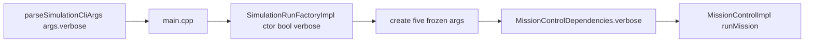

# Wire `-verbose` and empty-folder `errors:` report

> **For agentic workers:** REQUIRED SUB-SKILL: Use superpowers:subagent-driven-development (recommended) or superpowers:executing-plans to implement this plan task-by-task. Steps use checkbox (`- [ ]`) syntax for tracking. Before coding, create an isolated worktree via superpowers:using-git-worktrees. First action after approval: write this plan to [Drone-Mapper-ex3/docs/superpowers/plans/2026-08-26-wire-verbose-and-empty-plugin-report.md](Drone-Mapper-ex3/docs/superpowers/plans/2026-08-26-wire-verbose-and-empty-plugin-report.md).

**Goal:** Make `-verbose` reach `MissionControlDependencies.verbose`, and write `comparative_report.yaml` / `competitive_report.yaml` with `errors: [...]` when every folder plugin fails to load.

**Architecture:** Keep frozen `ISimulationRunFactory::create` unchanged. Add a `bool verbose` parameter to our concrete `SimulationRunFactoryImpl` constructor and pass `args.verbose` from [Simulator/src/main.cpp](Drone-Mapper-ex3/Simulator/src/main.cpp). On the empty-`bindings` path, still call the existing report writers with empty `results` and filled `failed_plugins`, then `unloadAll()` and return 0.

**Tech Stack:** C++20, gtest, yaml-cpp, CMake presets, Docker (`drone-mapper-ex3-dev`).

## Global Constraints

- Never edit files under `common/`, `Simulator/common_simulator/`, or `MissionControl/common_mission_control/` (including [ISimulationRunFactory.h](Drone-Mapper-ex3/Simulator/common_simulator/include/Simulator/ISimulationRunFactory.h) `create(...)`).
- Do not add `verbose` to frozen `ISimulationRunFactory::create`. `MissionControlDependencies.verbose` already exists in frozen [MissionControlFactory.h](Drone-Mapper-ex3/common/include/Common/MissionControlFactory.h) — only *set* it.
- No `new`/`delete`; no `exit()`/`abort()`.
- Branch from updated `main`; kebab-case name with no workplan codes/owner names. Propose each commit and wait for human approval ([git-workflow.mdc](Drone-Mapper-ex3/.cursor/rules/git-workflow.mdc)).
- Linux `.so` / `dlopen`: build and test inside Docker, not the Windows host.
- Out of scope: pickup item 3 (default composition 24/24 Error), README, HLD PDF, Known Issues excel export.

## Frozen surfaces (do not touch)

- [common/include/Common/MissionControlFactory.h](Drone-Mapper-ex3/common/include/Common/MissionControlFactory.h) — already has `bool verbose = false`
- [Simulator/common_simulator/include/Simulator/ISimulationRunFactory.h](Drone-Mapper-ex3/Simulator/common_simulator/include/Simulator/ISimulationRunFactory.h) — `create(...)` stays 5 args
- Entire `common/`, `Simulator/common_simulator/`, `MissionControl/common_mission_control/`

After every code change, run:

```bash
git diff --name-status main -- common/ Simulator/common_simulator/ MissionControl/common_mission_control/
git status --porcelain -- common/ Simulator/common_simulator/ MissionControl/common_mission_control/
```

Empty output on both = pass. Any line = revert, do not rationalize.

## File map

- Modify: [Simulator/include/Simulator/SimulationRunFactoryImpl.h](Drone-Mapper-ex3/Simulator/include/Simulator/SimulationRunFactoryImpl.h) — third ctor arg `bool verbose`
- Modify: [Simulator/src/SimulationRunFactoryImpl.cpp](Drone-Mapper-ex3/Simulator/src/SimulationRunFactoryImpl.cpp) — store it; set `.verbose = verbose_` (today hardcoded `false` at line 184)
- Modify: [Simulator/src/main.cpp](Drone-Mapper-ex3/Simulator/src/main.cpp) — pass `args.verbose`; on empty `bindings` write the aggregate report instead of returning
- Modify: [Simulator/tests/test_simulation_run_factory.cpp](Drone-Mapper-ex3/Simulator/tests/test_simulation_run_factory.cpp) — capturing fake + two tests
- Modify: [Simulator/tests/test_comparative_report_writer.cpp](Drone-Mapper-ex3/Simulator/tests/test_comparative_report_writer.cpp) and [test_competitive_report_writer.cpp](Drone-Mapper-ex3/Simulator/tests/test_competitive_report_writer.cpp) — empty-results + `errors` contract
- Create: [Simulator/tests/manual/check_all_folder_plugins_fail.sh](Drone-Mapper-ex3/Simulator/tests/manual/check_all_folder_plugins_fail.sh)
- Modify: [Simulator/tests/manual/run_all.sh](Drone-Mapper-ex3/Simulator/tests/manual/run_all.sh) — invoke the new script
- Docs/canvas after green tests (see Task 3)

Do **not** extract a new report-writer type. Duplicate the existing 15-line `writeComparativeReport` / `writeCompetitiveReport` block into the empty-`bindings` branch (YAGNI). Writers already emit empty `results_summary` and a filled `errors` list.

## Why `check_verbose.sh` will not go green on `sim_compose.yaml`

[SimulationRunImpl.cpp](Drone-Mapper-ex3/Simulator/src/SimulationRunImpl.cpp) returns at line 89–97 when `startup_errors_` is non-empty (`SPAWN_NOT_PASSABLE`) **without** calling `runMission()`. [MissionControlImpl](Drone-Mapper-ex3/MissionControl/src/MissionControlImpl.cpp) only writes `*.verbose.txt` inside `runMission()`. Pickup item 3 is that composition. Item 1 is proven by the factory capturing `deps.verbose` at construction (MC is still constructed before that early return). Do not add a completing composition in this plan. Do not add a `*.verbose.txt` assertion to `check_verbose.sh` (it would stay red). Existing [MissionControl/tests/test_mission_control.cpp](Drone-Mapper-ex3/MissionControl/tests/test_mission_control.cpp) already covers file write when `verbose=true`.



## Docker commands (all tests)

From repo root, image `drone-mapper-ex3-dev` (see [run_in_docker.sh](Drone-Mapper-ex3/Simulator/tests/manual/run_in_docker.sh)):

```bash
docker run --rm -e VCPKG_ROOT=/usr/local/vcpkg -v "${PWD}:/work" -w /work drone-mapper-ex3-dev bash -lc 'cmake --preset default && cmake --build --preset default && ctest --test-dir build/default --output-on-failure -R "test_simulation_run_factory|simulator_report_writers"'
```

On PowerShell, pass the repo path as the volume source. Filter names: `test_simulation_run_factory` is `add_test`; report tests are `gtest_discover_tests(simulator_report_writers_test)`.

---

### Task 1: Wire `-verbose` through the factory constructor

**Files:**
- Modify: `Simulator/include/Simulator/SimulationRunFactoryImpl.h`
- Modify: `Simulator/src/SimulationRunFactoryImpl.cpp` (ctor + line 184)
- Modify: `Simulator/src/main.cpp` (two `SimulationRunFactoryImpl` constructions, lines 82–83 and 99–100)
- Test: `Simulator/tests/test_simulation_run_factory.cpp`

**Interfaces:**
- Consumes: frozen `ISimulationRunFactory::create(sim, mission, drone, lidar, output_path)` — unchanged
- Consumes: `SimulationCliArgs.verbose` already parsed in [SimulationCli.cpp](Drone-Mapper-ex3/Simulator/src/io/SimulationCli.cpp)
- Produces: `SimulationRunFactoryImpl(MappingAlgorithmFactory, MissionControlFactory, bool verbose)` with required third arg (no default — forces `main.cpp` to pass `args.verbose`)
- Produces: `MissionControlDependencies.verbose` set from that member inside `create`

- [ ] **Step 1: Branch from updated main**

```bash
git checkout main
git pull
git checkout -b wire-verbose-and-empty-plugin-report
```

- [ ] **Step 2: Write the failing tests**

In [test_simulation_run_factory.cpp](Drone-Mapper-ex3/Simulator/tests/test_simulation_run_factory.cpp), after `makeMissionControlFactory()`, add a capturing factory and two tests. Keep the three existing tests compiling by passing `false` as the third ctor argument once Step 4 lands; until then the new tests fail to compile (red).

```cpp
struct CapturedMcDeps {
    bool verbose = false;
};

[[nodiscard]] static common::MissionControlFactory makeCapturingMissionControlFactory(
    CapturedMcDeps& sink) {
    return [&sink](common::MissionControlDependencies deps)
               -> std::unique_ptr<common::IMissionControl> {
        sink.verbose = deps.verbose;
        return std::make_unique<FakeMissionControl>(deps);
    };
}

TEST(SimulationRunFactory, PassesVerboseTrueToMissionControl) {
    const fs::path tmp = fs::temp_directory_path() / "srf_verbose_true";
    const fs::path map_path = writeTinyHiddenMap(tmp, 10, 10, 10);

    simulator::types::SimulationConfigData sim{};
    sim.map_filename = map_path;
    sim.map_resolution = 10.0 * common::cm;

    CapturedMcDeps captured;
    simulator::SimulationRunFactoryImpl factory{
        makeAlgorithmFactory(), makeCapturingMissionControlFactory(captured), true};
    auto run = factory.create(sim, {}, {}, {}, tmp / "output.npy");
    EXPECT_NE(run, nullptr);
    EXPECT_TRUE(captured.verbose);

    std::error_code ec;
    fs::remove_all(tmp, ec);
}

TEST(SimulationRunFactory, PassesVerboseFalseToMissionControl) {
    const fs::path tmp = fs::temp_directory_path() / "srf_verbose_false";
    const fs::path map_path = writeTinyHiddenMap(tmp, 10, 10, 10);

    simulator::types::SimulationConfigData sim{};
    sim.map_filename = map_path;
    sim.map_resolution = 10.0 * common::cm;

    CapturedMcDeps captured;
    simulator::SimulationRunFactoryImpl factory{
        makeAlgorithmFactory(), makeCapturingMissionControlFactory(captured), false};
    auto run = factory.create(sim, {}, {}, {}, tmp / "output.npy");
    EXPECT_NE(run, nullptr);
    EXPECT_FALSE(captured.verbose);

    std::error_code ec;
    fs::remove_all(tmp, ec);
}
```

Also change the three existing `SimulationRunFactoryImpl factory{makeAlgorithmFactory(), makeMissionControlFactory()};` constructions to pass `false`.

- [ ] **Step 3: Run tests — expect compile failure**

```bash
# inside Docker, after cmake --build --preset default
./build/default/Simulator/test_simulation_run_factory --gtest_filter=SimulationRunFactory.PassesVerbose*
```

Expected: compile error — `SimulationRunFactoryImpl` has no 3-argument constructor.

- [ ] **Step 4: Minimal implementation**

Header — replace the 2-arg ctor with:

```cpp
    SimulationRunFactoryImpl(common::MappingAlgorithmFactory algorithm_factory,
                              common::MissionControlFactory   mission_control_factory,
                              bool                            verbose);

private:
    common::MappingAlgorithmFactory  algorithm_factory_;
    common::MissionControlFactory    mission_control_factory_;
    bool                             verbose_ = false;
```

.cpp ctor:

```cpp
SimulationRunFactoryImpl::SimulationRunFactoryImpl(
    common::MappingAlgorithmFactory  algorithm_factory,
    common::MissionControlFactory    mission_control_factory,
    bool                             verbose)
    : algorithm_factory_(std::move(algorithm_factory)),
      mission_control_factory_(std::move(mission_control_factory)),
      verbose_(verbose) {}
```

In `create`, replace `.verbose = false` with `.verbose = verbose_`. Do not change the `create` signature.

`main.cpp` both construction sites:

```cpp
factories.push_back(std::make_unique<simulator::SimulationRunFactoryImpl>(
    algorithm_factory, mc.factory, args.verbose));
```

and

```cpp
factories.push_back(std::make_unique<simulator::SimulationRunFactoryImpl>(
    algo.factory, mission_control_factory, args.verbose));
```

- [ ] **Step 5: Run tests — expect pass**

```bash
./build/default/Simulator/test_simulation_run_factory --gtest_filter=SimulationRunFactory.*
```

Expected: all `SimulationRunFactory.*` tests PASS, including the two new ones.

Also run MissionControl verbose tests (already green, must stay green):

```bash
ctest --test-dir build/default --output-on-failure -R 'test_mission_control|test_simulation_run_factory'
```

- [ ] **Step 6: Frozen-interface check**

Commands in Global Constraints. Expected: empty.

- [ ] **Step 7: Propose commit — wait for human approval**

Do not run `git commit` until the user says yes. Proposed message:

```text
fix: pass -verbose through SimulationRunFactoryImpl to MissionControl
```

Files: header, factory .cpp, main.cpp, factory tests. No frozen paths.

---

### Task 2: Write aggregate report when every folder `.so` fails

**Files:**
- Modify: `Simulator/src/main.cpp` lines 105–108 (empty-`bindings` early return)
- Test: `Simulator/tests/test_comparative_report_writer.cpp`
- Test: `Simulator/tests/test_competitive_report_writer.cpp`
- Create: `Simulator/tests/manual/check_all_folder_plugins_fail.sh`
- Modify: `Simulator/tests/manual/run_all.sh`

**Interfaces:**
- Consumes: existing `writeComparativeReport(path, ComparativeReportInput)` / `writeCompetitiveReport` — `results` may be empty; `failed_plugins` is filenames (basenames)
- Consumes: `failed_plugins` already filled from `mc_outcome.errors` / `algo_outcome.errors` before the empty check
- Produces: `comparative_results_<time>/comparative_report.yaml` or `competition_<time>/competitive_report.yaml` even when `bindings.empty()`
- Does **not** change: single fixed-plugin load failure (comparative `algorithm=` / competition `mission_control=`) — still stderr + return 0, no report (pickup: folder case only)
- Does **not** change: CLI empty-folder (zero `.so` files) — still usage + return before load

- [ ] **Step 1: Writer tests (contract; writers already behave)**

Add to [test_comparative_report_writer.cpp](Drone-Mapper-ex3/Simulator/tests/test_comparative_report_writer.cpp):

```cpp
TEST(ComparativeReportWriter, EmptyResultsStillListsFailedPlugins) {
    simulator::io::ComparativeReportInput input;
    input.composition_file = "sim_compose.yaml";
    input.mission_control_folder = "mission_controls";
    input.generated_at_utc = "2026-08-26T00:00:00Z";
    input.results = {};
    input.failed_plugins = {"bad_mc.so"};

    const std::filesystem::path out =
        std::filesystem::temp_directory_path() / "test_comparative_empty_errors.yaml";
    simulator::io::writeComparativeReport(out, input);

    const YAML::Node report = YAML::LoadFile(out.string())["comparative_report"];
    ASSERT_TRUE(report);
    ASSERT_TRUE(report["results_summary"].IsSequence());
    EXPECT_EQ(report["results_summary"].size(), 0U);
    ASSERT_EQ(report["errors"].size(), 1U);
    EXPECT_EQ(report["errors"][0].as<std::string>(), "bad_mc.so");

    std::filesystem::remove(out);
}
```

Add the competitive twin (`competitive_report`, `mission_control: "mc.so"`, `errors: ["bad_algo.so"]`, `results_summary` size 0) in [test_competitive_report_writer.cpp](Drone-Mapper-ex3/Simulator/tests/test_competitive_report_writer.cpp).

Run:

```bash
./build/default/Simulator/simulator_report_writers_test --gtest_filter='*EmptyResults*'
```

Expected: PASS (writers already support this). These lock the YAML shape `main.cpp` must emit.

- [ ] **Step 2: Write the failing integration script**

Create [Simulator/tests/manual/check_all_folder_plugins_fail.sh](Drone-Mapper-ex3/Simulator/tests/manual/check_all_folder_plugins_fail.sh):

```bash
#!/usr/bin/env bash
# Folder full of .so files that do not register: still write aggregate errors: [...]
set -euo pipefail

REPO_ROOT="$(cd "$(dirname "${BASH_SOURCE[0]}")/../../.." && pwd)"
BUILD_DIR="${1:-${REPO_ROOT}/build/default}"
SIM="${BUILD_DIR}/Simulator/simulator_207190406_209543255"
UNREG="${BUILD_DIR}/Simulator/tests/fixtures/unregistered_plugin.so"
ALGO="${BUILD_DIR}/Algorithm/Algorithm_207190406_209543255.so"
MC="${BUILD_DIR}/MissionControl/MissionControl_207190406_209543255.so"
SCRATCH="/tmp/ex3_verify/all_folder_fail"
COMPOSE="${REPO_ROOT}/inputs/sim_compose.yaml"

rm -rf "${SCRATCH}"
mkdir -p "${SCRATCH}/mc_bad" "${SCRATCH}/algo_bad"
cp "${UNREG}" "${SCRATCH}/mc_bad/bad_mc.so"
cp "${UNREG}" "${SCRATCH}/algo_bad/bad_algo.so"

"$SIM" -comparative simulation="${COMPOSE}" \
    mission_control_folder="${SCRATCH}/mc_bad" \
    algorithm="${ALGO}"

REPORT=$(find "${SCRATCH}/mc_bad"/comparative_results_* -name comparative_report.yaml | head -n 1)
test -n "${REPORT}" || { echo "FAIL: no comparative_report.yaml"; exit 1; }
grep -q "bad_mc.so" "${REPORT}" || { echo "FAIL: errors missing bad_mc.so"; exit 1; }

"$SIM" -competition simulation="${COMPOSE}" \
    mission_control="${MC}" \
    algorithms_folder="${SCRATCH}/algo_bad"

REPORT=$(find "${SCRATCH}/algo_bad"/competition_* -name competitive_report.yaml | head -n 1)
test -n "${REPORT}" || { echo "FAIL: no competitive_report.yaml"; exit 1; }
grep -q "bad_algo.so" "${REPORT}" || { echo "FAIL: errors missing bad_algo.so"; exit 1; }

echo "PASS: all-folder plugin load failure wrote errors in both reports"
```

Add `"${ROOT}/check_all_folder_plugins_fail.sh" "${BUILD_DIR}"` to [run_all.sh](Drone-Mapper-ex3/Simulator/tests/manual/run_all.sh) after `check_cli_failures.sh`.

- [ ] **Step 3: Run script — expect FAIL**

```bash
sed -i 's/\r$//' Simulator/tests/manual/check_all_folder_plugins_fail.sh
chmod +x Simulator/tests/manual/check_all_folder_plugins_fail.sh
./Simulator/tests/manual/check_all_folder_plugins_fail.sh /work/build/default
```

Expected: `FAIL: no comparative_report.yaml` (`main.cpp` prints “no plugins loaded” and returns).

- [ ] **Step 4: Minimal `main.cpp` change**

Replace the empty-`bindings` block (currently lines 105–108) with: keep the stderr line; take `generated_at_utc` the same way as the success path (`UC::currentUtcTimestamp()`); fill `ComparativeReportInput` / `CompetitiveReportInput` exactly as lines 156–171 but with `results = {}` and `failed_plugins` already collected; write `output_root / "comparative_report.yaml"` or `"competitive_report.yaml"`; `std::cout` the output dir; `bindings.clear(); factories.clear(); loader.unloadAll(); return 0`. Do not run the orchestrator. Do not write per-plugin YAML.

Use the same field assignments as the success path (`composition.composition_file`, `args.mission_control_folder`, `args.mission_control.filename().string()`).

- [ ] **Step 5: Re-run script and writers — expect PASS**

```bash
cmake --build --preset default
./Simulator/tests/manual/check_all_folder_plugins_fail.sh /work/build/default
./build/default/Simulator/simulator_report_writers_test
./build/default/Simulator/test_simulation_run_factory --gtest_filter=SimulationRunFactory.*
```

Expected: `PASS: all-folder plugin load failure wrote errors in both reports`; all gtests PASS.

- [ ] **Step 6: Frozen-interface check** (same commands). Expected: empty.

- [ ] **Step 7: Propose commit — wait for human approval**

```text
fix: write aggregate report when no folder plugins load
```

Files: `main.cpp`, writer tests, new shell script, `run_all.sh`.

---

### Task 3: Progress docs and canvas (after both code commits)

Only after Tasks 1–2 tests are green. Do not claim `check_verbose.sh` file-list PASS.

- [ ] **Step 1: Update [docs/assignment-compliance-pickup.md](Drone-Mapper-ex3/docs/assignment-compliance-pickup.md)**

  - Header date → 2026-08-26; verdict: items 1–2 of the previous queue are done; remaining mandatory gaps are default-composition scores + README/HLD.
  - “Next session — do these in order”: drop old 1 and 2; old 3 (happy flow) becomes 1; README/HLD; Known Issues excel.
  - “Must fix” sections 1 and 3 (`-verbose`, all-folder `errors:`) → move into a short **Fixed 2026-08-26** list with file:line evidence (`SimulationRunFactoryImpl` ctor, `main.cpp` empty-`bindings`).
  - Keep “Must fix: Default composition never completes”.
  - Stale-notes table: workplan `-verbose` row will be updated in Step 3, so remove or rewrite that stale warning.

- [ ] **Step 2: Update canvas** [ex3-assignment-compliance.canvas.tsx](C:\Users\sagi1\.cursor\projects\c-Users-sagi1-Projects-DroneMapper\canvases\ex3-assignment-compliance.canvas.tsx)

  Follow [canvas/SKILL.md](C:\Users\sagi1\.cursor\skills-cursor\canvas\SKILL.md): read `cursor/canvas` SDK before editing. Change:
  - `A-verbose` and `A-errors` `status` to `"Pass"` with evidence of the ctor/`main.cpp` fix.
  - Stats: mandatory wiring gaps `0` / success tone; keep default-scenario `1` danger; submission docs `2` warning.
  - Verdict table: `-verbose` → Pass; `errors: list` → Pass (empty folder-plugin case included).
  - `rowTone` for those two rows: `success`.
  - Fix-order: remaining 1 = happy flow, 2 = README/HLD, 3 = Known Issues excel. Drop the old “wire -verbose” pill.
  - Date line → 2026-08-26. Remove the danger Callout for `-verbose`, or replace with a success/info note that wiring is done and file-list check waits on a completing cell.

- [ ] **Step 3: Update [docs/workplan.md](Drone-Mapper-ex3/docs/workplan.md)** (needed)

  - Opening “remaining work” line: drop `-verbose` wiring and empty-folder `errors:`.
  - Verification table `-verbose` row: **PASS (unit)** — flag reaches `MissionControlDependencies`; `check_verbose.sh` file-list still blocked by pickup item 3 (`runMission` skipped on `SPAWN_NOT_PASSABLE`).
  - “Still open” bullets: remove the two fixed items.
  - Checklist `-verbose` item: mark done with the same unit-vs-file-list caveat.

- [ ] **Step 4: Update [AGENTS.md](Drone-Mapper-ex3/AGENTS.md)** (needed)

  Status paragraph: remaining work is default-composition scoring and submission docs; `-verbose` and empty-folder `errors:` are done. Keep “start at pickup”.

- [ ] **Step 5: Update [docs/known-issues.md](Drone-Mapper-ex3/docs/known-issues.md)**

  Delete rows 1 and 20 (fixed bugs must not ship in the excel). Leave row 2 (default composition). Do not renumber remaining rows unless the table becomes confusing; if you delete, keep IDs 2–19 stable.

- [ ] **Step 6: Propose docs commit — wait for human approval**

```text
docs: record verbose wiring and empty-plugin report progress
```

- [ ] **Step 7: Final frozen check** on the whole branch vs `main`.

---

## Spec coverage (self-review)

- Pickup item 1 (`-verbose` → factory ctor, not frozen `create`) → Task 1
- Pickup item 1 re-run `check_verbose.sh` on a completing composition → deferred to item 3; documented; factory test is the gate
- Pickup item 2 (empty-`bindings` still writes `errors:`) → Task 2
- Frozen interfaces → every code task Step 6 + Task 3 Step 7
- Pickup/canvas/workplan/AGENTS → Task 3
- README/HLD/happy-flow → explicitly out of scope

## Placeholder scan

No TBD/TODO remaining. Commit steps wait for human approval (git-workflow), not silence.