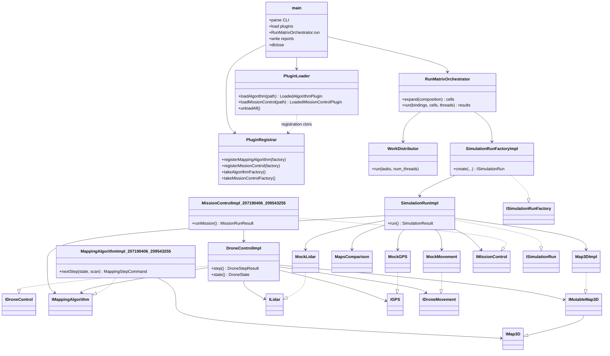

# Submission README and HLD PDF Implementation Plan

> **For agentic workers:** REQUIRED SUB-SKILL: Use superpowers:subagent-driven-development (recommended) or superpowers:executing-plans to implement this plan task-by-task. Steps use checkbox (`- [ ]`) syntax for tracking.

**Goal:** Replace the skeleton `README.md` with submission-ready build/run docs (names, IDs, presets, both CLI modes, artifact names) and add a root `HLD.pdf` with complete class and sequence diagrams that match the three-project plugin architecture (AdvCpp e14/e15).

**Architecture:** Keep the existing output-naming section in `README.md` and rewrite everything above it. Author an editable source `docs/HLD.md` (Markdown + Mermaid, adapted from ex2’s structure but reflecting ex3 `dlopen` / registrar / run-matrix) and render it to zip-root `HLD.pdf` via Mermaid CLI images + Pandoc. Update pickup / known-issues / AGENTS so the next session queue drops README/HLD.

**Tech Stack:** Markdown, Mermaid, Docker (`drone-mapper-ex3-dev` for verification; `minlag/mermaid-cli` + `pandoc/latex` for PDF render), CMake presets already in-repo.

## Global Constraints

- Never edit `common/`, `Simulator/common_simulator/`, or `MissionControl/common_mission_control/`
- README build/run instructions must match real presets and binary names (`e11` / AdvCpp: no manual library install steps beyond `VCPKG_ROOT` + presets)
- HLD and README must match the code (AdvCpp); class diagram incomplete → `e14`; sequence diagram incomplete → `e15`
- Student IDs: `207190406`, `209543255`; names from `students.txt`: Sagi Eisenberg / Yoav Naaman
- Artifacts: `simulator_207190406_209543255`, `Algorithm_207190406_209543255.so`, `MissionControl_207190406_209543255.so`
- Plugin namespaces (code): `algorithm_207190406_209543255`, `mission_control_207190406_209543255`, `user_common_207190406_209543255` — do **not** revive skeleton README’s lowercase `algorithm` / `mission_control` advice
- `HLD.pdf` must live at **repo/zip root** (not only under `docs/`)
- Docker Desktop for build verification; do not claim host-native gcc builds in README as the primary path
- Out of scope: Known Issues excel export, `bonus.txt`, zip packaging, code changes to Algorithm/MissionControl/Simulator
- **Start from updated `main`:** do **not** continue `fix-default-composition-scoring`. Before Task 1, sync `main` from `origin` and cut a **new** branch (see Task 0). README/HLD work must land on top of whatever is already merged (including PR #10 wall-recovery / 24/24 scoring).

## File map

| File | Role |
|------|------|
| `README.md` | Submission readme: authors, build, CLI, `.so`/exe names; keep output-naming |
| `docs/HLD.md` | Editable HLD source (prose + Mermaid); committed |
| `docs/hld/class-overview.mmd` | Mermaid class diagram extracted for CLI render |
| `docs/hld/seq-comparative-cell.mmd` | Mermaid sequence: one comparative cell (load → run → score) |
| `docs/hld/seq-drone-step.mmd` | Mermaid sequence: DroneControl step loop |
| `docs/hld/*.png` | Rendered diagram PNGs (committed so PDF rebuild is optional) |
| `HLD.pdf` | Zip-root deliverable graded for e14/e15 |
| `scripts/render_hld_pdf.sh` | Reproducible PNG + PDF generation |
| `docs/assignment-compliance-pickup.md` | Drop README/HLD from “Next session” / “Not ready for zip” |
| `docs/known-issues.md` | Resolve rows 3–4 |
| `AGENTS.md` | Status: remaining work = excel-at-zip-time only (or similar) |
| `docs/workplan.md` | Mark README/HLD done under path-to-submittable |

---

### Task 0: Sync `main` and create branch

**Files:** none (git only)

**Interfaces:**
- Consumes: `origin/main` after fetch
- Produces: clean local branch `docs-submission-readme-hld` based on updated `main`

- [ ] **Step 1: Fetch and fast-forward local `main`**

```bash
git fetch origin main
git checkout main
git pull --ff-only origin main
git log -1 --oneline
```

Expected: `HEAD` matches `origin/main` (as of 2026-08-27 that includes merge of PR #10 / wall-recovery scoring). Working tree clean except intentional untracked plan/docs you are about to add.

- [ ] **Step 2: Create the feature branch from that `main`**

```bash
git checkout -b docs-submission-readme-hld
```

If `docs-submission-readme-hld` already exists locally from an older base, delete it only when it has no unique commits you need (`git branch -D docs-submission-readme-hld`) and recreate from updated `main`.

- [ ] **Step 3: Confirm base**

```bash
git merge-base --is-ancestor origin/main HEAD && echo "HEAD contains origin/main"
git status -sb
```

Expected: prints `HEAD contains origin/main`; branch name `docs-submission-readme-hld`.

Do **not** start Task 1 until this task is done.

---

### Task 1: Rewrite `README.md`

**Files:**
- Modify: `README.md`
- Test: manual checklist against `CMakePresets.json`, `students.txt`, and built artifact names under `build/default/`

**Interfaces:**
- Consumes: `students.txt` lines; preset name `default`; CLI from Assignment 3
- Produces: submission-ready `README.md` (no skeleton placeholder)

- [ ] **Step 1: Replace `README.md` with this exact structure and content**

Overwrite `README.md` entirely with:

```markdown
# Drone Mapper — Assignment 3

**Authors:** Sagi Eisenberg (207190406), Yoav Naaman (209543255)

TAU Advanced Topics in Programming (2026B). Three separately built projects: a
`simulator_<ids>` executable that `dlopen`s `Algorithm_<ids>.so` and
`MissionControl_<ids>.so`.

| Artifact | Name |
|----------|------|
| Executable | `simulator_207190406_209543255` |
| Algorithm plugin | `Algorithm_207190406_209543255.so` |
| MissionControl plugin | `MissionControl_207190406_209543255.so` |

Plugin / UserCommon **namespaces** (code): `algorithm_207190406_209543255`,
`mission_control_207190406_209543255`, `user_common_207190406_209543255`.

## Build

Requires Docker image `drone-mapper-ex3-dev` (or an equivalent Linux + vcpkg + Ninja
environment with `VCPKG_ROOT` set). Dependencies come from `vcpkg.json` via the
CMake toolchain — no manual `apt`/`pip` library installs.

```bash
cmake --preset default
cmake --build --preset default
```

Outputs land under `build/default/`:

- `build/default/Simulator/simulator_207190406_209543255`
- `build/default/Algorithm/Algorithm_207190406_209543255.so`
- `build/default/MissionControl/MissionControl_207190406_209543255.so`

Optional ThreadSanitizer preset: `cmake --preset tsan` / `cmake --build --preset tsan`.

## Run

Arguments may appear in any order. The `=` sign has no spaces around it.

### Comparative mode

```bash
./simulator_207190406_209543255 -comparative \
  simulation=<composition.yaml> \
  mission_control_folder=<folder_with_MissionControl_*.so> \
  algorithm=<Algorithm_*.so> \
  [num_threads=<N>] \
  [-verbose]
```

### Competition mode

```bash
./simulator_207190406_209543255 -competition \
  simulation=<composition.yaml> \
  mission_control=<MissionControl_*.so> \
  algorithms_folder=<folder_with_Algorithm_*.so> \
  [num_threads=<N>] \
  [-verbose]
```

`num_threads` absent or `1`: work runs on the main thread only. `N >= 2`: `N` worker
threads plus the main thread. `-verbose` enables MissionControl verbose files.

Example (from the repo root, after build), using the provided composition:

```bash
BUILD=build/default
SCRATCH=/tmp/ex3_mc
mkdir -p "$SCRATCH"
cp "$BUILD/MissionControl/MissionControl_207190406_209543255.so" "$SCRATCH/"
"$BUILD/Simulator/simulator_207190406_209543255" -comparative \
  simulation=inputs/sim_compose.yaml \
  mission_control_folder="$SCRATCH" \
  algorithm="$BUILD/Algorithm/Algorithm_207190406_209543255.so"
```

## Tests

```bash
ctest --test-dir build/default --output-on-failure
```

## Output naming
```

Then **append unchanged** the existing `## Output naming` section from the current
`README.md` (from the heading through the final paragraph about `<plugin>` being the
`.so` filename). Do not delete or reword that section except to keep heading level
consistent (`## Output naming`).

Remove: skeleton “You should update this README”, lowercase-namespace advice, and the
stale “Provided file tree” dump (graders need build/run, not a frozen tree snapshot).

- [ ] **Step 2: Verify README against ground truth**

```bash
# From repo root
grep -E '207190406|209543255' students.txt README.md
grep -E 'default|tsan' CMakePresets.json
# After a Docker build (optional if binaries already present):
ls build/default/Simulator/simulator_207190406_209543255 \
   build/default/Algorithm/Algorithm_207190406_209543255.so \
   build/default/MissionControl/MissionControl_207190406_209543255.so
```

Expected: IDs match `students.txt`; presets `default` and `tsan` exist; artifact paths
match README table (or note that binaries appear only after build).

Checklist (all must be true):

- [ ] Names + IDs present
- [ ] Both CLI lines present (`-comparative` and `-competition`)
- [ ] `cmake --preset default` / `cmake --build --preset default`
- [ ] No “manual install yaml-cpp / mp-units” steps
- [ ] Output naming section still present
- [ ] No skeleton placeholder sentence

- [ ] **Step 3: Commit**

```bash
git add README.md
git commit -m "$(cat <<'EOF'
docs: rewrite README with authors, build presets, and CLI

Replace the skeleton placeholder with submission-ready names, IDs, CMake presets, both simulator modes, and keep the existing output-naming section.
EOF
)"
```

---

### Task 2: Author `docs/HLD.md` and Mermaid diagram sources

**Files:**
- Create: `docs/HLD.md`
- Create: `docs/hld/class-overview.mmd`
- Create: `docs/hld/seq-comparative-cell.mmd`
- Create: `docs/hld/seq-drone-step.mmd`

**Interfaces:**
- Consumes: real class names under `Simulator/include/Simulator/`, `MissionControl/`, `Algorithm/`
- Produces: HLD source that Task 3 renders to `HLD.pdf`

- [ ] **Step 1: Create `docs/hld/class-overview.mmd`**



Save **only the Mermaid body** (no surrounding ``` fences) into
`docs/hld/class-overview.mmd`.

- [ ] **Step 2: Create `docs/hld/seq-comparative-cell.mmd`**

```text
sequenceDiagram
    actor User
    participant Main as simulator main
    participant Loader as PluginLoader
    participant Reg as PluginRegistrar
    participant Orch as RunMatrixOrchestrator
    participant Factory as SimulationRunFactoryImpl
    participant Run as SimulationRunImpl
    participant MC as MissionControlImpl
    participant Score as MapsComparison

    User->>Main: -comparative simulation=... mission_control_folder=... algorithm=...
    Main->>Loader: load Algorithm_*.so + each MissionControl_*.so
    Loader->>Reg: REGISTER_* static ctors fill factories
    Main->>Orch: expand composition to cells
    loop each cell x each MissionControl binding
        Orch->>Factory: create(sim, mission, drone, lidar, algorithm factory, mc factory, ...)
        Factory->>Run: wire maps, mocks, plugins
        Orch->>Run: run()
        Run->>MC: runMission()
        MC-->>Run: MissionRunResult
        Run->>Score: compare(hidden, output)
        Run-->>Orch: SimulationResult (score, steps, paths)
    end
    Main->>Main: write comparative_report.yaml + per-plugin YAML
    Main->>Loader: destroy plugin objects then dlclose
```

Save as `docs/hld/seq-comparative-cell.mmd` (Mermaid body only).

- [ ] **Step 3: Create `docs/hld/seq-drone-step.mmd`**

```text
sequenceDiagram
    participant MC as MissionControlImpl
    participant DC as DroneControlImpl
    participant Algo as MappingAlgorithmImpl
    participant GPS as MockGPS
    participant Move as MockMovement
    participant Lidar as MockLidar
    participant Map as output Map3DImpl

    loop until Finished / MaxSteps / Error
        MC->>DC: step()
        DC->>GPS: position() / heading()
        DC->>Algo: nextStep(state, latest_scan)
        Algo-->>DC: MappingStepCommand
        alt recoverable wall throw from Move
            DC->>Move: advance/elevate
            Move-->>DC: throw blocked/boundary
            DC-->>DC: Continue (no scan write)
        else normal movement
            DC->>Move: rotate/advance/elevate
            DC->>Lidar: scan(orientations)
            DC->>Map: set voxels from scan
        end
        DC-->>MC: DroneStepResult
    end
```

Save as `docs/hld/seq-drone-step.mmd`.

- [ ] **Step 4: Write `docs/HLD.md`**

Create `docs/HLD.md` with these sections (fill prose to match code; no TBD):

1. **Title / authors / purpose** — Assignment 3 three-project design; IDs.
2. **Folder responsibilities** — table from `docs/component-placement.md` (Simulator / MissionControl / Algorithm / common / UserCommon). State explicitly: `common/` is course-published and unmodified.
3. **Main components** — bullet list covering `main` CLI, `PluginLoader`, `PluginRegistrar`, `RunMatrixOrchestrator`, `WorkDistributor`, `SimulationRunFactoryImpl`, `SimulationRunImpl`, mocks + `Map3DImpl` + `MapsComparison`, `MissionControlImpl_*`, `DroneControlImpl`, `MappingAlgorithmImpl_*` + frontier planner. Note: published `simulator::ISimulation` is **unused**; orchestration is `main` + `RunMatrixOrchestrator` (document this so e14 is not “missing SimulationManager”).
4. **Class diagram** — embed:

```markdown

```

   and also include the Mermaid source in a fenced `mermaid` block (same content as the `.mmd` file) so GitHub rendering works without PNGs.
5. **Sequence: comparative cell** — PNG + mermaid fence from `seq-comparative-cell`.
6. **Sequence: drone step** — PNG + mermaid fence from `seq-drone-step`; mention recoverable MockMovement catch → Continue and SimulationRun as backstop.
7. **Threading** — absent/`1` = main only; `N>=2` = N workers + main; recreate plugin instances per cell; no `.so` reload.
8. **Data / maps** — hidden vs output `Map3DImpl`; algorithm reads `const IMap3D&` only; DroneControl writes scans.

- [ ] **Step 5: Commit HLD source (diagrams as `.mmd` + `docs/HLD.md`; PNGs come in Task 3)**

```bash
git add docs/HLD.md docs/hld/*.mmd
git commit -m "$(cat <<'EOF'
docs: add Assignment 3 HLD source with class and sequence diagrams

Document the three-project plugin architecture, run-matrix flow, and DroneControl step loop for e14/e15.
EOF
)"
```

---

### Task 3: Render PNGs and root `HLD.pdf`

**Files:**
- Create: `scripts/render_hld_pdf.sh`
- Create: `docs/hld/class-overview.png`, `docs/hld/seq-comparative-cell.png`, `docs/hld/seq-drone-step.png`
- Create: `HLD.pdf` (repo root)

**Interfaces:**
- Consumes: `docs/HLD.md`, `docs/hld/*.mmd`
- Produces: zip-root `HLD.pdf`

- [ ] **Step 1: Add `scripts/render_hld_pdf.sh`**

```bash
#!/usr/bin/env bash
set -euo pipefail
ROOT="$(cd "$(dirname "$0")/.." && pwd)"
cd "$ROOT"

docker run --rm -v "$ROOT:/data" -w /data minlag/mermaid-cli \
  -i docs/hld/class-overview.mmd -o docs/hld/class-overview.png -b transparent

docker run --rm -v "$ROOT:/data" -w /data minlag/mermaid-cli \
  -i docs/hld/seq-comparative-cell.mmd -o docs/hld/seq-comparative-cell.png -b transparent

docker run --rm -v "$ROOT:/data" -w /data minlag/mermaid-cli \
  -i docs/hld/seq-drone-step.mmd -o docs/hld/seq-drone-step.png -b transparent

# Strip mermaid fences for pandoc (images already embedded via markdown image links).
# Pandoc reads docs/HLD.md; resource path includes docs/ so hld/*.png resolve.
docker run --rm -v "$ROOT:/data" -w /data/docs pandoc/latex \
  HLD.md -o /data/HLD.pdf --resource-path=. -f markdown -t pdf
```

On Windows PowerShell, invoke via:

```powershell
docker run --rm -v "${PWD}:/work" -w /work drone-mapper-ex3-dev bash -lc "sed -i 's/\r$//' scripts/render_hld_pdf.sh && bash scripts/render_hld_pdf.sh"
```

(If `minlag/mermaid-cli` or `pandoc/latex` cannot be pulled, fall back: install `pandoc` + `texlive-latex-base` + `texlive-fonts-recommended` inside `drone-mapper-ex3-dev` for the PDF step, and use a one-shot `node:20` container with `npx -y @mermaid-js/mermaid-cli` for PNGs. Do not leave `HLD.pdf` missing.)

- [ ] **Step 2: Run the render script**

Expected: `docs/hld/*.png` exist and are non-empty; `HLD.pdf` exists at repo root; `Get-Item HLD.pdf | Select Length` shows more than a few KB (diagrams embedded).

- [ ] **Step 3: Spot-check PDF content**

Open or `pdfinfo HLD.pdf` / extract text:

```bash
docker run --rm -v "${PWD}:/data" -w /data pandoc/latex pdftotext HLD.pdf - | head -40
```

Expected snippets: author names or IDs, `PluginLoader` / `RunMatrixOrchestrator` / `DroneControlImpl`, and mention of comparative or step loop.

- [ ] **Step 4: Commit PDF artifacts and script**

```bash
git add scripts/render_hld_pdf.sh docs/hld/*.png HLD.pdf
git commit -m "$(cat <<'EOF'
docs: add root HLD.pdf and render script for submission

Commit rendered class/sequence diagrams and zip-root HLD.pdf for AdvCpp e14/e15.
EOF
)"
```

Note: binary PDF in git is intentional for submission readiness.

---

### Task 4: Update compliance docs

**Files:**
- Modify: `docs/assignment-compliance-pickup.md`
- Modify: `docs/known-issues.md` (rows 3 and 4)
- Modify: `AGENTS.md`
- Modify: `docs/workplan.md` (path-to-submittable bullets for README/HLD)

**Interfaces:**
- Consumes: completed README + `HLD.pdf`
- Produces: pickup queue with only zip-time Known Issues excel (and optional bonus) left

- [ ] **Step 1: Update pickup**

In `docs/assignment-compliance-pickup.md`:

- Verdict: remove “Two submission-doc gaps remain (README/HLD)”; say README + HLD.pdf present; remaining gap is zip-time Known Issues excel (optional) / re-diff assignment before Sep 6.
- **Next session:** replace items 1–2 with: (1) export Known Issues excel at zip time; (2) pre-submission-review skill + zip `ex3_207190406_209543255.zip`.
- **Not ready for the zip:** delete README/HLD bullets (or mark done).
- Add under **Fixed** today’s date: README rewrite + root `HLD.pdf`.

- [ ] **Step 2: Resolve known-issues rows 3 and 4**

Rewrite row 3 (README) and row 4 (HLD) as **Resolved** with pointers to `README.md` / `HLD.pdf` (same style as rows 2/17/18).

- [ ] **Step 3: AGENTS.md + workplan**

- `AGENTS.md` Status: README/HLD done; remaining = Known Issues excel at zip + packaging.
- `docs/workplan.md` “Path to a submittable artifact”: mark README and HLD bullets done with date.

- [ ] **Step 4: Frozen check (must stay empty)**

```bash
git diff --name-status main -- common/ Simulator/common_simulator/ MissionControl/common_mission_control/
git status --porcelain -- common/ Simulator/common_simulator/ MissionControl/common_mission_control/
```

Expected: empty.

- [ ] **Step 5: Commit docs**

```bash
git add docs/assignment-compliance-pickup.md docs/known-issues.md AGENTS.md docs/workplan.md
git commit -m "$(cat <<'EOF'
docs: mark README and HLD submission gaps resolved

Update pickup, known-issues, AGENTS, and workplan after README rewrite and root HLD.pdf.
EOF
)"
```

---

## Self-review

1. **Spec coverage:** Task 0 syncs updated `main` then branches. Pickup item 1 (README) → Task 1. Pickup item 2 (HLD PDF) → Tasks 2–3. Compliance doc sync → Task 4. Frozen folders untouched.
2. **Placeholder scan:** No TBD; full README body and Mermaid sources inlined; PDF fallback if images fail to pull.
3. **Type consistency:** Class/sequence names match `Simulator/include/Simulator/*` and ID-suffixed plugin impl names used in registration.

## Execution Handoff

Plan complete and saved to `docs/superpowers/plans/2026-08-27-submission-readme-and-hld.md`. Two execution options:

**1. Subagent-Driven (recommended)** — fresh subagent per task, review between tasks  
**2. Inline Execution** — execute in this session with executing-plans checkpoints  

Which approach?
