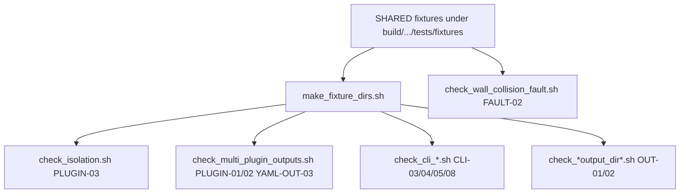

# Close Instructor Test-Catalog Gaps Implementation Plan

> **For agentic workers:** REQUIRED SUB-SKILL: Use superpowers:subagent-driven-development (recommended) or superpowers:executing-plans to implement this plan task-by-task. Steps use checkbox (`- [ ]`) syntax for tracking.

**Goal:** Close the eight black-box gaps between `docs/simulator_runtime_test_catalog.md` and `Simulator/tests/manual/*.sh` so an instructor-style CLI pass covers isolation with independent fixtures, multi-plugin outputs, CLI argument naming/order, non-writable output dirs, competition dir naming, and wall-collision fault survival.

**Architecture:** Keep extending the existing bash harness under `Simulator/tests/manual/` (same scratch layout `/tmp/ex3_verify`, same Docker entry via `run_all.sh`). Reuse the already-built test `.so` fixtures under `build/.../Simulator/tests/fixtures/` instead of renamed copies of our submission plugins. Add one new SHARED fixture only where the catalog requires a wall-seeking algorithm (`FAULT-02`). Prefer a one-cell `tiny_compose.yaml` for new multi-plugin / fault scripts so `run_all.sh` stays minutes, not another full 24-cell matrix.

**Tech Stack:** bash, CMake `SHARED` plugin fixtures, existing `simulator_207190406_209543255` CLI, Docker image `drone-mapper-ex3-dev`, gtest only where FAULT-02 already lives (`MissionControl/tests/test_drone_control.cpp`).

## Global Constraints

- Never edit `common/`, `Simulator/common_simulator/`, or `MissionControl/common_mission_control/`.
- No `new`/`delete`; no `exit()`/`abort()` in product code (scripts may `exit 1` on assertion failure).
- Build and run black-box scripts **inside Docker** (`drone-mapper-ex3-dev`), not the Windows host toolchain.
- Branch from updated `main`; kebab-case branch name with **no** workplan codes / owner names. Propose each commit and wait for human approval (`.cursor/rules/git-workflow.mdc`).
- Keep tests next to the project they exercise (`Simulator/tests/manual/`, fixture sources under `Simulator/tests/fixtures/`) — `.cursor/rules/testing-requirements.mdc`.
- Plugin fixtures: `PREFIX ""`, do **not** link Simulator registration `.cpp`; resolve registration via the executable’s `ENABLE_EXPORTS` — `.cursor/rules/plugin-architecture.mdc`.
- Assertion strings for CLI errors must be **loose** (substring on argument **names** / known prefixes like `unsupported argument(s):` / `missing argument(s):` / `could not create output directory`). Exact usage wording is “for your decision” — `.cursor/rules/error-handling-logging.mdc` / catalog `UNSPEC-06`.
- Do **not** invent bug-injection ceremony. Do **not** assert Assignment-2 YAML key names for `YAML-OUT-03` (catalog: schema GENUINELY UNSPECIFIED) — only file presence + plugin name in the filename.
- Out of scope: Point 3 skills, Point 4 orchestrator skill, AdvCpp rubric review, zip packaging.

## Investigation findings (do not re-derive)

1. **`valid_algorithm_plugin` / `valid_mission_control_plugin` / `unregistered_plugin` are already `SHARED` targets** in `Simulator/CMakeLists.txt` (~lines 303–335), output to `${CMAKE_CURRENT_BINARY_DIR}/tests/fixtures/` with `PREFIX ""`. `check_all_folder_plugins_fail.sh` already uses `unregistered_plugin.so`. The gap is **not** “build fixtures as `.so`”; it is that `make_fixture_dirs.sh` / `check_isolation.sh` still use **renamed copies of our own** Algorithm/MissionControl `.so`.
2. Stub fixtures register via `REGISTER_*` and return Finished / empty `MissionRunResult` immediately — enough to prove load + distinct filenames in reports; not a substitute for scoring quality.
3. `check_collision.sh` tests **OUT-01** (output-dir name collision), not **FAULT-02** (wall throw).
4. Unit coverage already exists for scrambled CLI order and multi-missing/unsupported args (`Simulator/tests/test_simulation_cli.cpp`) and for recoverable wall throw (`MissionControl/tests/test_drone_control.cpp` `CollisionBlockedThrowContinues`). This plan adds the missing **black-box** layer the catalog grades as CLI/process behavior.
5. Non-writable parent error text today: `error: could not create output directory under …` (`Simulator/src/main.cpp`).

## File map

| Path | Role |
|------|------|
| `Simulator/tests/fixtures/tiny_compose.yaml` | **Create** — 1 sim × 1 mission × 1 drone × 1 lidar pointing at existing `inputs/` configs (fast matrix). |
| `Simulator/tests/fixtures/faulty_wall_algorithm_plugin.cpp` | **Create** — grader-style algo that always `Advance`s (triggers MockMovement wall throw). |
| `Simulator/CMakeLists.txt` | **Modify** — `add_library(faulty_wall_algorithm_plugin SHARED …)` next to existing fixtures; `add_dependencies` if a test binary needs it (manual scripts only need the `.so` on disk — ensure target is built with the default Simulator build, e.g. `add_dependencies(simulator_207190406_209543255 faulty_wall_algorithm_plugin)` or depend from an existing always-built test target). |
| `Simulator/tests/manual/make_fixture_dirs.sh` | **Modify** — copy fixture `.so`s into scratch folders alongside (or instead of) `_copy2` clones. |
| `Simulator/tests/manual/check_isolation.sh` | **Modify** — competition run with **our** Algorithm + `valid_algorithm_plugin.so` (distinct binaries). |
| `Simulator/tests/manual/check_multi_plugin_outputs.sh` | **Create** — comparative + competition with 2 distinct loadable plugins; assert per-plugin `*_simulation_output.yaml` names (YAML-OUT-03) and report mentions both filenames. |
| `Simulator/tests/manual/check_collision.sh` → `check_output_dir_collision.sh` | **Rename** + keep OUT-01 asserts; update `run_all.sh`. |
| `Simulator/tests/manual/check_wall_collision_fault.sh` | **Create** — competition with `faulty_wall_algorithm_plugin.so`; assert exit code &lt; 128 (no crash). |
| `Simulator/tests/manual/check_cli_failures.sh` | **Modify** — assert argument-name substrings; add two unsupported args together. |
| `Simulator/tests/manual/check_cli_argument_order.sh` | **Create** — permuted successful CLI (CLI-03). |
| `Simulator/tests/manual/check_output_dir_unwritable.sh` | **Create** — CLI-08. |
| `Simulator/tests/manual/check_competition_output_dir.sh` | **Create** — OUT-02 pattern assert. |
| `Simulator/tests/manual/run_all.sh` | **Modify** — call new/renamed scripts. |
| `Simulator/tests/manual/README.md` | **Modify** — one-line notes for new scripts. |



---

### Task 1: Tiny compose + distinct fixture plugins in scratch dirs (PLUGIN-03 foundation)

**Files:**
- Create: `Simulator/tests/fixtures/tiny_compose.yaml`
- Modify: `Simulator/tests/manual/make_fixture_dirs.sh`
- Modify: `Simulator/tests/manual/check_isolation.sh`
- Modify: `Simulator/tests/manual/run_all.sh` (only if isolation’s prerequisites change — usually no)
- Test: run `make_fixture_dirs.sh` + `check_isolation.sh` in Docker

**Interfaces:**
- Consumes: existing `valid_algorithm_plugin.so` / `valid_mission_control_plugin.so` at `${BUILD_DIR}/Simulator/tests/fixtures/`
- Consumes: submission plugins at `${BUILD_DIR}/Algorithm/…` and `${BUILD_DIR}/MissionControl/…`
- Produces: scratch layout:
  - `/tmp/ex3_verify/plugins/algorithms/Algorithm_207190406_209543255.so`
  - `/tmp/ex3_verify/plugins/algorithms/valid_algorithm_plugin.so` (**distinct binary**, not a rename of ours)
  - `/tmp/ex3_verify/plugins/mission_controls/MissionControl_207190406_209543255.so`
  - `/tmp/ex3_verify/plugins/mission_controls/valid_mission_control_plugin.so`
- Produces: `tiny_compose.yaml` resolved relative to its own directory via existing `CompositionYamlParser` `base_dir`

- [ ] **Step 1: Branch from updated main**

```bash
git checkout main
git pull
git checkout -b close-instructor-test-catalog-gaps
```

- [ ] **Step 2: Add failing isolation assertion (before changing fixtures)**

In `check_isolation.sh`, after the competition run, add (will fail while scratch still uses `_copy2`):

```bash
report=$(find "${SCRATCH}/algorithms"/competition_* -maxdepth 1 -name 'competitive_report.yaml' | sort | tail -n1)
grep -q 'valid_algorithm_plugin.so' "$report" \
  || { echo "FAIL: competitive_report must mention valid_algorithm_plugin.so (distinct fixture)" >&2; exit 1; }
grep -q 'Algorithm_207190406_209543255.so' "$report" \
  || { echo "FAIL: competitive_report must mention our Algorithm .so" >&2; exit 1; }
# Must not rely on renamed clone:
if grep -q '_copy2' "$report"; then
  echo "FAIL: isolation must not use _copy2 clone of our own .so" >&2
  exit 1
fi
```

Also change the competition `algorithms_folder` setup comment at the top of the file to say the second plugin is the **fixture** `.so`, not a renamed copy.

- [ ] **Step 3: Run isolation in Docker — expect FAIL**

```bash
docker run --rm -e VCPKG_ROOT=/usr/local/vcpkg \
  -v "${PWD}:/work" -w /work drone-mapper-ex3-dev bash -lc '
  set -euo pipefail
  cmake --preset default && cmake --build --preset default
  ./Simulator/tests/manual/make_fixture_dirs.sh /work/build/default
  ./Simulator/tests/manual/check_isolation.sh /work/build/default
'
```

Expected: FAIL on `valid_algorithm_plugin.so` missing from report (or folder never contained that file).

- [ ] **Step 4: Write `tiny_compose.yaml`**

Create `Simulator/tests/fixtures/tiny_compose.yaml`:

```yaml
# One-cell composition for fast black-box scripts (not a substitute for full sim_compose smoke).
# Paths are relative to this file's directory (CompositionYamlParser base_dir).
simulation_compositions:
  simulations:
    - simulation_config: "../../../inputs/simulation/small_simulation_room.yaml"
      mission_configs:
        - "../../../inputs/mission/small_mission_room.yaml"
  drone_configs:
    - "../../../inputs/drone/drone_small.yaml"
  lidar_configs:
    - "../../../inputs/lidar/lidar_short.yaml"
```

If parser rejects `../` traversal, fall back to placing the file at `inputs/tiny_compose.yaml` with the same relative style as `sim_compose.yaml` (no `../`) — prefer that fallback rather than changing the parser.

- [ ] **Step 5: Update `make_fixture_dirs.sh`**

Replace the `_copy2` copies with fixture binaries:

```bash
FIXTURES="${BUILD_DIR}/Simulator/tests/fixtures"
ALGO_SO="${BUILD_DIR}/Algorithm/Algorithm_207190406_209543255.so"
MC_SO="${BUILD_DIR}/MissionControl/MissionControl_207190406_209543255.so"
VALID_ALGO="${FIXTURES}/valid_algorithm_plugin.so"
VALID_MC="${FIXTURES}/valid_mission_control_plugin.so"

for f in "$ALGO_SO" "$MC_SO" "$VALID_ALGO" "$VALID_MC"; do
    [ -f "$f" ] || { echo "missing built plugin: $f (build first)" >&2; exit 1; }
done

rm -rf "${SCRATCH}/plugins"
mkdir -p "${SCRATCH}/plugins/algorithms" "${SCRATCH}/plugins/mission_controls" \
         "${SCRATCH}/plugins/algorithms_empty" "${SCRATCH}/plugins/mission_controls_empty"

cp "$ALGO_SO" "${SCRATCH}/plugins/algorithms/Algorithm_207190406_209543255.so"
cp "$VALID_ALGO" "${SCRATCH}/plugins/algorithms/valid_algorithm_plugin.so"
cp "$MC_SO" "${SCRATCH}/plugins/mission_controls/MissionControl_207190406_209543255.so"
cp "$VALID_MC" "${SCRATCH}/plugins/mission_controls/valid_mission_control_plugin.so"
```

Keep empty dirs for CLI empty-folder cases.

- [ ] **Step 6: Point `check_isolation.sh` at tiny compose + updated scratch**

Use `simulation="${REPO_ROOT}/Simulator/tests/fixtures/tiny_compose.yaml"` (or `inputs/tiny_compose.yaml` if Step 4 fell back). Keep `nm` undefined-symbol dumps on **our** submission `.so`s (still valuable). Competition folder = `${SCRATCH}/algorithms` after `make_fixture_dirs.sh`.

- [ ] **Step 7: Re-run isolation — expect PASS**

Same Docker command as Step 3. Expected: PASS; report lists both `.so` filenames; process exit 0.

- [ ] **Step 8: Commit** (wait for human approval)

```bash
git add Simulator/tests/fixtures/tiny_compose.yaml \
        Simulator/tests/manual/make_fixture_dirs.sh \
        Simulator/tests/manual/check_isolation.sh
git commit -m "test: load distinct fixture Algorithm .so for isolation check"
```

---

### Task 2: Multi-plugin black-box + per-plugin YAML presence (PLUGIN-01/02, YAML-OUT-03)

**Files:**
- Create: `Simulator/tests/manual/check_multi_plugin_outputs.sh`
- Modify: `Simulator/tests/manual/run_all.sh`
- Modify: `Simulator/tests/manual/README.md` (one bullet)
- Test: Docker run of the new script

**Interfaces:**
- Consumes: Task 1 scratch layout + `tiny_compose.yaml`
- Produces: assertions that both modes write `<plugin_filename>_simulation_output.yaml` for each **successful** plugin (matches `main.cpp` naming: `plugin_result.plugin_filename + "_simulation_output.yaml"`)

- [ ] **Step 1: Write the script (assertions first — red if fixtures missing)**

Create `Simulator/tests/manual/check_multi_plugin_outputs.sh`:

```bash
#!/usr/bin/env bash
# PLUGIN-01 / PLUGIN-02 / YAML-OUT-03: two genuinely distinct loadable plugins per mode;
# each successful plugin gets <name>_simulation_output.yaml in the results dir.
set -euo pipefail

REPO_ROOT="$(cd "$(dirname "${BASH_SOURCE[0]}")/../../.." && pwd)"
BUILD_DIR="${1:-${REPO_ROOT}/build/default}"
SIM="${BUILD_DIR}/Simulator/simulator_207190406_209543255"
COMPOSE="${REPO_ROOT}/Simulator/tests/fixtures/tiny_compose.yaml"
SCRATCH="/tmp/ex3_verify/multi_plugin"

"${REPO_ROOT}/Simulator/tests/manual/make_fixture_dirs.sh" "${BUILD_DIR}"

rm -rf "${SCRATCH}"
mkdir -p "${SCRATCH}/mission_controls" "${SCRATCH}/algorithms"
cp /tmp/ex3_verify/plugins/mission_controls/*.so "${SCRATCH}/mission_controls/"
cp /tmp/ex3_verify/plugins/algorithms/*.so "${SCRATCH}/algorithms/"

"$SIM" -comparative \
    simulation="${COMPOSE}" \
    mission_control_folder="${SCRATCH}/mission_controls" \
    algorithm="${SCRATCH}/algorithms/Algorithm_207190406_209543255.so"

cmp_dir=$(find "${SCRATCH}/mission_controls" -maxdepth 1 -type d -name 'comparative_results_*' | sort | tail -n1)
test -n "${cmp_dir}" || { echo "FAIL: no comparative_results_* dir" >&2; exit 1; }
test -f "${cmp_dir}/MissionControl_207190406_209543255.so_simulation_output.yaml" \
  || { echo "FAIL: missing our MC simulation_output.yaml" >&2; exit 1; }
test -f "${cmp_dir}/valid_mission_control_plugin.so_simulation_output.yaml" \
  || { echo "FAIL: missing fixture MC simulation_output.yaml" >&2; exit 1; }
grep -E 'MissionControl_207190406_209543255\.so|valid_mission_control_plugin\.so' \
  "${cmp_dir}/comparative_report.yaml" >/dev/null \
  || { echo "FAIL: comparative_report missing plugin filenames" >&2; exit 1; }

"$SIM" -competition \
    simulation="${COMPOSE}" \
    mission_control="${SCRATCH}/mission_controls/MissionControl_207190406_209543255.so" \
    algorithms_folder="${SCRATCH}/algorithms"

comp_dir=$(find "${SCRATCH}/algorithms" -maxdepth 1 -type d -name 'competition_*' | sort | tail -n1)
test -n "${comp_dir}" || { echo "FAIL: no competition_* dir" >&2; exit 1; }
test -f "${comp_dir}/Algorithm_207190406_209543255.so_simulation_output.yaml" \
  || { echo "FAIL: missing our Algorithm simulation_output.yaml" >&2; exit 1; }
test -f "${comp_dir}/valid_algorithm_plugin.so_simulation_output.yaml" \
  || { echo "FAIL: missing fixture Algorithm simulation_output.yaml" >&2; exit 1; }

echo "PASS: multi-plugin outputs present for comparative and competition"
```

Do **not** assert YAML schema keys beyond file existence.

If a stub plugin lands only under `errors:` (no `_simulation_output.yaml`), that is a product bug or a fixture limitation — investigate before weakening the assert. Prefer fixing fixture/`main` so successful loads still emit the per-plugin YAML (today `main.cpp` writes it for every row in the result table, including failures with score -1 — confirm and keep the assert).

- [ ] **Step 2: chmod +x and wire into `run_all.sh`**

After `check_isolation.sh` (or after smoke):

```bash
"${ROOT}/check_multi_plugin_outputs.sh" "${BUILD_DIR}"
```

- [ ] **Step 3: Run in Docker — expect PASS**

```bash
docker run --rm -e VCPKG_ROOT=/usr/local/vcpkg \
  -v "${PWD}:/work" -w /work drone-mapper-ex3-dev bash -lc '
  ./Simulator/tests/manual/check_multi_plugin_outputs.sh /work/build/default
'
```

- [ ] **Step 4: Commit** (wait for approval)

```bash
git add Simulator/tests/manual/check_multi_plugin_outputs.sh \
        Simulator/tests/manual/run_all.sh \
        Simulator/tests/manual/README.md
git commit -m "test: assert distinct multi-plugin simulation_output YAML files"
```

---

### Task 3: Rename OUT-01 script + add FAULT-02 wall-collision black-box

**Files:**
- Rename: `Simulator/tests/manual/check_collision.sh` → `check_output_dir_collision.sh`
- Create: `Simulator/tests/fixtures/faulty_wall_algorithm_plugin.cpp`
- Modify: `Simulator/CMakeLists.txt` (new SHARED target + ensure it builds with default Simulator build)
- Create: `Simulator/tests/manual/check_wall_collision_fault.sh`
- Modify: `Simulator/tests/manual/run_all.sh`
- Test: Docker; also keep existing gtest `CollisionBlockedThrowContinues` green via `ctest`

**Interfaces:**
- Consumes: MockMovement throw-on-wall behavior already in Simulator; DroneControl recoverable catch
- Produces: `faulty_wall_algorithm_plugin.so` that always returns `Advance` + `Working` (or Advance then Finished) so MockMovement throws on a real map cell
- Produces: black-box assert — process exit code &lt; 128 (no crash). Mission continue vs abort after catch is unspecified (catalog) — do **not** require `COMPLETED`

- [ ] **Step 1: Rename OUT-01 script and update callers**

```bash
git mv Simulator/tests/manual/check_collision.sh \
       Simulator/tests/manual/check_output_dir_collision.sh
```

Update the header comment to say **OUT-01 / output-dir collision**, not wall collision. Replace `check_collision.sh` in `run_all.sh` with `check_output_dir_collision.sh`.

- [ ] **Step 2: Write failing FAULT-02 script (fixture not built yet)**

`check_wall_collision_fault.sh`:

```bash
#!/usr/bin/env bash
# FAULT-02: faulty algorithm commands a wall hit; MockMovement throws; process must not crash.
set -euo pipefail

REPO_ROOT="$(cd "$(dirname "${BASH_SOURCE[0]}")/../../.." && pwd)"
BUILD_DIR="${1:-${REPO_ROOT}/build/default}"
SIM="${BUILD_DIR}/Simulator/simulator_207190406_209543255"
FAULT_SO="${BUILD_DIR}/Simulator/tests/fixtures/faulty_wall_algorithm_plugin.so"
MC="${BUILD_DIR}/MissionControl/MissionControl_207190406_209543255.so"
COMPOSE="${REPO_ROOT}/Simulator/tests/fixtures/tiny_compose.yaml"
SCRATCH="/tmp/ex3_verify/wall_fault"

[ -f "$FAULT_SO" ] || { echo "FAIL: missing $FAULT_SO" >&2; exit 1; }

rm -rf "${SCRATCH}"
mkdir -p "${SCRATCH}/algorithms"
cp "$FAULT_SO" "${SCRATCH}/algorithms/"

set +e
"$SIM" -competition \
    simulation="${COMPOSE}" \
    mission_control="${MC}" \
    algorithms_folder="${SCRATCH}/algorithms"
code=$?
set -e

if [ "$code" -ge 128 ]; then
    echo "FAIL: simulator crashed on wall-collision fault (signal $((code - 128)))" >&2
    exit 1
fi
echo "PASS: wall-collision fault did not crash simulator (exit ${code})"
```

- [ ] **Step 3: Run script — expect FAIL (missing .so)**

- [ ] **Step 4: Add fixture source + CMake target**

`Simulator/tests/fixtures/faulty_wall_algorithm_plugin.cpp`:

```cpp
// Test-only Algorithm .so: always Advance so MockMovement can throw on a real wall.
#include <Common/IMappingAlgorithm.h>
#include <Common/MappingAlgorithmRegistration.h>
#include <Common/Units.h>

namespace FixtureFaultyWall {

class FaultyWallAlgorithm final : public common::IMappingAlgorithm {
public:
    explicit FaultyWallAlgorithm(common::MappingAlgorithmDependencies deps)
        : common::IMappingAlgorithm(std::move(deps)) {}

    [[nodiscard]] common::types::MappingStepCommand nextStep(
        const common::types::DroneState& /*state*/,
        const common::types::LidarScanResult* /*latest_scan*/) override {
        using namespace mp_units::si::unit_symbols;
        common::types::MappingStepCommand cmd;
        cmd.status = common::types::AlgorithmStatus::Working;
        cmd.movement.type = common::types::MovementCommandType::Advance;
        cmd.movement.distance = 50.0 * cm; // large step toward / through obstacles
        return cmd;
    }
};

} // namespace FixtureFaultyWall

using FaultyWallAlgorithm = FixtureFaultyWall::FaultyWallAlgorithm;
REGISTER_MAPPING_ALGORITHM(FaultyWallAlgorithm);
```

Mirror existing fixture CMake block:

```cmake
add_library(faulty_wall_algorithm_plugin SHARED
    tests/fixtures/faulty_wall_algorithm_plugin.cpp
)
set_target_properties(faulty_wall_algorithm_plugin PROPERTIES
    PREFIX ""
    LIBRARY_OUTPUT_DIRECTORY "${PLUGIN_FIXTURES_OUT}"
)
target_link_libraries(faulty_wall_algorithm_plugin PRIVATE common::common)
drone_warnings(faulty_wall_algorithm_plugin)
add_dependencies(simulator_207190406_209543255 faulty_wall_algorithm_plugin)
```

(Adjust the executable target name if CMake uses a different target id — match the existing `add_executable` name in the same file.)

- [ ] **Step 5: Rebuild + run FAULT-02 script and unit test**

```bash
docker run --rm -e VCPKG_ROOT=/usr/local/vcpkg \
  -v "${PWD}:/work" -w /work drone-mapper-ex3-dev bash -lc '
  cmake --build --preset default
  ctest --test-dir build/default --output-on-failure -R CollisionBlockedThrowContinues
  ./Simulator/tests/manual/check_wall_collision_fault.sh /work/build/default
  ./Simulator/tests/manual/check_output_dir_collision.sh /work/build/default
'
```

Expected: all PASS (exit &lt; 128 on fault script; two comparative dirs on OUT-01).

- [ ] **Step 6: Wire both into `run_all.sh`; commit** (wait for approval)

```bash
git add Simulator/tests/fixtures/faulty_wall_algorithm_plugin.cpp \
        Simulator/CMakeLists.txt \
        Simulator/tests/manual/check_wall_collision_fault.sh \
        Simulator/tests/manual/check_output_dir_collision.sh \
        Simulator/tests/manual/run_all.sh
git commit -m "test: rename output-dir collision check and add wall-fault black-box"
```

---

### Task 4: Strengthen CLI failure assertions (CLI-04, CLI-05)

**Files:**
- Modify: `Simulator/tests/manual/check_cli_failures.sh`
- Test: Docker run of that script alone

**Interfaces:**
- Consumes: existing `SimulationCli` messages `unsupported argument(s): …` and `missing argument(s): …`
- Produces: captured stdout+stderr must contain argument **name substrings**; two unsupported args in one invocation

- [ ] **Step 1: Replace `run_and_report` with assert helpers**

```bash
run_and_assert() {
    local label="$1"; shift
    local -a needles=()
    while [[ "${1:-}" == --contains ]]; do
        shift
        needles+=("$1")
        shift
    done
    echo "=== ${label} ==="
    set +e
    local out
    out=$("$@" 2>&1)
    local code=$?
    set -e
    echo "$out"
    if [ "$code" -ge 128 ]; then
        echo "FAIL: ${label} crashed (signal $((code - 128)))" >&2
        exit 1
    fi
    local n
    for n in "${needles[@]}"; do
        echo "$out" | grep -Fq "$n" \
          || { echo "FAIL: ${label}: output missing '${n}'" >&2; exit 1; }
    done
    echo "(exit code: ${code})"
    echo
}
```

- [ ] **Step 2: Update cases**

```bash
run_and_assert "unsupported argument" \
    --contains "unsupported argument(s):" --contains "bogus_arg" \
    "$SIM" -comparative \
    simulation="${REPO_ROOT}/inputs/sim_compose.yaml" \
    mission_control_folder=/tmp/ex3_verify/plugins/mission_controls \
    algorithm="${BUILD_DIR}/Algorithm/Algorithm_207190406_209543255.so" \
    bogus_arg=1

run_and_assert "two unsupported arguments" \
    --contains "unsupported argument(s):" --contains "foo" --contains "bar" \
    "$SIM" -comparative \
    simulation="${REPO_ROOT}/inputs/sim_compose.yaml" \
    mission_control_folder=/tmp/ex3_verify/plugins/mission_controls \
    algorithm="${BUILD_DIR}/Algorithm/Algorithm_207190406_209543255.so" \
    foo=1 bar=2

run_and_assert "two missing arguments" \
    --contains "missing argument(s):" --contains "mission_control_folder" --contains "algorithm" \
    "$SIM" -comparative \
    simulation="${REPO_ROOT}/inputs/sim_compose.yaml"

# keep nonexistent-file / empty-folder / malformed cases; add loose --contains on path or key names
```

Ensure `make_fixture_dirs.sh` ran first (via `run_all.sh` or call it at top of this script).

- [ ] **Step 3: Run — expect PASS**

```bash
docker run --rm -e VCPKG_ROOT=/usr/local/vcpkg \
  -v "${PWD}:/work" -w /work drone-mapper-ex3-dev bash -lc '
  ./Simulator/tests/manual/make_fixture_dirs.sh /work/build/default
  ./Simulator/tests/manual/check_cli_failures.sh /work/build/default
'
```

- [ ] **Step 4: Commit** (wait for approval)

```bash
git add Simulator/tests/manual/check_cli_failures.sh
git commit -m "test: assert CLI failure messages name missing and unsupported args"
```

---

### Task 5: Non-writable results parent (CLI-08)

**Files:**
- Create: `Simulator/tests/manual/check_output_dir_unwritable.sh`
- Modify: `Simulator/tests/manual/run_all.sh`
- Test: Docker

**Interfaces:**
- Consumes: `main.cpp` message prefix `could not create output directory`
- Produces: chmod `a-w` on the **folder that would contain** `comparative_results_*` / `competition_*` (the `mission_control_folder` / `algorithms_folder` itself)

- [ ] **Step 1: Write the script**

```bash
#!/usr/bin/env bash
# CLI-08: results directory cannot be created → error to screen, no crash.
set -euo pipefail

REPO_ROOT="$(cd "$(dirname "${BASH_SOURCE[0]}")/../../.." && pwd)"
BUILD_DIR="${1:-${REPO_ROOT}/build/default}"
SIM="${BUILD_DIR}/Simulator/simulator_207190406_209543255"
COMPOSE="${REPO_ROOT}/Simulator/tests/fixtures/tiny_compose.yaml"
SCRATCH="/tmp/ex3_verify/unwritable"
ALGO="${BUILD_DIR}/Algorithm/Algorithm_207190406_209543255.so"
MC="${BUILD_DIR}/MissionControl/MissionControl_207190406_209543255.so"

rm -rf "${SCRATCH}"
mkdir -p "${SCRATCH}/mission_controls" "${SCRATCH}/algorithms"
cp "$MC" "${SCRATCH}/mission_controls/"
cp "$ALGO" "${SCRATCH}/algorithms/"

# Drop write on the parent folders so create_directories(comparative_results_*) fails.
chmod a-w "${SCRATCH}/mission_controls" "${SCRATCH}/algorithms"

cleanup() {
    chmod u+w "${SCRATCH}/mission_controls" "${SCRATCH}/algorithms" 2>/dev/null || true
}
trap cleanup EXIT

set +e
out=$("$SIM" -comparative \
    simulation="${COMPOSE}" \
    mission_control_folder="${SCRATCH}/mission_controls" \
    algorithm="${ALGO}" 2>&1)
code=$?
set -e
echo "$out"
if [ "$code" -ge 128 ]; then
    echo "FAIL: crashed creating comparative output dir" >&2
    exit 1
fi
echo "$out" | grep -Fq "could not create output directory" \
  || { echo "FAIL: missing create-dir error text" >&2; exit 1; }

set +e
out=$("$SIM" -competition \
    simulation="${COMPOSE}" \
    mission_control="${MC}" \
    algorithms_folder="${SCRATCH}/algorithms" 2>&1)
code=$?
set -e
echo "$out"
if [ "$code" -ge 128 ]; then
    echo "FAIL: crashed creating competition output dir" >&2
    exit 1
fi
echo "$out" | grep -Fq "could not create output directory" \
  || { echo "FAIL: missing create-dir error text (competition)" >&2; exit 1; }

echo "PASS: non-writable parent reported without crash"
```

Note: running as root inside Docker can bypass `chmod a-w`. If that happens, use a non-root user in the script (`su` / `runuser`) **or** document that this check must run as non-root and fail clearly when `chmod` has no effect (re-test by attempting `touch "${SCRATCH}/mission_controls/probe"` and skipping/failing with a message if probe succeeds). Prefer the probe guard:

```bash
if touch "${SCRATCH}/mission_controls/probe" 2>/dev/null; then
    echo "FAIL: mission_controls still writable after chmod (run as non-root)" >&2
    exit 1
fi
```

- [ ] **Step 2: Run in Docker — expect PASS (or clear FAIL if root)**

- [ ] **Step 3: Wire `run_all.sh`; commit** (wait for approval)

```bash
git add Simulator/tests/manual/check_output_dir_unwritable.sh Simulator/tests/manual/run_all.sh
git commit -m "test: cover non-writable results directory CLI error"
```

---

### Task 6: Scrambled CLI argument order black-box (CLI-03)

**Files:**
- Create: `Simulator/tests/manual/check_cli_argument_order.sh`
- Modify: `Simulator/tests/manual/run_all.sh`
- Test: Docker

**Interfaces:**
- Consumes: same acceptance as smoke comparative; unit test already covers parse layer
- Produces: exit 0 + `comparative_results_*` exists when tokens are permuted

- [ ] **Step 1: Write the script**

```bash
#!/usr/bin/env bash
# CLI-03: all arguments can appear in any order (black-box).
set -euo pipefail

REPO_ROOT="$(cd "$(dirname "${BASH_SOURCE[0]}")/../../.." && pwd)"
BUILD_DIR="${1:-${REPO_ROOT}/build/default}"
SIM="${BUILD_DIR}/Simulator/simulator_207190406_209543255"
COMPOSE="${REPO_ROOT}/Simulator/tests/fixtures/tiny_compose.yaml"
SCRATCH="/tmp/ex3_verify/arg_order"
ALGO="${BUILD_DIR}/Algorithm/Algorithm_207190406_209543255.so"
MC="${BUILD_DIR}/MissionControl/MissionControl_207190406_209543255.so"

rm -rf "${SCRATCH}"
mkdir -p "${SCRATCH}/mission_controls"
cp "$MC" "${SCRATCH}/mission_controls/"

"$SIM" \
    algorithm="${ALGO}" \
    -verbose \
    mission_control_folder="${SCRATCH}/mission_controls" \
    -comparative \
    num_threads=2 \
    simulation="${COMPOSE}"

dir=$(find "${SCRATCH}/mission_controls" -maxdepth 1 -type d -name 'comparative_results_*' | sort | tail -n1)
test -n "$dir" || { echo "FAIL: no comparative_results_* after scrambled argv" >&2; exit 1; }
test -f "${dir}/comparative_report.yaml" \
  || { echo "FAIL: missing comparative_report.yaml" >&2; exit 1; }
echo "PASS: scrambled argument order accepted"
```

- [ ] **Step 2: Run — expect PASS; wire `run_all.sh`; commit**

```bash
git add Simulator/tests/manual/check_cli_argument_order.sh Simulator/tests/manual/run_all.sh
git commit -m "test: black-box scrambled CLI argument order"
```

---

### Task 7: Assert `competition_<time>` directory pattern (OUT-02)

**Files:**
- Create: `Simulator/tests/manual/check_competition_output_dir.sh`
- Modify: `Simulator/tests/manual/run_all.sh`
- Modify: `Simulator/tests/manual/README.md`
- Test: Docker

**Interfaces:**
- Consumes: `OutputDirHelper` prefix `competition_`
- Produces: same style of assert as `check_output_dir_collision.sh`, but for competition naming (and optionally two back-to-back runs → two dirs)

- [ ] **Step 1: Write the script**

```bash
#!/usr/bin/env bash
# OUT-02: competition results live under algorithms_folder as competition_<time>.
set -euo pipefail

REPO_ROOT="$(cd "$(dirname "${BASH_SOURCE[0]}")/../../.." && pwd)"
BUILD_DIR="${1:-${REPO_ROOT}/build/default}"
SIM="${BUILD_DIR}/Simulator/simulator_207190406_209543255"
COMPOSE="${REPO_ROOT}/Simulator/tests/fixtures/tiny_compose.yaml"
SCRATCH="/tmp/ex3_verify/competition_outdir"
ALGO="${BUILD_DIR}/Algorithm/Algorithm_207190406_209543255.so"
MC="${BUILD_DIR}/MissionControl/MissionControl_207190406_209543255.so"

rm -rf "${SCRATCH}"
mkdir -p "${SCRATCH}/algorithms"
cp "$ALGO" "${SCRATCH}/algorithms/"

"$SIM" -competition \
    simulation="${COMPOSE}" \
    mission_control="${MC}" \
    algorithms_folder="${SCRATCH}/algorithms"
"$SIM" -competition \
    simulation="${COMPOSE}" \
    mission_control="${MC}" \
    algorithms_folder="${SCRATCH}/algorithms"

after=$(find "${SCRATCH}/algorithms" -maxdepth 1 -type d -name 'competition_*' | sort)
count=$(echo "$after" | grep -c 'competition_' || true)
echo "--- result directories ---"
echo "$after"
if [ "$count" -lt 2 ]; then
    echo "FAIL: expected 2 distinct competition_* directories, found ${count}" >&2
    exit 1
fi
# Guard against accidental comparative_ prefix under algorithms_folder:
if find "${SCRATCH}/algorithms" -maxdepth 1 -type d -name 'comparative_results_*' | grep -q .; then
    echo "FAIL: competition mode must not create comparative_results_* under algorithms_folder" >&2
    exit 1
fi
echo "PASS: ${count} distinct competition_* directories"
```

- [ ] **Step 2: Run — expect PASS; wire `run_all.sh`; commit**

```bash
git add Simulator/tests/manual/check_competition_output_dir.sh \
        Simulator/tests/manual/run_all.sh \
        Simulator/tests/manual/README.md
git commit -m "test: assert competition_ results directory naming"
```

---

### Task 8: Full harness regression

**Files:** none new — verify only

- [ ] **Step 1: Run full default-preset manual suite in Docker**

```bash
docker run --rm -e VCPKG_ROOT=/usr/local/vcpkg \
  -v "${PWD}:/work" -w /work drone-mapper-ex3-dev bash -lc '
  cmake --preset default && cmake --build --preset default
  ./Simulator/tests/manual/run_all.sh /work/build/default
'
```

Expected: `run_all.sh: all default-preset checks finished` with every new script green.

- [ ] **Step 2: Confirm `run_all.sh` invocation order**

Final `run_all.sh` should include (order flexible except `make_fixture_dirs` first):

1. `make_fixture_dirs.sh`
2. `run_smoke_pass.sh`
3. `check_output_dir_collision.sh` (renamed)
4. `check_competition_output_dir.sh`
5. `check_verbose.sh`
6. `check_threading.sh`
7. `check_cli_failures.sh`
8. `check_cli_argument_order.sh`
9. `check_output_dir_unwritable.sh`
10. `check_all_folder_plugins_fail.sh`
11. `check_isolation.sh`
12. `check_multi_plugin_outputs.sh`
13. `check_wall_collision_fault.sh`

- [ ] **Step 3: No commit unless Step 1 forced a fix** — if a fix was needed, commit that fix alone with an explanatory message.

---

## Self-review

**1. Spec coverage (roadmap 8 gaps → tasks):**

| Gap | Catalog | Task |
|-----|---------|------|
| 1 Isolation uses own `.so` copy | PLUGIN-03 | Task 1 |
| 2 Misleading `check_collision` / missing FAULT-02 BB | FAULT-02, OUT-01 | Task 3 |
| 3 CLI failures don’t assert arg names / dual unsupported | CLI-04, CLI-05 | Task 4 |
| 4 No 2+ distinct plugin binaries E2E | PLUGIN-01, PLUGIN-02, YAML-OUT-03 | Task 2 |
| 5 No per-plugin assignment-2-style YAML assert | YAML-OUT-03 | Task 2 |
| 6 Non-writable results dir | CLI-08 | Task 5 |
| 7 Scrambled argv | CLI-03 | Task 6 |
| 8 `competition_<time>` pattern | OUT-02 | Task 7 |

**2. Placeholder scan:** no TBD/TODO/“similar to Task N” left; scripts and CMake snippets are concrete. Tiny-compose `../` fallback is an explicit alternate path, not a placeholder.

**3. Type / name consistency:** scratch roots under `/tmp/ex3_verify/…`; fixture `.so` basenames match CMake target names with `PREFIX ""`; per-plugin YAML suffix `_simulation_output.yaml` matches `main.cpp`; OUT scripts use `comparative_results_*` vs `competition_*` consistently.

**4. Correction vs earlier gap note:** do **not** add CMake for `valid_*` plugins — they already exist. Only `faulty_wall_algorithm_plugin` is new SHARED work.
