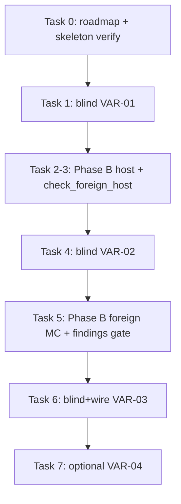

# Independent Component Variants Implementation Plan

> **For agentic workers:** REQUIRED SUB-SKILL: Use superpowers:subagent-driven-development (recommended) or superpowers:executing-plans to implement this plan task-by-task. Steps use checkbox (`- [ ]`) syntax for tracking.

**Goal:** Prove each shipped plugin works against skeleton-blind foreign counterparts (and our host against adversarial plugins) via a test-only `skeleton_host` plus fixture `.so`s under `Simulator/tests/`, without softening assertions to match our current code.

**Architecture:** Blind-author each variant in an `ex_3_skeleton`-rooted Cursor window into `ex_3_skeleton/blind_deliverables/`; Phase B copies those sources into `Drone-Mapper-ex3/Simulator/tests/`, wires CMake (`PREFIX ""` fixtures, `ENABLE_EXPORTS` host with **its own** registration ctor bodies — never our `simulator_registration`), and adds `check_*.sh` scripts. VAR-02 findings stop for human review before any production Algorithm/MissionControl fix.

**Tech Stack:** C++20, CMake, `common::common` + yaml-cpp + TinyNPY + `${CMAKE_DL_LIBS}`, Docker `drone-mapper-ex3-dev`, bash black-box scripts, staff `inputs/` YAML + `.npy`.

## Global Constraints

- **Execution gate:** Roadmap half **cleared 2026-08-28** (`docs/instructor-test-catalog-followup-roadmap.md` Points 1–4 done, including Point 2 Tasks 4–8 and Point 4). Task 0 Step 1 is satisfied; still run Task 0 Step 2 (`verify-interfaces-vs-skeleton`) before Task 1. Do **not** start Task 1 until that skeleton verify passes.
- Never edit `common/`, `Simulator/common_simulator/`, or `MissionControl/common_mission_control/`.
- Blind windows must not open or paste from `Drone-Mapper-ex3` sources/docs/rules.
- Host fakes named `HostMap3D`, `HostLidar`, `HostGPS`, `HostMovement` — never `Mock*` (ZIP-13 grep).
- Fixture `.so`s: `SHARED`, `PREFIX ""`, link `common::common` only; registration ctor symbol stays undefined in the `.so`.
- Host: `ENABLE_EXPORTS ON`; own `MappingAlgorithmRegistration` / `MissionControlRegistration` `.cpp`; do **not** link `$<TARGET_OBJECTS:simulator_registration>`.
- No `new`/`delete` in C++; no `exit()`/`abort()` in product/host code (scripts may `exit 1` on assert).
- Build/run black-box checks in Docker (`drone-mapper-ex3-dev`), not Windows-native toolchain.
- Branch from updated `main`; kebab-case name with no workplan codes/owner names; **propose each commit and wait for human approval** (`.cursor/rules/git-workflow.mdc`).
- Do not assert specific score numbers. Do not invent bug-injection ceremony.
- Spec correction: frozen `AlgorithmStatus` has **no** `Error` enumerator (`Working` / `Finished` / `FinishedWithUnmappableVoxels` only). VAR-03 “algorithm error” = throw from `nextStep`, or never `Finished` (max-steps), not a nonexistent status.
- Out of scope: re-doing catalog Tasks 4–8 / Point 4; cross-team physical `.so` swap; second real Simulator.


## Investigation findings (do not re-derive)

1. Existing fixtures (`valid_*`, `unregistered`, `faulty_wall_algorithm_plugin`) already prove loader isolation; they are too trivial for independence / fusion-policy tests.
2. Our Algorithm plans over `MappingAlgorithmDependencies.output_map` — filled by MissionControl fusion. Foreign MC that never carves `Empty` is legal and is the highest-value VAR-02 case.
3. Registration ctor **bodies** live only in our Simulator (`MappingAlgorithmRegistration.cpp` → `PluginRegistrar`). Blind host must invent its own pending-factory singleton + ctor bodies.
4. Staff configs live under `inputs/`; `tiny_compose.yaml` already points at `small_simulation_room` + `small_mission_room` + `drone_small` + `lidar_short`. Prefer those plus at least one more staff pair (e.g. house) for multi-scenario host runs.
5. Skeleton `vcpkg.json` already has `yaml-cpp`, `tinynpy`, `mp-units`, `gtest` — blind host may use those without copying our parser code.


## File map


| Path                                                                    | Role                                                                 |
| ----------------------------------------------------------------------- | -------------------------------------------------------------------- |
| `ex_3_skeleton/blind_deliverables/var01_skeleton_host/`                 | Blind staging (VAR-01 sources + `ASSUMPTIONS.md`)                    |
| `ex_3_skeleton/blind_deliverables/var02_foreign_mission_control/`       | Blind staging (VAR-02 `.cpp` + `ASSUMPTIONS.md`)                     |
| `ex_3_skeleton/blind_deliverables/var03_adversarial/`                   | Blind staging (one `.cpp` per adversarial plugin + `ASSUMPTIONS.md`) |
| `ex_3_skeleton/blind_deliverables/var04_baseline_algorithm/`            | Blind staging (optional lawnmower/frontier-lite + `ASSUMPTIONS.md`)  |
| `Simulator/tests/hosts/skeleton_host/`                                  | Phase B copy of VAR-01 (Host* classes, loaders, main, registration)  |
| `Simulator/tests/fixtures/foreign_hits_only_mission_control_plugin.cpp` | Phase B copy of VAR-02                                               |
| `Simulator/tests/fixtures/adversarial_*.cpp`                            | Phase B copies of VAR-03                                             |
| `Simulator/tests/fixtures/baseline_lawnmower_algorithm_plugin.cpp`      | Phase B copy of VAR-04 (optional)                                    |
| `Simulator/CMakeLists.txt`                                              | `skeleton_host` exe + new SHARED fixtures + `add_dependencies`       |
| `Simulator/tests/manual/check_foreign_host.sh`                          | VAR-01 black-box                                                     |
| `Simulator/tests/manual/check_foreign_mission_control.sh`               | VAR-02 black-box + findings dump                                     |
| `Simulator/tests/manual/check_adversarial_plugins.sh`                   | VAR-03 black-box                                                     |
| `Simulator/tests/manual/check_baseline_algorithm.sh`                    | VAR-04 black-box (optional)                                          |
| `Simulator/tests/manual/run_all.sh`                                     | Include new scripts (optional ones behind comment or always-on)      |
| `Simulator/tests/manual/README.md`                                      | One-line notes                                                       |
| `docs/known-issues.md`                                                  | Only if human chooses Known Issues for a VAR-02 finding              |





---


### Task 0: Execution gate — roadmap finished + skeleton interfaces verified

**Files:**

- Verify only: `docs/instructor-test-catalog-followup-roadmap.md`
- Run: `.cursor/skills/verify-interfaces-vs-skeleton/SKILL.md` (no code edits unless drift found)

**Interfaces:**

- Consumes: roadmap status; local `../ex_3_skeleton` vs our frozen headers
- Produces: written confirmation in the chat that gate passed (required before Task 1)

- [x] **Step 1: Confirm roadmap is finished**

Read `docs/instructor-test-catalog-followup-roadmap.md` header/status. Point 2 Tasks 4–8 and Point 4 must be done (or explicitly marked cancelled with human sign-off). If still open, **stop** — do not continue this plan.

**2026-08-28:** roadmap Points 1–4 marked done (Point 2 through Tasks 1–8 + full `run_all.sh`; Point 4 = `verify-instructor-test-catalog`). Step 1 **passed**.

- [x] **Step 2: Verify frozen headers vs skeleton**

Invoke `verify-interfaces-vs-skeleton` (or the skill’s documented procedure). Expected: no signature/member drift between our `common/`, `Simulator/common_simulator/`, `MissionControl/common_mission_control/` and a freshly updated `ex_3_skeleton`. If drift exists, fix/sync **before** any blind authoring.

- [x] **Step 3: Create feature branch (only after Steps 1–2 pass)**

```bash
git checkout main
git pull
git checkout -b independent-component-variants
```

- [x] **Step 4: Stop — no commit required for this task**

---


### Task 1: Blind-author VAR-01 `skeleton_host` (ex_3_skeleton window)

**Files:**

- Create under `ex_3_skeleton/blind_deliverables/var01_skeleton_host/` (paths relative to skeleton root):
  - `ASSUMPTIONS.md`
  - `HostMap3D.h` / `HostMap3D.cpp`
  - `HostGPS.h` / `HostGPS.cpp`
  - `HostLidar.h` / `HostLidar.cpp`
  - `HostMovement.h` / `HostMovement.cpp`
  - `HostConfigLoad.h` / `HostConfigLoad.cpp` (YAML + `.npy` → config structs + voxel grid)
  - `HostRegistrar.h` / `HostRegistrar.cpp` (pending algorithm + mission-control factories)
  - `MappingAlgorithmRegistration.cpp`
  - `MissionControlRegistration.cpp`
  - `main.cpp`

**Interfaces:**

- Consumes: frozen headers only (`IMap3D`, `IMutableMap3D`, `IGPS`, `ILidar`, `IDroneMovement`, `IMissionControl`, `IMappingAlgorithm`, registration macros, Units/types)
- Produces: CLI:

```text
skeleton_host --algorithm=<so> --mission-control=<so> \
    --simulation=<yaml> --mission=<yaml> \
    [--drone=<yaml>] [--lidar=<yaml>]
```

- Produces: stdout summary lines (exact keys for Phase B asserts):

```text
HOST_STATUS=<Completed|MaxSteps|Error|CrashContained>
HOST_STEPS=<uint>
HOST_VOXELS_EMPTY=<uint>
HOST_VOXELS_OCCUPIED=<uint>
HOST_VOXELS_UNMAPPED=<uint>
HOST_ILLEGAL_MOVE_ATTEMPTS=<uint>
```

- [x] **Step 1: Open a Cursor window rooted at** `ex_3_skeleton` **only**

Do not open `Drone-Mapper-ex3` in that window. Do not paste production sources.

- [x] **Step 2: Paste this prompt into the blind window (verbatim)**

```text
You are authoring a TEST-ONLY foreign simulator host for Assignment 3 plugin independence.
Workspace is ex_3_skeleton only. Do NOT look outside this folder. Do NOT invent APIs beyond
the frozen headers under common/, Simulator/common_simulator/, MissionControl/common_mission_control/.

Deliverable directory (create it):
  blind_deliverables/var01_skeleton_host/

Implement executable sources for `skeleton_host` that:
1. Parse CLI: --algorithm= --mission-control= --simulation= --mission= optional --drone= --lidar=
2. Load staff YAML configs from inputs/ (same key shapes as the YAML files under inputs/) using
   yaml-cpp. Load the simulation map .npy with TinyNPY (int8 or uint8 voxels). Do NOT copy any
   code from another team's Map3DImpl — invent HostMap3D : IMutableMap3D yourself.
3. Implement HostGPS, HostLidar (scan against the HIDDEN map), HostMovement (block wall/boundary;
   you choose throw vs failed MovementResult — document the choice in ASSUMPTIONS.md).
4. Implement HostRegistrar singleton + MappingAlgorithmRegistration.cpp and
   MissionControlRegistration.cpp ctor bodies that store pending factories (same contract as the
   published registration headers: macros construct Registration objects during dlopen).
5. dlopen both plugins with RTLD_NOW|RTLD_LOCAL, take factories, create instances with
   MappingAlgorithmDependencies / MissionControlDependencies (output_map is a separate empty
   HostMap3D sized from mission bounds + simulation offset/resolution — document how you size it).
6. Call missionControl->runMission(). Catch std::exception at the boundary (do not std::terminate).
7. Print exactly these summary lines to stdout (values filled in):
   HOST_STATUS=...
   HOST_STEPS=...
   HOST_VOXELS_EMPTY=...
   HOST_VOXELS_OCCUPIED=...
   HOST_VOXELS_UNMAPPED=...
   HOST_ILLEGAL_MOVE_ATTEMPTS=...
8. Destroy plugin objects, clear factories, dlclose, return 0 from main (non-zero only for CLI
   misuse / missing files — never abort/exit).

Also write ASSUMPTIONS.md listing every semantic choice the headers left unspecified
(e.g. atVoxel out of bounds, lidar hit ordering, movement failure style, output map sizing).

Class names MUST be HostMap3D, HostGPS, HostLidar, HostMovement — never Mock*.
No new/delete. Prefer unique_ptr.
```

- [x] **Step 3: Confirm blind deliverable exists**

From the skeleton root, list:

```bash
ls blind_deliverables/var01_skeleton_host/
```

Expected: the files listed above, including a non-empty `ASSUMPTIONS.md`.

- [x] **Step 4: Do not commit from the skeleton window into Drone-Mapper-ex3 yet**

Blind sources stay under `ex_3_skeleton/blind_deliverables/` until Phase B copies them. If the skeleton repo is separate git, commit there only if you want a local backup — Drone-Mapper-ex3 commits happen in Task 2+.

---


### Task 2: Phase B — wire `skeleton_host` into Simulator CMake and copy sources

**Files:**

- Create: `Simulator/tests/hosts/skeleton_host/*` (copy from `../ex_3_skeleton/blind_deliverables/var01_skeleton_host/`)
- Modify: `Simulator/CMakeLists.txt` (add `skeleton_host` target after existing fixture block)

**Interfaces:**

- Consumes: blind VAR-01 sources
- Produces: `${BUILD_DIR}/Simulator/tests/hosts/skeleton_host` or `${BUILD_DIR}/Simulator/skeleton_host` executable (pick one path and keep scripts consistent — plan uses `${BUILD_DIR}/Simulator/skeleton_host`)

- [ ] **Step 1: Copy blind sources into the repo**

```bash
mkdir -p Simulator/tests/hosts/skeleton_host
cp -r ../ex_3_skeleton/blind_deliverables/var01_skeleton_host/* \
  Simulator/tests/hosts/skeleton_host/
```

Adjust paths if this repo’s sibling skeleton folder differs; keep ASSUMPTIONS.md in the copy.

- [ ] **Step 2: Add CMake target (append near the end of** `Simulator/CMakeLists.txt`**, after fixtures)**

```cmake
# Test-only foreign host (never shipped). Own registration bodies — do NOT link
# simulator_registration OBJECT (must not share our PluginRegistrar).
set(SKELETON_HOST_DIR "${CMAKE_CURRENT_SOURCE_DIR}/tests/hosts/skeleton_host")
add_executable(skeleton_host
    ${SKELETON_HOST_DIR}/main.cpp
    ${SKELETON_HOST_DIR}/HostMap3D.cpp
    ${SKELETON_HOST_DIR}/HostGPS.cpp
    ${SKELETON_HOST_DIR}/HostLidar.cpp
    ${SKELETON_HOST_DIR}/HostMovement.cpp
    ${SKELETON_HOST_DIR}/HostConfigLoad.cpp
    ${SKELETON_HOST_DIR}/HostRegistrar.cpp
    ${SKELETON_HOST_DIR}/MappingAlgorithmRegistration.cpp
    ${SKELETON_HOST_DIR}/MissionControlRegistration.cpp
)
set_target_properties(skeleton_host PROPERTIES
    ENABLE_EXPORTS ON
    RUNTIME_OUTPUT_DIRECTORY "${CMAKE_CURRENT_BINARY_DIR}"
)
target_include_directories(skeleton_host PRIVATE
    ${SKELETON_HOST_DIR}
    ${CMAKE_CURRENT_SOURCE_DIR}/common_simulator/include
    ${CMAKE_SOURCE_DIR}/MissionControl/common_mission_control/include
)
target_link_libraries(skeleton_host PRIVATE
    common::common
    TinyNPY::TinyNPY
    yaml-cpp::yaml-cpp
    ${CMAKE_DL_LIBS}
)
drone_warnings(skeleton_host)
```

If blind file names differ, rename CMake entries to match the actual deliverable — do not rewrite host logic to match our Map3DImpl.

- [ ] **Step 3: Build in Docker — expect SUCCESS**

```bash
docker run --rm -e VCPKG_ROOT=/usr/local/vcpkg \
  -v "${PWD}:/work" -w /work drone-mapper-ex3-dev bash -lc '
  set -euo pipefail
  cmake --preset default
  cmake --build --preset default --target skeleton_host \
    Algorithm_207190406_209543255 MissionControl_207190406_209543255
  test -x build/default/Simulator/skeleton_host
'
```

Expected: binary exists. If compile fails on missing files, fix CMake file list to match blind deliverable names only.

- [ ] **Step 4: Propose commit (wait for human approval)**

```bash
git add Simulator/tests/hosts/skeleton_host Simulator/CMakeLists.txt
git commit -m "$(cat <<'EOF'
feat: add skeleton_host foreign plugin driver for independence tests

EOF
)"
```

---


### Task 3: Black-box `check_foreign_host.sh` (VAR-01)

**Files:**

- Create: `Simulator/tests/manual/check_foreign_host.sh`
- Modify: `Simulator/tests/manual/run_all.sh`
- Modify: `Simulator/tests/manual/README.md`

**Interfaces:**

- Consumes: `skeleton_host`, our `Algorithm_*.so`, our `MissionControl_*.so`, staff inputs
- Produces: PASS if both plugins survive ≥2 staff scenarios without crash / illegal move into host-Occupied

- [ ] **Step 1: Write the check script**

Create `Simulator/tests/manual/check_foreign_host.sh`:

```bash
#!/usr/bin/env bash
# VAR-01: our plugins under blind skeleton_host on staff inputs maps.
set -euo pipefail

REPO_ROOT="$(cd "$(dirname "${BASH_SOURCE[0]}")/../../.." && pwd)"
BUILD_DIR="${1:-${REPO_ROOT}/build/default}"
HOST="${BUILD_DIR}/Simulator/skeleton_host"
ALGO="${BUILD_DIR}/Algorithm/Algorithm_207190406_209543255.so"
MC="${BUILD_DIR}/MissionControl/MissionControl_207190406_209543255.so"
INPUTS="${REPO_ROOT}/inputs"

[ -x "$HOST" ] || { echo "FAIL: missing $HOST" >&2; exit 1; }
[ -f "$ALGO" ] || { echo "FAIL: missing $ALGO" >&2; exit 1; }
[ -f "$MC" ] || { echo "FAIL: missing $MC" >&2; exit 1; }

run_one() {
  local name="$1" sim="$2" mission="$3" drone="$4" lidar="$5"
  echo "=== foreign host scenario: ${name} ==="
  set +e
  out=$("$HOST" \
    --algorithm="$ALGO" \
    --mission-control="$MC" \
    --simulation="$sim" \
    --mission="$mission" \
    --drone="$drone" \
    --lidar="$lidar" 2>&1)
  code=$?
  set -e
  echo "$out"
  if [ "$code" -ge 128 ]; then
    echo "FAIL: skeleton_host crashed on ${name} (signal $((code - 128)))" >&2
    exit 1
  fi
  echo "$out" | grep -q '^HOST_STATUS=' \
    || { echo "FAIL: ${name}: missing HOST_STATUS" >&2; exit 1; }
  echo "$out" | grep -q '^HOST_ILLEGAL_MOVE_ATTEMPTS=0$' \
    || { echo "FAIL: ${name}: illegal move into Occupied (HOST_ILLEGAL_MOVE_ATTEMPTS != 0)" >&2; exit 1; }
  status=$(echo "$out" | sed -n 's/^HOST_STATUS=//p' | tail -n1)
  case "$status" in
    Completed|MaxSteps|Error|CrashContained) ;;
    *) echo "FAIL: ${name}: unexpected HOST_STATUS=${status}" >&2; exit 1 ;;
  esac
}

run_one small_room \
  "${INPUTS}/simulation/small_simulation_room.yaml" \
  "${INPUTS}/mission/small_mission_room.yaml" \
  "${INPUTS}/drone/drone_small.yaml" \
  "${INPUTS}/lidar/lidar_short.yaml"

run_one house_lower \
  "${INPUTS}/simulation/house_simulation.yaml" \
  "${INPUTS}/mission/house_mission_lower.yaml" \
  "${INPUTS}/drone/drone_small.yaml" \
  "${INPUTS}/lidar/lidar_short.yaml"

echo "PASS: check_foreign_host"
```

- [ ] **Step 2: chmod + wire into** `run_all.sh`

Add before the final echo in `run_all.sh`:

```bash
"${ROOT}/check_foreign_host.sh" "${BUILD_DIR}"
```

Add a one-line note to `Simulator/tests/manual/README.md`.

- [ ] **Step 3: Run in Docker — expect PASS (or real finding)**

```bash
docker run --rm -e VCPKG_ROOT=/usr/local/vcpkg \
  -v "${PWD}:/work" -w /work drone-mapper-ex3-dev bash -lc '
  set -euo pipefail
  cmake --build --preset default --target skeleton_host \
    Algorithm_207190406_209543255 MissionControl_207190406_209543255
  bash Simulator/tests/manual/check_foreign_host.sh build/default
'
```

If this fails because our plugins depend on our Map3DImpl semantics: **do not soften the script**. Record the failure for human review (same spirit as VAR-02 findings gate); production fixes only after approval.

- [ ] **Step 4: Propose commit (wait for human approval)**

```bash
git add Simulator/tests/manual/check_foreign_host.sh \
  Simulator/tests/manual/run_all.sh Simulator/tests/manual/README.md
git commit -m "$(cat <<'EOF'
test: black-box our plugins under skeleton_host on staff maps

EOF
)"
```

---


### Task 4: Blind-author VAR-02 foreign MissionControl (ex_3_skeleton window)

**Files:**

- Create: `ex_3_skeleton/blind_deliverables/var02_foreign_mission_control/foreign_hits_only_mission_control_plugin.cpp`
- Create: `ex_3_skeleton/blind_deliverables/var02_foreign_mission_control/ASSUMPTIONS.md`

**Interfaces:**

- Consumes: `IMissionControl`, `MissionControlDependencies`, `REGISTER_MISSION_CONTROL`, sensors/map interfaces
- Produces: one `.so` source that:
  1. Writes **only** lidar hits as `Occupied` on `output_map` (no Empty ray-carve)
  2. Performs **exactly one** scan per step (no scan batching)
  3. Passes `latest_scan = nullptr` on every `mapping_algorithm.nextStep(...)`
  4. Uses coarser effective mapping (e.g. skip writing some hits, or only write every Nth voxel — document in ASSUMPTIONS.md)

- [ ] **Step 1: Fresh blind Cursor window at** `ex_3_skeleton`

Do not reuse a chat that already saw Phase B / our sources.

- [ ] **Step 2: Paste this prompt (verbatim)**

```text
Author a TEST-ONLY MissionControl plugin for Assignment 3 independence testing.
Workspace: ex_3_skeleton only. Output:
  blind_deliverables/var02_foreign_mission_control/foreign_hits_only_mission_control_plugin.cpp
  blind_deliverables/var02_foreign_mission_control/ASSUMPTIONS.md

Requirements (legal but unlike a free-space-carving host):
- class registered with REGISTER_MISSION_CONTROL
- runMission() loops calling mapping_algorithm.nextStep(state, nullptr) ALWAYS
  (never pass a non-null latest_scan pointer)
- at most one lidar.scan(...) per mission step; never batch multiple scans in one step
- on scan: for each LidarHit, output_map.set(hit_world_position, Occupied) ONLY
  — do NOT mark Empty along the beam
- stop on AlgorithmStatus::Finished or FinishedWithUnmappableVoxels, or when steps
  reach mission_config.max_steps → MissionRunStatus::MaxSteps
- catch exceptions from movement if you choose; document choice
- no new/delete; unique_ptr OK

Document all assumptions in ASSUMPTIONS.md.
```

- [ ] **Step 3: Confirm deliverable files exist**

```bash
ls ex_3_skeleton/blind_deliverables/var02_foreign_mission_control/
```

---


### Task 5: Phase B — wire foreign MC, black-box check, findings gate

**Files:**

- Create: `Simulator/tests/fixtures/foreign_hits_only_mission_control_plugin.cpp` (copy)
- Create: `Simulator/tests/manual/check_foreign_mission_control.sh`
- Modify: `Simulator/CMakeLists.txt`
- Modify: `Simulator/tests/manual/run_all.sh`, `README.md`
- Maybe later: Algorithm sources / `docs/known-issues.md` (only after human decision)

**Interfaces:**

- Consumes: foreign MC `.so`, our Algorithm, our simulator `-competition` OR `skeleton_host`
- Produces: stdout/report dump for findings review; **no automatic production fix**

- [ ] **Step 1: Copy fixture + CMake SHARED target**

```bash
cp ../ex_3_skeleton/blind_deliverables/var02_foreign_mission_control/foreign_hits_only_mission_control_plugin.cpp \
  Simulator/tests/fixtures/
```

Add to `Simulator/CMakeLists.txt` next to other fixtures:

```cmake
add_library(foreign_hits_only_mission_control_plugin SHARED
    tests/fixtures/foreign_hits_only_mission_control_plugin.cpp
)
set_target_properties(foreign_hits_only_mission_control_plugin PROPERTIES
    PREFIX ""
    LIBRARY_OUTPUT_DIRECTORY "${PLUGIN_FIXTURES_OUT}"
)
target_link_libraries(foreign_hits_only_mission_control_plugin PRIVATE common::common)
drone_warnings(foreign_hits_only_mission_control_plugin)
add_dependencies(simulator_207190406_209543255 foreign_hits_only_mission_control_plugin)
```

- [ ] **Step 2: Write** `check_foreign_mission_control.sh`

```bash
#!/usr/bin/env bash
# VAR-02: our Algorithm under foreign hits-only MissionControl (competition path).
# Diagnostic: dumps coverage evidence; does NOT auto-fail on low score.
set -euo pipefail

REPO_ROOT="$(cd "$(dirname "${BASH_SOURCE[0]}")/../../.." && pwd)"
BUILD_DIR="${1:-${REPO_ROOT}/build/default}"
SIM="${BUILD_DIR}/Simulator/simulator_207190406_209543255"
HOST="${BUILD_DIR}/Simulator/skeleton_host"
ALGO="${BUILD_DIR}/Algorithm/Algorithm_207190406_209543255.so"
FOREIGN_MC="${BUILD_DIR}/Simulator/tests/fixtures/foreign_hits_only_mission_control_plugin.so"
INPUTS="${REPO_ROOT}/inputs"
COMPOSE="${REPO_ROOT}/Simulator/tests/fixtures/tiny_compose.yaml"
SCRATCH="/tmp/ex3_verify/foreign_mc"
FINDINGS="/tmp/ex3_verify/foreign_mc_findings.txt"

[ -f "$FOREIGN_MC" ] || { echo "FAIL: missing $FOREIGN_MC" >&2; exit 1; }

rm -rf "${SCRATCH}"
mkdir -p "${SCRATCH}/algorithms"
cp "$ALGO" "${SCRATCH}/algorithms/"

set +e
"$SIM" -competition \
  simulation="${COMPOSE}" \
  mission_control="${FOREIGN_MC}" \
  algorithms_folder="${SCRATCH}/algorithms" >"${SCRATCH}/sim_stdout.txt" 2>"${SCRATCH}/sim_stderr.txt"
sim_code=$?
set -e

if [ "$sim_code" -ge 128 ]; then
  echo "FAIL: simulator crashed under foreign MC" >&2
  exit 1
fi

report=$(find "${SCRATCH}/algorithms"/competition_* -maxdepth 1 -name 'competitive_report.yaml' | sort | tail -n1)
{
  echo "=== VAR-02 findings $(date -u +%Y-%m-%dT%H:%M:%SZ) ==="
  echo "sim_exit=${sim_code}"
  echo "report=${report}"
  [ -n "$report" ] && cat "$report"
  echo "--- stderr ---"
  cat "${SCRATCH}/sim_stderr.txt"
  echo "--- host cross-check (if skeleton_host present) ---"
  if [ -x "$HOST" ]; then
    "$HOST" \
      --algorithm="$ALGO" \
      --mission-control="$FOREIGN_MC" \
      --simulation="${INPUTS}/simulation/small_simulation_room.yaml" \
      --mission="${INPUTS}/mission/small_mission_room.yaml" \
      --drone="${INPUTS}/drone/drone_small.yaml" \
      --lidar="${INPUTS}/lidar/lidar_short.yaml" || true
  fi
} | tee "$FINDINGS"

echo "FINDINGS written to ${FINDINGS}"
echo "STOP: present findings to human before any Algorithm/MissionControl production fix."
echo "PASS: check_foreign_mission_control (diagnostic completed; crash-free)"
```

Hard requirements this script **must** enforce: no crash (`exit < 128`). Coverage collapse is reported in findings, not auto-graded as FAIL.

- [ ] **Step 3: Run script; present findings; wait for human**

Paste `/tmp/ex3_verify/foreign_mc_findings.txt` (or Docker-equivalent path) into chat. For each issue list: symptom, which foreign behavior likely caused it, evidence. Human chooses **fix** or **Known Issues row** per finding. **Do not implement production fixes in this step.**

- [ ] **Step 4: Only if human approved fixes — implement them in a follow-up commit on this branch**

Otherwise add Known Issues via `populate-known-issues` skill, or skip.

- [ ] **Step 5: Wire** `run_all.sh` **+ propose commit for harness only (wait for approval)**

```bash
git add Simulator/tests/fixtures/foreign_hits_only_mission_control_plugin.cpp \
  Simulator/CMakeLists.txt \
  Simulator/tests/manual/check_foreign_mission_control.sh \
  Simulator/tests/manual/run_all.sh Simulator/tests/manual/README.md
git commit -m "$(cat <<'EOF'
test: exercise our Algorithm under foreign hits-only MissionControl

EOF
)"
```

Production Algorithm/MissionControl fixes (if any) are **separate** commits after human approval.

---


### Task 6: VAR-03 adversarial plugins (blind + Phase B)

**Files:**

- Blind create under `ex_3_skeleton/blind_deliverables/var03_adversarial/`:
  - `adversarial_throw_algorithm_plugin.cpp`
  - `adversarial_never_finish_algorithm_plugin.cpp`
  - `adversarial_into_occupied_algorithm_plugin.cpp`
  - `adversarial_bad_scan_orientation_algorithm_plugin.cpp`
  - `adversarial_throw_mission_control_plugin.cpp`
  - `adversarial_empty_mission_control_plugin.cpp`
  - `adversarial_implausible_steps_mission_control_plugin.cpp`
  - `ASSUMPTIONS.md`
- Phase B copies into `Simulator/tests/fixtures/`
- Create: `Simulator/tests/manual/check_adversarial_plugins.sh`
- Modify: `Simulator/CMakeLists.txt`, `run_all.sh`, `README.md`

**Interfaces:**

- Algorithm behaviors (skeleton-correct):
  - throw from `nextStep`
  - never return `Finished` / `FinishedWithUnmappableVoxels` (max-steps)
  - request `Advance` into a voxel `output_map` already reports `Occupied` (if none Occupied yet, Advance aggressively until host/map blocks — document)
  - request `scan_orientation` with absurd angles (e.g. altitude ±180°)
- MissionControl behaviors:
  - throw from `runMission`
  - return immediately with default/`Completed` and steps 0 (empty)
  - return `MissionRunStatus::Error` with `steps = 999999` (implausible)

**Note:** Skip inventing `AlgorithmStatus::Error` — it does not exist in frozen headers.

- [ ] **Step 1: Blind window prompt**

```text
Author TEST-ONLY adversarial plugins under
  blind_deliverables/var03_adversarial/
One .cpp per behavior (names below). Each uses REGISTER_* macros.
Algorithms:
  adversarial_throw_algorithm_plugin.cpp — throw std::runtime_error from nextStep
  adversarial_never_finish_algorithm_plugin.cpp — always Working + Hover
  adversarial_into_occupied_algorithm_plugin.cpp — if any Occupied in output_map bounds,
    Advance toward it; else Advance max_advance repeatedly
  adversarial_bad_scan_orientation_algorithm_plugin.cpp — scan_orientation with extreme angles
MissionControls:
  adversarial_throw_mission_control_plugin.cpp — throw from runMission
  adversarial_empty_mission_control_plugin.cpp — return Completed, steps 0 immediately
  adversarial_implausible_steps_mission_control_plugin.cpp — return Error, steps=999999
Also ASSUMPTIONS.md. Workspace: ex_3_skeleton only.
```

- [ ] **Step 2: Phase B — CMake for each SHARED lib**

For each plugin `NAME`, mirror:

```cmake
add_library(NAME SHARED tests/fixtures/NAME.cpp)
set_target_properties(NAME PROPERTIES PREFIX "" LIBRARY_OUTPUT_DIRECTORY "${PLUGIN_FIXTURES_OUT}")
target_link_libraries(NAME PRIVATE common::common)  # omit for unregistered-style if unused
drone_warnings(NAME)
add_dependencies(simulator_207190406_209543255 NAME)
```

(MissionControl fixtures link `common::common`; same pattern as `valid_mission_control_plugin`.)

- [ ] **Step 3: Write** `check_adversarial_plugins.sh`

Pattern (repeat per plugin; use `tiny_compose.yaml`):

```bash
#!/usr/bin/env bash
set -euo pipefail
REPO_ROOT="$(cd "$(dirname "${BASH_SOURCE[0]}")/../../.." && pwd)"
BUILD_DIR="${1:-${REPO_ROOT}/build/default}"
SIM="${BUILD_DIR}/Simulator/simulator_207190406_209543255"
FIXTURES="${BUILD_DIR}/Simulator/tests/fixtures"
MC_OURS="${BUILD_DIR}/MissionControl/MissionControl_207190406_209543255.so"
ALGO_OURS="${BUILD_DIR}/Algorithm/Algorithm_207190406_209543255.so"
COMPOSE="${REPO_ROOT}/Simulator/tests/fixtures/tiny_compose.yaml"
SCRATCH="/tmp/ex3_verify/adversarial"

assert_no_crash() {
  local code="$1" label="$2"
  if [ "$code" -ge 128 ]; then
    echo "FAIL: ${label} crashed (signal $((code - 128)))" >&2
    exit 1
  fi
}

run_competition_with_algo() {
  local so="$1" label="$2"
  rm -rf "${SCRATCH}/${label}"
  mkdir -p "${SCRATCH}/${label}/algorithms"
  cp "${FIXTURES}/${so}" "${SCRATCH}/${label}/algorithms/"
  set +e
  "$SIM" -competition \
    simulation="${COMPOSE}" \
    mission_control="${MC_OURS}" \
    algorithms_folder="${SCRATCH}/${label}/algorithms"
  local code=$?
  set -e
  assert_no_crash "$code" "$label"
}

run_comparative_with_mc() {
  local so="$1" label="$2"
  rm -rf "${SCRATCH}/${label}"
  mkdir -p "${SCRATCH}/${label}/mission_controls"
  cp "${FIXTURES}/${so}" "${SCRATCH}/${label}/mission_controls/"
  set +e
  "$SIM" -comparative \
    simulation="${COMPOSE}" \
    mission_control_folder="${SCRATCH}/${label}/mission_controls" \
    algorithm="${ALGO_OURS}"
  local code=$?
  set -e
  assert_no_crash "$code" "$label"
  report=$(find "${SCRATCH}/${label}/mission_controls"/comparative_results_* \
    -maxdepth 1 -name 'comparative_report.yaml' | sort | tail -n1)
  # Load/run failures should appear in errors: for throw/unloadable cases;
  # empty/implausible may still produce a results_summary entry — assert no crash only
  # plus report file exists.
  [ -n "$report" ] || { echo "FAIL: ${label}: missing comparative_report" >&2; exit 1; }
}

run_competition_with_algo adversarial_throw_algorithm_plugin.so throw_algo
run_competition_with_algo adversarial_never_finish_algorithm_plugin.so never_finish
run_competition_with_algo adversarial_into_occupied_algorithm_plugin.so into_occ
run_competition_with_algo adversarial_bad_scan_orientation_algorithm_plugin.so bad_scan

run_comparative_with_mc adversarial_throw_mission_control_plugin.so throw_mc
run_comparative_with_mc adversarial_empty_mission_control_plugin.so empty_mc
run_comparative_with_mc adversarial_implausible_steps_mission_control_plugin.so implausible_mc

echo "PASS: check_adversarial_plugins"
```

Tighten per-plugin asserts only where behavior is definite (e.g. throw → `errors:` contains the `.so` name **or** score `-1` in per-plugin YAML — inspect one real run and lock the stronger assert that matches actual containment without softening).

- [ ] **Step 4: Docker run + propose commit (wait for approval)**

```bash
git add Simulator/tests/fixtures/adversarial_*.cpp Simulator/CMakeLists.txt \
  Simulator/tests/manual/check_adversarial_plugins.sh \
  Simulator/tests/manual/run_all.sh Simulator/tests/manual/README.md
git commit -m "$(cat <<'EOF'
test: adversarial plugin fixtures for black-box containment

EOF
)"
```

---


### Task 7 (optional): VAR-04 baseline lawnmower algorithm

**Cut first if time is short** (after packaging is safe per spec). Skip entirely if Sep 6 pressure is high.

**Files:**

- Blind: `ex_3_skeleton/blind_deliverables/var04_baseline_algorithm/baseline_lawnmower_algorithm_plugin.cpp` + `ASSUMPTIONS.md`
- Phase B: `Simulator/tests/fixtures/baseline_lawnmower_algorithm_plugin.cpp`
- Create: `Simulator/tests/manual/check_baseline_algorithm.sh`
- Modify: CMake, `run_all.sh`

**Interfaces:**

- Blind lawnmower / frontier-lite `IMappingAlgorithm` that eventually `Finished` on small_room
- Competition folder: our Algorithm + baseline → report mentions both; no crash; both get output YAML

- [ ] **Step 1: Blind prompt**

```text
Author baseline_lawnmower_algorithm_plugin.cpp under
blind_deliverables/var04_baseline_algorithm/ using REGISTER_MAPPING_ALGORITHM.
Simple deterministic exploration (lawnmower or frontier-lite) using only IMap3D
read access + configs. Must eventually return Finished or FinishedWithUnmappableVoxels
on a small bounded mission. ASSUMPTIONS.md required. ex_3_skeleton workspace only.
```

- [ ] **Step 2: Phase B SHARED target + check script**

```bash
#!/usr/bin/env bash
set -euo pipefail
REPO_ROOT="$(cd "$(dirname "${BASH_SOURCE[0]}")/../../.." && pwd)"
BUILD_DIR="${1:-${REPO_ROOT}/build/default}"
SIM="${BUILD_DIR}/Simulator/simulator_207190406_209543255"
MC="${BUILD_DIR}/MissionControl/MissionControl_207190406_209543255.so"
ALGO="${BUILD_DIR}/Algorithm/Algorithm_207190406_209543255.so"
BASE="${BUILD_DIR}/Simulator/tests/fixtures/baseline_lawnmower_algorithm_plugin.so"
COMPOSE="${REPO_ROOT}/Simulator/tests/fixtures/tiny_compose.yaml"
SCRATCH="/tmp/ex3_verify/baseline"

rm -rf "$SCRATCH"
mkdir -p "${SCRATCH}/algorithms"
cp "$ALGO" "$BASE" "${SCRATCH}/algorithms/"

set +e
"$SIM" -competition \
  simulation="${COMPOSE}" \
  mission_control="${MC}" \
  algorithms_folder="${SCRATCH}/algorithms"
code=$?
set -e
[ "$code" -lt 128 ] || { echo "FAIL: crash" >&2; exit 1; }
report=$(find "${SCRATCH}/algorithms"/competition_* -maxdepth 1 -name 'competitive_report.yaml' | sort | tail -n1)
grep -q 'Algorithm_207190406_209543255.so' "$report"
grep -q 'baseline_lawnmower_algorithm_plugin.so' "$report"
echo "PASS: check_baseline_algorithm"
```

- [ ] **Step 3: Propose commit (wait for approval)**

```bash
git commit -m "$(cat <<'EOF'
test: baseline lawnmower algorithm fixture for competition cross-check

EOF
)"
```

---


## Self-review

**Spec coverage**


| Spec item                                                | Task                            |
| -------------------------------------------------------- | ------------------------------- |
| Roadmap prerequisite before execution                    | Task 0                          |
| verify-interfaces-vs-skeleton                            | Task 0                          |
| Single host under `Simulator/tests/hosts/skeleton_host/` | Tasks 1–2                       |
| Staff `inputs/` maps (several)                           | Task 3                          |
| Own registration bodies / no our registrar               | Task 1–2                        |
| Host* naming / ZIP-13                                    | Task 1 prompt                   |
| Blind then Phase B single-PC windows                     | Tasks 1/4 vs 2/5                |
| VAR-02 hits-only / no batch / nullptr scan / coarser     | Task 4–5                        |
| Findings gate before production fix                      | Task 5 Steps 3–4                |
| VAR-03 adversarial set                                   | Task 6 (status Error corrected) |
| VAR-04 optional                                          | Task 7                          |
| `check_*.sh` + `run_all.sh`                              | Tasks 3, 5, 6, 7                |
| No score assertions                                      | All check scripts               |


**Placeholder scan:** none intentional; CMake file lists may need renaming to match blind deliverable filenames (called out explicitly).

**Type consistency:** `HOST_`* summary keys shared by Task 1 and Task 3; fixture target names shared by Tasks 5–7 and scripts.

---


## Execution handoff

Plan complete and saved to `docs/superpowers/plans/2026-08-28-independent-component-variants.md`.

**Roadmap half of Task 0 passed 2026-08-28.** Do not start Task 1 until Task 0 Step 2 (skeleton interface verify) also passes.

Two execution options when ready:

1. **Subagent-Driven (recommended)** — fresh subagent per task, review between tasks
2. **Inline Execution** — execute in this session with executing-plans checkpoints

Which approach?