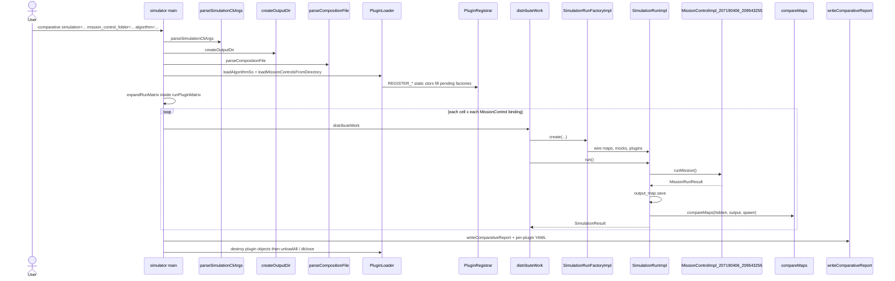

# Fix AdvCpp Rubric Findings Implementation Plan

> **For agentic workers:** REQUIRED SUB-SKILL: Use superpowers:subagent-driven-development (recommended) or superpowers:executing-plans to implement this plan task-by-task. Steps use checkbox (`- [ ]`) syntax for tracking.

**Goal:** Clear every site in `docs/advcpp-rubric-review.md` (combined table plus the 2026-09-02 new sites) without changing frozen headers, plugin isolation, or mapping scores/runtime, then re-run `advcpp-rubric-review` to confirm the table is empty of those sites.

**Architecture:** Shared quantity/sphere/miss helpers land in `UserCommon/` first, then Simulator mocks, MissionControl, and the algorithm consume them. Header/API work (I/O merge, RAII `dlopen`, free-function modules, include DAG) follows once call sites compile against the new helpers. HLD/PDF is last code-adjacent work; the final task is a four-group rubric re-review plus targeted tests (and cell-runtime after algorithm edits).

**Tech Stack:** C++20, mp-units (`common::PhysicalLength` / `Position3D` / `si::cos`), CMake presets, GTest, Docker image `drone-mapper-ex3-dev`, Mermaid CLI + Pandoc for `HLD.pdf`.

## Global Constraints

- Never edit `common/`, `Simulator/common_simulator/`, or `MissionControl/common_mission_control/` (e18). `MovementResult` stays `{bool success; std::string message;}` — e05 is solved without adding a frozen enum.
- No `new`/`delete`; no `exit()`/`abort()`. `dlclose` only after plugin objects and factories are destroyed.
- UserCommon must not `#include` Simulator headers. MissionControl/Algorithm must not `#include` Simulator implementation headers.
- `UserCommon/` has no `CMakeLists.txt`; every new `.cpp` is added to each consumer that needs it (`Algorithm/CMakeLists.txt`, `MissionControl/CMakeLists.txt`, `Simulator/CMakeLists.txt`).
- Behavior-preserving: 24/24 COMPLETED and `mission_score` bands must not regress. After Tasks 1–4, run `algorithm_test` / `test_drone_control` / `test_simulator_mocks`; after algorithm body changes, run `verify-cell-runtime` (Release, serial) before claiming done.
- Do not add a wall-clock abort in Algorithm or MissionControl.
- Git: branch from updated `main`; **do not run `git commit` until the human approves** the staged diff and message (`git-workflow.mdc`). Plan commit steps list the proposed message only.
- Build/test from repo `Drone-Mapper-ex3/` inside `drone-mapper-ex3-dev` (or equivalent Linux + `$VCPKG_ROOT` + Ninja). Host Windows is not the compiler.
- `-Wall -Wextra -Werror -pedantic` via `drone_warnings()`.
- Never put `docs/advcpp-rubric-review.md` or this plan in the submission zip.

## Scope note

This is one sequenced plan, not four independent plans: Tasks 2–4 consume Task 1 helpers, Task 6 consumes Task 5 type splits, Task 7 documents the names Task 6 produced. Do not start Task 7 until the public names in Tasks 5–6 are final.

## File map

| File | Responsibility |
|------|----------------|
| `UserCommon/include/.../LidarConstants.h` | Shared named policy quantities (miss sentinel, trace factor, cone caps, mission spans). |
| `UserCommon/include/.../BeamMath.h` + `UserCommon/src/BeamMath.cpp` | Quantity-preserving beam geometry; miss test; no `<mp-units/systems/si/math.h>` in the header. |
| `UserCommon/include/.../SimulationCoordUtil.h` + `.cpp` | Sphere-sample walk + spawn Z shift; **no** `SimulationTypes.h`. |
| `UserCommon/include/.../LidarCone.h` + `UserCommon/src/LidarCone.cpp` | Non-template cone helpers in `.cpp`; templates stay in the header. |
| `UserCommon/include/.../ConeTemplate.h` + `UserCommon/src/ConeTemplate.cpp` | Cache/stamp bodies in `.cpp`; `BeamRun` is an implementation detail. |
| `UserCommon/include/.../IRunErrorLog.h` | Also declares `currentUtcTimestamp` / `formatUtcTimestamp` (TimeFormat merged). |
| `UserCommon/src/RunErrorLog.cpp` | Pimpl `ofstream`; timestamps via `IRunErrorLog.h`. |
| `Simulator/include/Simulator/io/SimulatorPaths.h` | Path resolve + output dir + error-log-from-map + CLI parse. |
| `Simulator/include/Simulator/io/SimulatorReports.h` | Comparative / competitive / per-plugin YAML writers. |
| `Simulator/include/Simulator/RunMatrixTypes.h` | `MatrixCell`, `PluginMatrixBinding`, `PluginMatrixResult`. |
| `Simulator/include/Simulator/PluginLoadTypes.h` | `LoadedAlgorithmPlugin`, `LoadedMissionControlPlugin`, `PluginLoadOutcome`. |
| `Simulator/include/Simulator/PluginLoader.h` | RAII `DlHandle`; count/at accessors, not `const vector&`. |
| `Simulator/src/main.cpp` | Thin `main`; plugin bootstrap + report helpers in anonymous namespace. |
| `docs/hld/*.mmd`, `docs/HLD.md`, `HLD.pdf` | Class + sequence diagrams matching the post-refactor names. |
| `docs/advcpp-rubric-review.md` | Regenerated by Task 8 (not a submission file). |

Deleted after merge (replace includes, then delete the old header files):

- `UserCommon/include/.../TimeFormat.h`
- `Simulator/include/Simulator/OutputPathUtil.h`
- `Simulator/include/Simulator/io/{PathResolver,OutputDirHelper,SimulationCli,ComparativeReportWriter,CompetitiveReportWriter,SimulationOutputYamlWriter}.h`

Keep `YamlConfigParsers.h` (already a grouped parser header).

---

### Task 0: Sync `main` and create branch

**Files:** none (git only)

**Interfaces:**
- Consumes: `origin/main`
- Produces: branch `fix-advcpp-rubric-findings`

- [ ] **Step 1: Update main and branch**

```bash
cd /work   # Drone-Mapper-ex3 repo root inside the devcontainer
git fetch origin main
git checkout main
git pull --ff-only origin main
git checkout -b fix-advcpp-rubric-findings
git merge-base --is-ancestor origin/main HEAD && echo "HEAD contains origin/main"
```

Expected: prints `HEAD contains origin/main`; `git status -sb` shows `fix-advcpp-rubric-findings`.

Do not start Task 1 until this is done.

---

### Task 1: UserCommon quantity core (e03/e04/e10/e16/e17/e23 shared)

**Files:**
- Create: `UserCommon/include/user_common_207190406_209543255/LidarConstants.h`
- Create: `UserCommon/src/BeamMath.cpp`
- Create: `UserCommon/src/LidarCone.cpp`
- Create: `UserCommon/src/ConeTemplate.cpp`
- Modify: `UserCommon/include/user_common_207190406_209543255/BeamMath.h`
- Modify: `UserCommon/include/user_common_207190406_209543255/SimulationCoordUtil.h`
- Modify: `UserCommon/src/SimulationCoordUtil.cpp`
- Modify: `UserCommon/include/user_common_207190406_209543255/LidarCone.h`
- Modify: `UserCommon/include/user_common_207190406_209543255/ConeTemplate.h`
- Modify: `Algorithm/CMakeLists.txt` (add the new UserCommon `.cpp` files to `Algorithm_207190406_209543255` and `algorithm_test`)
- Modify: `MissionControl/CMakeLists.txt` (add `BeamMath.cpp`, `SimulationCoordUtil.cpp` to the `.so` and both test binaries)
- Modify: `Simulator/CMakeLists.txt` (add `BeamMath.cpp` wherever `MockLidar`/`MockMovement` compile; add `SimulationCoordUtil.cpp` already present)
- Test: `Simulator/tests/test_usercommon_simulation_coord_util.cpp`
- Test: `Algorithm/tests/test_lidar_cone.cpp`
- Test: `Algorithm/tests/test_cone_template.cpp`

**Interfaces:**
- Consumes: `common::Position3D`, `common::PhysicalLength`, `common::Orientation`, `common::IMap3D`
- Produces:
  - `inline constexpr PhysicalLength kLidarMissDistance = std::numeric_limits<double>::max() * cm;`
  - `inline constexpr double kLidarTraceResolutionFactor = 0.1;`
  - `inline constexpr double kConeWalkResolutionFactor = 0.5;`
  - `inline constexpr double kConeDirectionOverlap = 0.85;`
  - `inline constexpr std::size_t kMinSphereDirections = 6;`
  - `inline constexpr std::size_t kMaxSphereDirections = 64;`
  - `bool isMissDistance(PhysicalLength);`
  - `Position3D pointAlongBeam(const Position3D&, const Orientation&, PhysicalLength);` (declaration only in the header)
  - `Position3D worldInitialDronePosition(Position3D local_spawn, common::ZLength map_offset_z);`
  - `template <typename Fn> void forEachSphereSample(const IMap3D&, const Position3D& center, PhysicalLength radius, Fn&&);`
  - `bool sphereHitsOccupiedOrOutOfBounds(const IMap3D&, const Position3D&, PhysicalLength);`

- [ ] **Step 1: Write the failing tests for the new UserCommon contracts**

Add to `Simulator/tests/test_usercommon_simulation_coord_util.cpp`:

```cpp
TEST(SimulationCoordUtil, WorldSpawnAddsOnlyZOffset) {
    using common::cm;
    using common::x_extent;
    using common::y_extent;
    using common::z_extent;
    const common::Position3D local{
        10.0 * x_extent[cm], 20.0 * y_extent[cm], 5.0 * z_extent[cm]};
    const common::Position3D world =
        user_common_207190406_209543255::worldInitialDronePosition(
            local, 40.0 * z_extent[cm]);
    EXPECT_EQ(world.x, local.x);
    EXPECT_EQ(world.y, local.y);
    EXPECT_EQ(world.z, 45.0 * z_extent[cm]);
}

TEST(SimulationCoordUtil, SphereWalkSkipsOutsideRadiusThenHitsOccupied) {
    FakeMap3D map(makeConfig(/*resolution_cm=*/10.0, /*max_bound_cm=*/100.0),
                  common::types::VoxelOccupancy::Empty);
    // Occupied at +20 cm on X from centre (two voxels at 10 cm resolution).
    // Use a tiny custom map if FakeMap3D is fill-only: count samples instead.
    int samples = 0;
    user_common_207190406_209543255::forEachSphereSample(
        map,
        common::Position3D{50.0 * common::x_extent[common::cm],
                           50.0 * common::y_extent[common::cm],
                           50.0 * common::z_extent[common::cm]},
        15.0 * common::cm, [&](const common::Position3D&) {
            ++samples;
            return true; // continue
        });
    EXPECT_GT(samples, 1);
}
```

Update existing `worldInitialDronePosition(simulation)` call sites in this test file to the two-argument form (the old overload must not exist).

Add to `Algorithm/tests/test_lidar_cone.cpp` (or a new `TEST` in that file):

```cpp
TEST(BeamMath, PointAlongBeamPlusXKeepsQuantityTypes) {
    using common::cm;
    using common::deg;
    using common::x_extent;
    const auto p = user_common_207190406_209543255::beam_math::pointAlongBeam(
        common::Position3D{}, common::Orientation{0.0 * deg, 0.0 * deg}, 10.0 * cm);
    EXPECT_NEAR(p.x.numerical_value_in(common::cm), 10.0, 1e-9);
    EXPECT_NEAR(p.y.numerical_value_in(common::cm), 0.0, 1e-9);
    EXPECT_NEAR(p.z.numerical_value_in(common::cm), 0.0, 1e-9);
}

TEST(BeamMath, MissDistanceUsesNamedSentinel) {
    using user_common_207190406_209543255::beam_math::isMissDistance;
    using user_common_207190406_209543255::kLidarMissDistance;
    EXPECT_TRUE(isMissDistance(kLidarMissDistance));
    EXPECT_FALSE(isMissDistance(0.0 * common::cm));
}
```

- [ ] **Step 2: Run tests to verify they fail**

```bash
cmake --build --preset default
ctest --test-dir build/default -R 'test_usercommon_simulation_coord_util|BeamMath' --output-on-failure
```

Expected: FAIL — `worldInitialDronePosition` arity mismatch and/or `kLidarMissDistance` / `forEachSphereSample` not defined.

- [ ] **Step 3: Add `LidarConstants.h`**

```cpp
#pragma once

#include <Common/Units.h>

#include <cstddef>
#include <limits>

namespace user_common_207190406_209543255 {

inline constexpr common::PhysicalLength kLidarMissDistance =
    std::numeric_limits<double>::max() * common::cm;

/// MockLidar / ScanResultToVoxels sub-voxel step = factor * map resolution.
inline constexpr double kLidarTraceResolutionFactor = 0.1;

/// Cone template / countUnresolvedVoxels walk step = factor * resolution.
inline constexpr double kConeWalkResolutionFactor = 0.5;

inline constexpr double kConeDirectionOverlap = 0.85;
inline constexpr std::size_t kMinSphereDirections = 6;
inline constexpr std::size_t kMaxSphereDirections = 64;

inline constexpr common::PhysicalLength kOpenVolumeMinSpan = 199.0 * common::cm;
inline constexpr common::PhysicalLength kSmallOutdoorMaxSpan = 250.0 * common::cm;
inline constexpr common::PhysicalLength kHouseMinXySpan = 249.0 * common::cm;
inline constexpr common::PhysicalLength kHouseMinZSpan = 99.0 * common::cm;
inline constexpr common::PhysicalLength kHouseMaxZSpan = 199.0 * common::cm;
inline constexpr common::PhysicalLength kShortRangeLidarMax = 90.0 * common::cm;
inline constexpr common::AltitudeAngle kDownwardScanThreshold = -10.0 * common::deg;

} // namespace user_common_207190406_209543255
```

- [ ] **Step 4: Rewrite `BeamMath.h` as declarations; move bodies to `BeamMath.cpp`**

Header (no `<mp-units/systems/si/math.h>`, no `<cmath>` except if `wrapDeg` stays declared):

```cpp
#pragma once

#include <user_common_207190406_209543255/LidarConstants.h>

#include <Common/Types.h>

namespace user_common_207190406_209543255::beam_math {

using common::Orientation;
using common::PhysicalLength;
using common::Position3D;

[[nodiscard]] bool isZeroDistance(PhysicalLength distance);
[[nodiscard]] bool isMissDistance(PhysicalLength distance);
[[nodiscard]] Orientation absoluteBeamOrientation(const Orientation& drone_heading,
                                                  const Orientation& relative_beam);
[[nodiscard]] Orientation normalizeOrientation(Orientation orientation);
[[nodiscard]] Position3D pointAlongBeam(const Position3D& origin,
                                        const Orientation& beam_orientation,
                                        PhysicalLength distance);

} // namespace user_common_207190406_209543255::beam_math
```

`BeamMath.cpp` — `isMissDistance` compares to `kLidarMissDistance` (no unwrapped `== max()`). `pointAlongBeam` uses `si::cos` / `si::sin` and `mp_units::quantity_cast` onto `x_extent` / `y_extent` / `z_extent` so the function never stores `double dir_x` / `distance_cm`:

```cpp
#include <user_common_207190406_209543255/BeamMath.h>

#include <mp-units/systems/si/math.h>

#include <cmath>

namespace user_common_207190406_209543255::beam_math {

namespace mp = common::mp;
namespace si = common::si;
using common::cm;
using common::deg;
using common::x_extent;
using common::y_extent;
using common::z_extent;

bool isZeroDistance(PhysicalLength distance) { return distance == 0.0 * cm; }

bool isMissDistance(PhysicalLength distance) {
    return distance == kLidarMissDistance;
}

Orientation absoluteBeamOrientation(const Orientation& drone_heading,
                                    const Orientation& relative_beam) {
    return Orientation{relative_beam.horizontal + drone_heading.horizontal,
                       relative_beam.altitude + drone_heading.altitude};
}

namespace {
[[nodiscard]] double wrapDeg(double degrees) {
    double x = std::fmod(degrees, 360.0);
    if (x <= -180.0) {
        x += 360.0;
    } else if (x > 180.0) {
        x -= 360.0;
    }
    return x;
}
} // namespace

Orientation normalizeOrientation(Orientation orientation) {
    using common::AltitudeAngle;
    using common::HorizontalAngle;
    return Orientation{
        HorizontalAngle{wrapDeg(orientation.horizontal.numerical_value_in(deg)) * deg},
        AltitudeAngle{wrapDeg(orientation.altitude.numerical_value_in(deg)) * deg},
    };
}

Position3D pointAlongBeam(const Position3D& origin, const Orientation& beam_orientation,
                          PhysicalLength distance) {
    const Orientation beam = normalizeOrientation(beam_orientation);
    const auto cos_altitude = si::cos(beam.altitude);
    const auto dx = cos_altitude * si::cos(beam.horizontal); // dimensionless
    const auto dy = cos_altitude * si::sin(beam.horizontal);
    const auto dz = si::sin(beam.altitude);
    return Position3D{
        origin.x + mp::quantity_cast<x_extent[cm]>(dx * distance),
        origin.y + mp::quantity_cast<y_extent[cm]>(dy * distance),
        origin.z + mp::quantity_cast<z_extent[cm]>(dz * distance),
    };
}

} // namespace user_common_207190406_209543255::beam_math
```

If `quantity_cast<x_extent[cm]>` fails to compile, use the equivalent `mp::quantity_cast<common::XLength::unit>(...)` form that this tree's mp-units 2.3 accepts — **do not** fall back to `force_numerical_value_in` for the step/dir multiply.

`wrapDeg` still unwraps degrees at the normalize boundary (angles are periodic); that is the allowed boundary, not beam marching.

- [ ] **Step 5: Rewrite `SimulationCoordUtil` without Simulator types**

Header:

```cpp
#pragma once

#include <Common/IMap3D.h>
#include <Common/Units.h>

namespace user_common_207190406_209543255 {

[[nodiscard]] inline common::Position3D worldInitialDronePosition(
    common::Position3D local_spawn, common::ZLength map_offset_z) {
    local_spawn.z = local_spawn.z + map_offset_z;
    return local_spawn;
}

/// Calls `fn(sample_position)` for every resolution-grid sample inside the sphere.
/// `fn` returns `false` to stop early. Does not interpret occupancy.
template <typename Fn>
void forEachSphereSample(const common::IMap3D& map, const common::Position3D& center,
                         common::PhysicalLength radius, Fn&& fn) {
    const common::types::MapConfig cfg = map.getMapConfig();
    if (cfg.resolution <= 0.0 * common::cm || radius < 0.0 * common::cm) {
        return;
    }
    const int steps = static_cast<int>(mp_units::ceil(radius / cfg.resolution));
    using common::cm;
    using common::x_extent;
    using common::y_extent;
    using common::z_extent;
    for (int dx = -steps; dx <= steps; ++dx) {
        for (int dy = -steps; dy <= steps; ++dy) {
            for (int dz = -steps; dz <= steps; ++dz) {
                const auto ox = static_cast<double>(dx) * cfg.resolution;
                const auto oy = static_cast<double>(dy) * cfg.resolution;
                const auto oz = static_cast<double>(dz) * cfg.resolution;
                if (ox * ox + oy * oy + oz * oz > radius * radius) {
                    continue;
                }
                const common::Position3D sample{
                    center.x + mp_units::quantity_cast<x_extent[cm]>(ox),
                    center.y + mp_units::quantity_cast<y_extent[cm]>(oy),
                    center.z + mp_units::quantity_cast<z_extent[cm]>(oz),
                };
                if (!fn(sample)) {
                    return;
                }
            }
        }
    }
}

[[nodiscard]] bool sphereHitsOccupiedOrOutOfBounds(const common::IMap3D& map,
                                                   const common::Position3D& center,
                                                   common::PhysicalLength radius);

[[nodiscard]] bool isDroneSpawnPassable(const common::IMap3D& hidden_map,
                                        common::PhysicalLength radius,
                                        const common::Position3D& center);

} // namespace user_common_207190406_209543255
```

`SimulationCoordUtil.cpp`:

```cpp
bool sphereHitsOccupiedOrOutOfBounds(const common::IMap3D& map,
                                     const common::Position3D& center,
                                     common::PhysicalLength radius) {
    bool hit = false;
    forEachSphereSample(map, center, radius, [&](const common::Position3D& sample) {
        if (!map.isInBounds(sample) ||
            map.atVoxel(sample) == common::types::VoxelOccupancy::Occupied) {
            hit = true;
            return false;
        }
        return true;
    });
    return hit;
}

bool isDroneSpawnPassable(const common::IMap3D& hidden_map, common::PhysicalLength radius,
                          const common::Position3D& center) {
    return !sphereHitsOccupiedOrOutOfBounds(hidden_map, center, radius);
}
```

If `mp_units::ceil(radius / cfg.resolution)` or `ox * ox` on quantities does not compile, compute `steps` as `static_cast<int>(std::ceil((radius / cfg.resolution).numerical_value_in(mp::one)))` — that unwrap is the voxel-index boundary allowed by `mp-units-strong-types.mdc`. Keep sample **positions** as `Position3D` additions, not `cx + ox` doubles.

Update every production caller of `worldInitialDronePosition(simulation)`:

```cpp
UC::worldInitialDronePosition(simulation_config.initial_drone_position,
                              simulation_config.map_offset.z);
```

in `Simulator/src/SimulationRunImpl.cpp` and `Simulator/src/SimulationRunFactoryImpl.cpp`.

- [ ] **Step 6: Move LidarCone / ConeTemplate non-template bodies to `.cpp`**

- `LidarCone.h`: keep `forEachConeBeam` and `detail::walkBeam` templates. Change `walkBeam` to take `PhysicalLength z_max` and `PhysicalLength step` (e16). Replace `0.85` / `6` / `64` / `0.5 * resolution` with `LidarConstants.h`. Move `coneHalfAngleRad`, `directionCountForHalfAngle`, `fibonacciSphereOrientations`, `countUnresolvedVoxels` to `LidarCone.cpp`. `countUnresolvedVoxels` caches `const MapConfig& config = map.getMapConfig();` once (e21).
- `ConeTemplate.h`: leave `walkTemplate` / `nearFieldContainsSolid` templates. Change `ConeTemplate::step` from `double step_cm` to `PhysicalLength step` (e16). Nested `BeamRun` / `ConeTemplate` stay as `namespace detail` types (e01/e22). Move `VoxelStamp` and `ConeTemplateCache` method bodies to `ConeTemplate.cpp`. Drop `#include <user_common_.../LidarCone.h>` from the header; include it only in `ConeTemplate.cpp` (e17). `build` takes `PhysicalLength resolution`, not `double res_cm`.

- [ ] **Step 7: Wire CMake**

`Algorithm/CMakeLists.txt` — add to both the SHARED lib and `algorithm_test`:

```cmake
${CMAKE_SOURCE_DIR}/UserCommon/src/BeamMath.cpp
${CMAKE_SOURCE_DIR}/UserCommon/src/LidarCone.cpp
${CMAKE_SOURCE_DIR}/UserCommon/src/ConeTemplate.cpp
```

`MissionControl/CMakeLists.txt` — add `BeamMath.cpp` and `SimulationCoordUtil.cpp` to the `.so`, `test_drone_control`, and `test_mission_control`.

`Simulator/CMakeLists.txt` — add `BeamMath.cpp` to `test_simulator_mocks` and the simulator executable source list (next to MockLidar/MockMovement). Keep compiling `SimulationCoordUtil.cpp` where it already is.

- [ ] **Step 8: Run tests to verify they pass**

```bash
cmake --build --preset default
ctest --test-dir build/default -R 'test_usercommon_simulation_coord_util|algorithm_test' --output-on-failure
```

Expected: PASS (algorithm_test may still compile ConeTemplate users; fix include paths if `detail::ConeTemplate` rename breaks tests — update `test_cone_template.cpp` to the `detail` names or keep `ConeTemplate` as a public alias: `using ConeTemplate = detail::ConeTemplate;`).

- [ ] **Step 9: Propose commit (wait for human approval)**

Proposed message: `refactor: keep beam and sphere math in quantity types`

Do not run `git commit` until approved.

---

### Task 2: Simulator mocks consume the helpers (e03/e04/e06/e16/e23)

**Files:**
- Modify: `Simulator/src/MockMovement.cpp`
- Modify: `Simulator/include/Simulator/MockMovement.h`
- Modify: `Simulator/src/MockLidar.cpp`
- Modify: `Simulator/include/Simulator/MockLidar.h`
- Modify: `Simulator/src/MockGPS.cpp`
- Modify: `Simulator/include/Simulator/MockGPS.h`
- Modify: `Simulator/include/Simulator/Map3DImpl.h` (ctor `const MapConfig&` only in this task; TinyNPY pimpl is Task 6)
- Modify: `Simulator/src/MapsComparison.cpp`
- Test: `Simulator/tests/test_simulator_mocks.cpp`
- Test: `Simulator/tests/test_maps_comparison.cpp`

**Interfaces:**
- Consumes: `pointAlongBeam`, `kLidarMissDistance`, `kLidarTraceResolutionFactor`, `sphereHitsOccupiedOrOutOfBounds`
- Produces: MockMovement/MockLidar/MockGPS with `const&` config/position params; MapsComparison grid loops go through one local index helper

- [ ] **Step 1: Write the failing test for miss sentinel + elevate magnitude**

In `test_simulator_mocks.cpp` add (names must match existing fixture helpers):

```cpp
TEST(MockLidar, MissUsesSharedSentinel) {
    // Existing empty-map scan of a miss beam already returns max cm.
    // Lock the sentinel so it stays kLidarMissDistance, not a raw max*cm literal.
    const auto scan = lidar.scan(common::Orientation{});
    bool any_miss = false;
    for (const auto& hit : scan) {
        if (user_common_207190406_209543255::beam_math::isMissDistance(hit.distance)) {
            any_miss = true;
        }
    }
    EXPECT_TRUE(any_miss);
}
```

If the current empty-map fixture has no miss, adapt to the existing miss assertion in this file and change it to `isMissDistance`.

- [ ] **Step 2: Run the test**

```bash
ctest --test-dir build/default -R test_simulator_mocks --output-on-failure
```

Expected: FAIL if the mock still returns a different miss encoding; otherwise it already passes and Step 3 still must delete the duplicate `sphereCollides` / unwrap trig.

- [ ] **Step 3: Minimal mock implementations**

`MockMovement.cpp` — delete the local `sphereCollides`. Include `SimulationCoordUtil.h` and `BeamMath.h`.

```cpp
common::types::MovementResult MockMovement::advance(common::PhysicalLength distance) {
    if (mp_units::abs(distance) > drone_.max_advance) {
        return {false, "advance: distance exceeds max_advance"};
    }
    const common::Position3D pos = gps_.position();
    const common::Orientation heading = gps_.heading();
    const common::Position3D new_pos = user_common_207190406_209543255::beam_math::pointAlongBeam(
        pos, common::Orientation{heading.horizontal, 0.0 * common::deg}, distance);
    if (user_common_207190406_209543255::sphereHitsOccupiedOrOutOfBounds(
            hidden_map_, new_pos, drone_.radius)) {
        throw std::runtime_error("advance: destination blocked by obstacle or map boundary");
    }
    gps_.setPosition(new_pos);
    return {true, {}};
}

common::types::MovementResult MockMovement::elevate(common::PhysicalLength distance) {
    if (mp_units::abs(distance) > drone_.max_elevate) {
        return {false, "elevate: distance exceeds max_elevate"};
    }
    const common::Position3D pos = gps_.position();
    const common::Position3D new_pos{pos.x, pos.y, pos.z + mp_units::quantity_cast<common::z_extent[common::cm]>(distance)};
    if (user_common_207190406_209543255::sphereHitsOccupiedOrOutOfBounds(
            hidden_map_, new_pos, drone_.radius)) {
        throw std::runtime_error("elevate: destination blocked by obstacle or map boundary");
    }
    gps_.setPosition(new_pos);
    return {true, {}};
}
```

Rotate: compare `mp_units::abs(angle) > drone_.max_rotate` with quantity types, not unwrapped `std::abs` on degrees.

`MockLidar.cpp` `traceBeam`:

```cpp
const PhysicalLength step = kLidarTraceResolutionFactor * map_.getMapConfig().resolution;
for (PhysicalLength distance = 0.0 * cm; distance <= config_.z_max; distance += step) {
    const Position3D sample = bm::pointAlongBeam(origin, beam, distance);
    if (map_.atVoxel(sample) == common::types::VoxelOccupancy::Occupied) {
        if (distance < config_.z_min) {
            return 0.0 * cm;
        }
        return distance;
    }
}
return kLidarMissDistance;
```

No `dir_x` doubles. No `numeric_limits<double>::max() * cm`.

`MockGPS.cpp` — snap with quantities:

```cpp
[[nodiscard]] common::PhysicalLength snapToRes(common::PhysicalLength value,
                                               common::PhysicalLength res) {
    if (res <= 0.0 * common::cm) {
        return value;
    }
    const double n = mp_units::round((value / res).numerical_value_in(mp_units::one));
    return n * res;
}

void MockGPS::setPosition(const common::Position3D& position) {
    position_ = common::Position3D{
        mp_units::quantity_cast<common::x_extent[common::cm]>(
            snapToRes(mp_units::quantity_cast<common::isq::length[common::cm]>(position.x), resolution_)),
        /* same for y, z */
    };
}
```

If axis-to-`isq::length` casts are noisy, snap each axis with `round((pos.x / res).numerical_value_in(one)) * res` then `quantity_cast` back — unwrap only at the index/count boundary.

Headers — pass by `const&` and move into members:

```cpp
MockMovement(MockGPS& gps, const common::IMap3D& hidden_map,
             const common::types::DroneConfigData& drone_config);
MockLidar(const common::types::LidarConfigData& config, const common::IMap3D& map,
          const common::IGPS& gps);
MockGPS(const common::Position3D& position, const common::Orientation& heading,
        common::PhysicalLength gps_resolution);
void setPosition(const common::Position3D& position);
void setHeading(const common::Orientation& heading);
```

`Map3DImpl.h`: `Map3DImpl(..., const common::types::MapConfig& map_config);` then `config_(map_config)` (copy once).

`MapsComparison.cpp`: extract in the anonymous namespace:

```cpp
struct GridExtent { int nx, ny, nz; common::types::MapConfig config; };

[[nodiscard]] GridExtent gridExtent(const common::IMap3D& map) {
    const auto config = map.getMapConfig();
    const auto size_x = config.boundaries.max_x - config.boundaries.min_x;
    // nx = lround((size_x / config.resolution).numerical_value_in(one)) — index boundary only
    ...
}

[[nodiscard]] common::Position3D voxelCenter(const GridExtent& g, int ix, int iy, int iz);
```

Nested BFS loops iterate `ix,iy,iz` ints and call `voxelCenter` — no `double` resolution walking in the scorer.

- [ ] **Step 4: Run tests**

```bash
cmake --build --preset default
ctest --test-dir build/default -R 'test_simulator_mocks|test_maps_comparison|test_map3d_impl|test_simulation_run' --output-on-failure
```

Expected: PASS.

- [ ] **Step 5: Propose commit**

Proposed message: `refactor: share quantity movement and lidar miss sentinel`

Wait for approval.

---

### Task 3: MissionControl e05 / footprint / fusion / step split

**Files:**
- Modify: `MissionControl/src/DroneControlImpl.cpp`
- Modify: `MissionControl/include/MissionControl/DroneControlImpl.h`
- Modify: `MissionControl/src/ScanResultToVoxels.cpp`
- Modify: `MissionControl/include/MissionControl/ScanResultToVoxels.h`
- Modify: `MissionControl/src/MissionControlImpl.cpp`
- Modify: `MissionControl/include/MissionControl/MissionControlImpl.h`
- Test: `MissionControl/tests/test_drone_control.cpp`
- Test: `MissionControl/tests/test_mission_control.cpp`

**Interfaces:**
- Consumes: `forEachSphereSample`, `kLidarTraceResolutionFactor`, `kLidarMissDistance`, `pointAlongBeam`
- Produces:
  - `void applyScanToMap(IMutableMap3D&, const Position3D&, const Orientation&, const LidarScanResult&, const LidarConfigData&);` (free function)
  - `isRecoverableMovementFailure` takes `const MovementResult&` or is deleted in favor of `!result.success`
  - `MissionControlImpl` error text is a fixed string per `ErrorRef.code`

**Frozen-API rule for e05:** Do not change `IDroneMovement` or `MovementResult`. Structured signal is `MovementResult.success`. Wall collisions still **throw**; `DroneControlImpl` catches `const std::exception&` and recovers **without** reading `ex.what()`. `!success` from `IDroneMovement` is recoverable stay-put (boolean is structured). Limit violations stay `DroneStepStatus::Error` from `movementWithinLimits` with a fixed message. Unsupported command from `executeMovement` stays Error with a fixed message.

- [ ] **Step 1: Write the failing tests**

In `test_drone_control.cpp`, add a fake movement that returns `{false, "custom diagnostic with no keywords"}` on advance. Today `isRecoverableMovementFailure` would treat that as Error. New contract: Continue (stay put).

```cpp
TEST(DroneControl, UnsuccessfulMovementResultIsRecoverableWithoutStringMatch) {
    // FakeMovement::advance returns {false, "no-keywords"}; algorithm asks Advance.
    const auto result = control.step();
    EXPECT_EQ(result.status, common::types::DroneStepStatus::Continue);
}

TEST(DroneControl, MovementExceptionRecoversWithoutMessageMatch) {
    // FakeMovement::advance throws std::runtime_error("wall");
    const auto result = control.step();
    EXPECT_EQ(result.status, common::types::DroneStepStatus::Continue);
}
```

Mirror the existing blocked-throw fixture (around the `"advance: destination blocked..."` tests) so the throw path stops depending on substring `"blocked"`.

In `test_mission_control.cpp`, assert ErrorRef on a failed step:

```cpp
ASSERT_FALSE(result.errors.empty());
EXPECT_EQ(result.errors.front().code, "DRONE_STEP_FAILED");
EXPECT_EQ(result.errors.front().message, "Drone step failed.");
```

- [ ] **Step 2: Run tests to verify they fail**

```bash
ctest --test-dir build/default -R 'test_drone_control|test_mission_control' --output-on-failure
```

Expected: FAIL on the new recoverability test (Error instead of Continue) and/or ErrorRef message still being the raw step string.

- [ ] **Step 3: Implement**

`DroneControlImpl.h` ctor:

```cpp
DroneControlImpl(const common::types::DroneConfigData& drone,
                 const common::types::MissionConfigData& mission,
                 const common::types::LidarConfigData& lidar,
                 common::ILidar& lidar_sensor, common::IGPS& gps,
                 common::IDroneMovement& movement, common::IMutableMap3D& output_map,
                 common::IMappingAlgorithm& mapping_algorithm);
```

Members still stored by value; constructor copies from `const&`.

Anonymous namespace in `DroneControlImpl.cpp`:

```cpp
void markDroneFootprintEmpty(common::IMutableMap3D& map, const Position3D& centre,
                             PhysicalLength radius) {
    forEachSphereSample(map, centre, radius, [&](const Position3D& sample) {
        if (map.atVoxel(sample) != common::types::VoxelOccupancy::Occupied) {
            map.set(sample, common::types::VoxelOccupancy::Empty);
        }
        return true;
    });
}

[[nodiscard]] bool movementWithinLimits(const types::MovementCommand& command,
                                        const types::DroneConfigData& drone) {
    switch (command.type) {
    case types::MovementCommandType::Hover: return true;
    case types::MovementCommandType::Rotate: return command.angle <= drone.max_rotate;
    case types::MovementCommandType::Advance: return command.distance <= drone.max_advance;
    case types::MovementCommandType::Elevate:
        return mp_units::abs(command.distance) <= drone.max_elevate;
    }
    return false;
}
```

Delete `isRecoverableMovementFailure(const std::string&)`.

Delete `supplementGridAlignedFusion` from `DroneControlImpl.cpp`. Fold any grid-centre extra into `applyScanToMap` in `ScanResultToVoxels.cpp` so there is one fusion walk (e10). If the supplement is still needed for honesty tests, move that loop into `ScanResultToVoxels.cpp` as a helper in the same file, called from `applyScanToMap`.

`ScanResultToVoxels.h` — drop the class; include `<Common/IMutableMap3D.h>` and `<Common/types/LidarTypes.h>` only (not umbrella `Types.h`):

```cpp
void applyScanToMap(common::IMutableMap3D& output_map,
                    const common::Position3D& scan_origin,
                    const common::Orientation& drone_heading,
                    const common::types::LidarScanResult& scan,
                    const common::types::LidarConfigData& lidar_config);
```

Step uses `kLidarTraceResolutionFactor * resolution` (e23).

`DroneControlImpl::step` split:

```cpp
[[nodiscard]] types::DroneStepResult applyMovement(const types::MappingStepCommand& command) {
    if (!command.movement.has_value()) {
        return {types::DroneStepStatus::Continue, {}};
    }
    if (!movementWithinLimits(*command.movement, drone_)) {
        return {types::DroneStepStatus::Error, "Movement command exceeds drone limits."};
    }
    try {
        const types::MovementResult movement_result = executeMovement(movement_, *command.movement);
        if (!movement_result.success) {
            return {types::DroneStepStatus::Continue, {}}; // structured: boolean failure → stay
        }
    } catch (const std::exception&) {
        return {types::DroneStepStatus::Continue, {}}; // MockMovement wall throw
    }
    return {types::DroneStepStatus::Continue, {}};
}

void applyScanIfRequested(const types::MappingStepCommand& command) {
    if (!command.scan_orientation.has_value()) {
        return;
    }
    latest_scan_ = lidar_sensor_.scan(*command.scan_orientation);
    has_latest_scan_ = true;
    applyScanToMap(output_map_, gps_.position(), gps_.heading(), latest_scan_, lidar_);
}

types::DroneStepResult DroneControlImpl::step() {
    const types::DroneState current_state = state();
    markDroneFootprintEmpty(output_map_, current_state.position, drone_.radius);
    ...
    const auto move_result = applyMovement(command);
    if (move_result.status == types::DroneStepStatus::Error) {
        return move_result;
    }
    const bool pose_changed = gps_.position().x != current_state.position.x ||
                              gps_.position().y != current_state.position.y ||
                              gps_.position().z != current_state.position.z;
    applyScanIfRequested(command);
    if (command.scan_orientation.has_value() && pose_changed) {
        markDroneFootprintEmpty(output_map_, gps_.position(), drone_.radius);
    }
    ++step_index_;
    return {types::DroneStepStatus::Continue, {}};
}
```

e21: skip the post-scan footprint if pose is unchanged (hover / rotate / recoverable stay). Always keep the **start-of-step** footprint (honesty).

`MissionControlImpl.h` — forward-declare `class DroneControlImpl;`; include `DroneControlImpl.h` only in `MissionControlImpl.cpp` (e17).

`MissionControlImpl.cpp` ErrorRef:

```cpp
errors.push_back(common::types::ErrorRef{"DRONE_STEP_FAILED", "Drone step failed."});
```

Do not copy `step_result.message` into `ErrorRef.message`. Keep the step message for verbose logs if needed, but the structured handler only sees the code.

- [ ] **Step 4: Run tests**

```bash
cmake --build --preset default
ctest --test-dir build/default -R 'test_drone_control|test_mission_control' --output-on-failure
```

Expected: PASS. Existing tests that expected Error on `{false, "blocked..."}` still pass (Continue). Tests that expected Error on oversize commands still pass via `movementWithinLimits`.

- [ ] **Step 5: Propose commit**

Proposed message: `refactor: structure drone-step failures and share scan fusion`

Wait for approval.

---

### Task 4: Algorithm quantity, constants, splits, caches (e03/e04/e09/e10/e16/e21/e22/e23)

**Files:**
- Modify: `Algorithm/src/MappingAlgorithmImpl.cpp`
- Modify: `Algorithm/src/MappingAlgorithmFrontier.cpp`
- Modify: `Algorithm/src/MappingAlgorithmFrontier.h`
- Modify: `Algorithm/src/PathShaping.cpp`
- Modify: `Algorithm/src/ScanPlanning.cpp`
- Modify: `Algorithm/src/WavefrontPlanner.cpp`
- Modify: `Algorithm/src/ExplorationPlan.h`
- Test: `Algorithm/tests/test_mapping_algorithm.cpp`
- Test: `Algorithm/tests/test_path_shaping.cpp`
- Test: `Algorithm/tests/test_scan_planning.cpp`
- Test: `Algorithm/tests/test_wavefront_planner.cpp`
- Test: `Algorithm/tests/test_mapping_algorithm_frontier.cpp`

**Interfaces:**
- Consumes: `LidarConstants.h`, `pointAlongBeam`, `forEachSphereSample`
- Produces:
  - `struct MissionVolumeSpans { PhysicalLength x, y, z; }; MissionVolumeSpans missionVolumeSpans(const MapConfig&);`
  - `isSpherePassable(..., PhysicalLength radius, PhysicalLength step, ...)`
  - `hasHorizontalUnmapped(..., PhysicalLength step)`
  - `constexpr std::size_t kMaxArrivalScans = 4;`
  - `using InformationRate = double;` on `ExplorationPlan` with a comment that it is voxels/step
  - `nextStep` helpers: `handleReplan`, `updateProgressWindow`, `emitMovementOrScan` — each ≤ ~40 lines
  - `WavefrontPlanner::plan` helpers: `rankClusters`, `buildCandidatePlans`, `selectPlan`
  - `exploreReachable` helpers: `runBoundedSearch` + `clusterFrontierCells`

- [ ] **Step 1: Write failing tests for span helper and named arrival cap**

In `test_scan_planning.cpp`:

```cpp
TEST(ScanPlanning, MissionVolumeSpansMatchBoundaryDeltas) {
    auto config = makeConfigWithSpans(/*x*/200, /*y*/200, /*z*/200); // use existing map-config helper
    const auto spans = algorithm_207190406_209543255::detail::missionVolumeSpans(config);
    EXPECT_EQ(spans.x, 200.0 * common::cm);
    EXPECT_TRUE(algorithm_207190406_209543255::detail::isOpenVolumeMission(config));
}
```

If `missionVolumeSpans` is not yet declared, this fails to compile — that is the failing test.

- [ ] **Step 2: Run `algorithm_test` filter**

```bash
ctest --test-dir build/default -R 'ScanPlanning.MissionVolumeSpans' --output-on-failure
```

Expected: FAIL compile or FAIL assertion.

- [ ] **Step 3: Shared spans + magic numbers**

In `ScanPlanning.cpp` (anonymous namespace or the `detail` namespace already used by the header):

```cpp
struct MissionVolumeSpans {
    common::PhysicalLength x{};
    common::PhysicalLength y{};
    common::PhysicalLength z{};
};

[[nodiscard]] MissionVolumeSpans missionVolumeSpans(const types::MapConfig& config) {
    return MissionVolumeSpans{
        mp_units::quantity_cast<common::isq::length[common::cm]>(
            config.boundaries.max_x - config.boundaries.min_x),
        mp_units::quantity_cast<common::isq::length[common::cm]>(
            config.boundaries.max_y - config.boundaries.min_y),
        mp_units::quantity_cast<common::isq::length[common::cm]>(
            config.boundaries.max_height - config.boundaries.min_height),
    };
}

bool isOpenVolumeMission(const types::MapConfig& config) {
    const auto s = missionVolumeSpans(config);
    return s.x >= kOpenVolumeMinSpan && s.y >= kOpenVolumeMinSpan && s.z >= kOpenVolumeMinSpan;
}

bool isSmallOutdoorMission(const types::MapConfig& config) {
    const auto s = missionVolumeSpans(config);
    return s.x >= kOpenVolumeMinSpan && s.x < kSmallOutdoorMaxSpan &&
           s.y >= kOpenVolumeMinSpan && s.y < kSmallOutdoorMaxSpan &&
           s.z >= kOpenVolumeMinSpan && s.z < kSmallOutdoorMaxSpan;
}

bool isHouseVolumeMission(const types::MapConfig& config) {
    const auto s = missionVolumeSpans(config);
    return s.x >= kHouseMinXySpan && s.y >= kHouseMinXySpan &&
           s.z >= kHouseMinZSpan && s.z < kHouseMaxZSpan;
}
```

Declare `missionVolumeSpans` / the three predicates in `ScanPlanning.h` if tests need them (they already call the predicates).

`pointingDown`: `return dir.altitude < kDownwardScanThreshold;`

`volumeGainAllowed`: `return lidar.z_max <= kShortRangeLidarMax;`

`unitVector` / `angularDistance`: keep two `Position3D` tips from `pointAlongBeam(..., 1.0 * cm)` and use quantity multiply for the dot product, or compare orientations without `std::array<double,3>`:

```cpp
[[nodiscard]] double angularDistance(const Orientation& a, const Orientation& b) {
    const Position3D ua = bm::pointAlongBeam(Position3D{}, a, 1.0 * cm);
    const Position3D ub = bm::pointAlongBeam(Position3D{}, b, 1.0 * cm);
    const auto dot = ua.x * ub.x + ua.y * ub.y + ua.z * ub.z; // may need quantity_cast to one
    return 1.0 - std::clamp(dot_as_double, -1.0, 1.0);
}
```

If mixed-axis multiply will not compile, quantity_cast each axis to `isq::length` first. Do not introduce `std::array<double,3>`.

`buildSweepDirections`: cache `const MapConfig bounds = map.getMapConfig();` once (already true after the existing `bounds` local — delete the second `getMapConfig` if any remain). Extract:

```cpp
[[nodiscard]] std::optional<ScoredDirection> scoreTemplate(
    const ctpl::ConeTemplate& cone, ...);
```

so `buildSweepDirections` is a loop + sort.

`WavefrontPlanner.cpp`: `hasHorizontalUnmapped(..., PhysicalLength step)` using `start + Position3D{step, 0, 0}` via quantity_cast. Replace `90.0` with `kShortRangeLidarMax`.

`MappingAlgorithmFrontier.cpp`: `isSpherePassable` / `sphereIntersectsCellBox` take `PhysicalLength` radius and step. Use `forEachSphereSample` when the Occupied/OOB/Unmapped-passable predicate differs — the iterator is shared; the predicate stays local (Unmapped is passable for planning). `quantizePosition` may unwrap only to produce `int qx` after `(pos.x - offset.x) / resolution`.

`PathShaping.cpp`: delete `xCm`/`yCm`/`zCm`. `sameAltitude`: `mp_units::abs(a.z - b.z) <= kSameAltitudeEpsilon` with `kSameAltitudeEpsilon` as `ZLength`. Planar heading uses `pointAlongBeam` or `Position3D` subtraction.

`ExplorationPlan.h`:

```cpp
using InformationRate = double; // voxels gained per step; dimensionless by design
InformationRate expected_rate = 0.0;
```

Move `target_keys` / `frontier_cells` under a comment `// planner internals consumed by MappingAlgorithmImpl` — they stay because the algorithm needs them; wrapping in `namespace plan_detail` inside `detail` is enough for e22.

`MappingAlgorithmImpl.cpp`:

```cpp
constexpr std::size_t kMaxArrivalScans = 4;
constexpr common::PhysicalLength kPositionEpsilon = 1e-6 * cm;

bool MappingAlgorithmImpl::samePosition(const Position3D& a, const Position3D& b) const {
    const Position3D d = a - b;
    return mp_units::abs(d.x) <= mp_units::quantity_cast<x_extent[cm]>(kPositionEpsilon) &&
           mp_units::abs(d.y) <= mp_units::quantity_cast<y_extent[cm]>(kPositionEpsilon) &&
           mp_units::abs(d.z) <= mp_units::quantity_cast<z_extent[cm]>(kPositionEpsilon);
}
```

`reachedWaypoint` / `movementToward`: compare `mp_units::abs(target.z - state.position.z)` to `1e-6 * cm` and clamp elevate with `std::clamp` on quantities (`std::clamp(dh, -limit, limit)`).

`predictPose` Advance branch:

```cpp
next.position = bm::pointAlongBeam(
    state.position,
    Orientation{state.heading.horizontal, 0.0 * deg},
    movement.distance);
```

Rotate: `next.heading.horizontal = state.heading.horizontal + delta;` with `delta` a `HorizontalAngle` (no `deg` unwrap). Elevate: `next.position.z = state.position.z + quantity_cast<z_extent[cm]>(movement.distance);`.

`nextStep` — at entry:

```cpp
const types::MapConfig& map_config = output_map_.getMapConfig();
```

Pass `map_config` into helpers; do not call `getMapConfig()` again in this function.

Extract:

```cpp
[[nodiscard]] types::MappingStepCommand finishIfUnmapped(const IMap3D& map) {
    types::MappingStepCommand cmd{};
    cmd.status = detail::hasAnyNotMappedInBounds(map)
                     ? types::AlgorithmStatus::FinishedWithUnmappableVoxels
                     : types::AlgorithmStatus::Finished;
    return cmd;
}

bool handleReplan(const types::DroneState& state, ...); // the plan_exhausted block
bool updateProgressWindow(); // returns true if finished
types::MappingStepCommand emitMovementOrScan(const types::DroneState& state);
```

Call `countUnmappedInBounds` **once** per progress-window tick; `hasAnyNotMappedInBounds` only on the finish paths (it must early-exit internally — verify the function returns on first Unmapped and does not scan the whole map after finding one). If it currently scans fully, rewrite:

```cpp
bool hasAnyNotMappedInBounds(const IMap3D& map) {
    // iterate voxels; return true on first Unmapped
}
```

`buildArrivalSweep`: `if (isSmallOutdoorMission(...) && impl_->arrival_scans.size() > kMaxArrivalScans) resize(kMaxArrivalScans);`

`WavefrontPlanner::plan`: after `exploreReachable`, call `rankClusters(reach, ...)`, then `buildCandidatePlans(...)`, then `selectPlan(...)`. Move the `stable_sort` lambda into `rankClusters`. Move the per-cluster path reconstruct loop into `buildCandidatePlans`.

`exploreReachable`: move the `while (!queue.empty())` loop into `runBoundedSearch(...)` returning `{parent_of, frontier_list, truncated}`; move the existing post-loop clustering into `clusterFrontierCells(frontier_list, ...)`.

Keep navigation semantics (Unmapped passable, ALG28 expansion cap) identical — existing `test_wavefront_planner.cpp` / `test_mapping_algorithm_frontier.cpp` are the lock.

- [ ] **Step 4: Run algorithm tests**

```bash
cmake --build --preset default
ctest --test-dir build/default -R algorithm_test --output-on-failure
```

Expected: PASS.

- [ ] **Step 5: Propose commit**

Proposed message: `refactor: split mapping helpers and keep planner math in quantities`

Wait for approval.

---

### Task 5: Simulator I/O header merge + CLI / main / composition splits (e02/e09/e10)

**Files:**
- Create: `Simulator/include/Simulator/io/SimulatorPaths.h`
- Create: `Simulator/include/Simulator/io/SimulatorReports.h`
- Create: `Simulator/include/Simulator/RunMatrixTypes.h` (types only; functions stay Task 6)
- Modify: `Simulator/src/io/SimulationCli.cpp` (same functions, included from `SimulatorPaths.h`)
- Modify: `Simulator/src/main.cpp`
- Modify: `Simulator/src/io/CompositionYamlParser.cpp`
- Modify: `Simulator/src/io/YamlParseUtil.hpp`
- Modify: `UserCommon/include/.../IRunErrorLog.h` (merge TimeFormat declarations)
- Delete: `TimeFormat.h` and the one-function I/O headers listed in the file map
- Modify: every `#include` listed by grep for the deleted headers
- Modify: `README.md` TimeFormat path sentence (`IRunErrorLog.h` instead of `TimeFormat.h`)
- Test: `Simulator/tests/test_simulation_cli.cpp`
- Test: `Simulator/tests/test_output_path_util.cpp`
- Test: `Simulator/tests/test_output_dir_helper.cpp`
- Test: `Simulator/tests/test_comparative_report_writer.cpp`
- Test: `Simulator/tests/test_competitive_report_writer.cpp`
- Test: `Simulator/tests/test_simulation_output_yaml_writer.cpp`
- Test: `Simulator/tests/test_usercommon_time_error_log.cpp`
- Test: `Simulator/tests/test_yaml_config_parsers.cpp`

**Interfaces:**
- Consumes: existing `parseSimulationCliArgs`, `writeComparativeReport`, `errorLogPathFromOutputMap`
- Produces:
  - `#include <Simulator/io/SimulatorPaths.h>` for CLI + paths + `createOutputDir` + `errorLogPathFromOutputMap` (namespace `simulator::io`, with `errorLogPathFromOutputMap` moved into `simulator::io`)
  - `#include <Simulator/io/SimulatorReports.h>` for the three writers
  - `writeModeReport(SimulatorMode, ...)` used by both the empty-bindings path and the success path
  - `parseCompositionGroup(...)` helper

- [ ] **Step 1: Write a test that `writeModeReport` is the single assembly path**

Do not add a new public header for tests. Instead add in `test_simulation_cli.cpp` (or a small `test_main_helpers` is YAGNI): after the merge, existing CLI tests must still compile with `#include <Simulator/io/SimulatorPaths.h>`. That compile failure is the red bar for Step 2 if you change the include first in the test.

Update `test_simulation_cli.cpp`:

```cpp
#include <Simulator/io/SimulatorPaths.h>
```

- [ ] **Step 2: Run CLI test to verify the include fails**

```bash
cmake --build --preset default --target simulator_cli_test
```

Expected: FAIL — `SimulatorPaths.h` not found.

- [ ] **Step 3: Create grouped headers and split long functions**

`SimulatorPaths.h` concatenates the current contents of `PathResolver.h`, `OutputDirHelper.h`, `OutputPathUtil.h` (move `errorLogPathFromOutputMap` into `namespace simulator::io`), and `SimulationCli.h`. Keep function bodies in the existing `.cpp` files; only `errorLogPathFromOutputMap` may stay `inline` in the grouped header.

`SimulatorReports.h` concatenates the three writer headers. Include `RunMatrixTypes.h` for `PluginMatrixResult` instead of `RunMatrixOrchestrator.h` (e17 — even before Task 6 converts the orchestrator).

`RunMatrixTypes.h`:

```cpp
#pragma once
#include <Simulator/ISimulationRunFactory.h>
#include <Simulator/SimulationTypes.h>
#include <cstddef>
#include <functional>
#include <string>
#include <vector>

namespace simulator {
struct MatrixCell { /* existing fields */ };
struct PluginMatrixBinding {
    std::string plugin_filename;
    std::reference_wrapper<ISimulationRunFactory> factory;
};
struct PluginMatrixResult {
    std::string plugin_filename;
    std::vector<types::SimulationResult> results;
};
}
```

`SimulationCli.cpp` — split `parseSimulationCliArgs` (keep the same signature):

```cpp
struct TokenParse {
    std::optional<SimulatorMode> mode;
    std::unordered_map<std::string, std::string> values;
    std::vector<std::string> unsupported;
    bool verbose = false;
    bool mode_conflict = false;
};

[[nodiscard]] TokenParse collectTokens(int argc, char** argv, std::vector<std::string>& errors);
void addShapeErrors(const TokenParse& tokens, SimulationCliParseResult& result);
void applyFilesystemChecks(SimulationCliParseResult& result);
```

`parseSimulationCliArgs` becomes: collectTokens → addShapeErrors → maybe print diag → applyFilesystemChecks → set `ok`. Target ≤ ~40 lines for the public function.

`CompositionYamlParser.cpp`:

```cpp
[[nodiscard]] bool parseOneSimulationGroup(
    const YAML::Node& entry, const std::filesystem::path& base_dir,
    UC::IRunErrorLog& log, SimulationCompositionData& composition);
```

`parseCompositionFile` loops `simulations_yaml` and calls `parseOneSimulationGroup`.

`YamlParseUtil.hpp` — add:

```cpp
template <typename T, typename Fill>
UC::ConfigParseResult<T> parseWrappedConfig(const std::filesystem::path& path,
                                            UC::IRunErrorLog& log,
                                            const char* wrapper_key,
                                            const char* missing_code,
                                            Fill&& fill) {
    UC::ConfigParseResult<T> result{};
    const auto root = loadYamlFile(path, log, wrapper_key);
    if (!root.has_value()) {
        result.errors.push_back({missing_code, path.string()});
        return result;
    }
    fill(configRoot(*root, wrapper_key), result);
    return result;
}
```

Rewrite `parseDroneConfig` (and the other four parsers) to call `parseWrappedConfig`. Keep field-by-field fill lambdas — do not invent new YAML keys.

`main.cpp` anonymous namespace:

```cpp
struct PluginBootstrap {
    simulator::PluginLoader loader;
    std::vector<std::unique_ptr<simulator::SimulationRunFactoryImpl>> factories;
    std::vector<simulator::PluginMatrixBinding> bindings;
    std::vector<std::string> failed_plugins;
};

[[nodiscard]] PluginBootstrap loadPlugins(const sim_io::SimulationCliArgs& args);

void writeModeReport(sim_io::SimulatorMode mode, const fs::path& output_root,
                     const sim_io::SimulationCliArgs& args,
                     const types::SimulationCompositionData& composition,
                     const std::string& generated_at_utc,
                     const std::vector<simulator::PluginMatrixResult>& results,
                     const std::vector<std::string>& failed_plugins);

void writePerPluginSimulationYaml(...);
```

`main` after CLI parse: create dir → parse composition → `loadPlugins` → if bindings empty `writeModeReport` + unload → else `run` → print counts → `writePerPluginSimulationYaml` → `writeModeReport` → destroy bindings/factories → `unloadAll`. Target `main` ≤ ~50 lines.

Update `PluginMatrixBinding` construction:

```cpp
factories.push_back(std::make_unique<SimulationRunFactoryImpl>(...));
bindings.push_back({mc.filename, std::ref(*factories.back())});
```

(`std::ref` / `reference_wrapper` is the e13 factory-pointer fix; Task 6 only has to consume this type.)

Grep-replace includes. Delete old headers. Update tests' includes. `errorLogPathFromOutputMap` call sites become `simulator::io::errorLogPathFromOutputMap`.

TimeFormat: move both declarations into `IRunErrorLog.h`; keep `TimeFormat.cpp` (or rename later — YAGNI). Delete `TimeFormat.h`. Replace `#include <.../TimeFormat.h>` with `IRunErrorLog.h`.

- [ ] **Step 4: Run I/O tests**

```bash
cmake --build --preset default
ctest --test-dir build/default -R 'simulator_cli_test|simulator_output_|simulator_report_|test_yaml_config|test_usercommon_time|test_output_' --output-on-failure
```

Expected: PASS.

- [ ] **Step 5: Propose commit**

Proposed message: `refactor: group simulator I/O headers and split CLI main`

Wait for approval.

---

### Task 6: Encapsulation, RAII, free-function modules, include DAG (e01/e06/e08/e13/e17/e22)

**Files:**
- Create: `Simulator/include/Simulator/PluginLoadTypes.h`
- Modify: `Simulator/include/Simulator/PluginLoader.h`
- Modify: `Simulator/src/PluginLoader.cpp`
- Modify: `Simulator/include/Simulator/RunMatrixOrchestrator.h`
- Modify: `Simulator/src/RunMatrixOrchestrator.cpp`
- Modify: `Simulator/include/Simulator/WorkDistributor.h`
- Modify: `Simulator/src/WorkDistributor.cpp`
- Modify: `Simulator/include/Simulator/MapsComparison.h`
- Modify: `Simulator/src/MapsComparison.cpp`
- Modify: `Simulator/include/Simulator/SimulationRunImpl.h`
- Modify: `Simulator/include/Simulator/SimulationRunFactoryImpl.h`
- Modify: `Simulator/include/Simulator/PluginRegistrar.h`
- Modify: `Simulator/include/Simulator/Map3DImpl.h`
- Create: `Simulator/src/Map3DNpy.h` (TinyNPY-facing constructors; not a published include)
- Modify: `Simulator/src/Map3DImpl.cpp`
- Modify: `Simulator/src/SimulationRunFactoryImpl.cpp`
- Modify: `Simulator/tests/test_map3d_impl.cpp`
- Modify: `UserCommon/include/.../RunErrorLog.h`
- Modify: `UserCommon/src/RunErrorLog.cpp`
- Modify: `Simulator/include/Simulator/MockMovement.h`
- Test: `Simulator/tests/test_plugin_loader.cpp`
- Test: `Simulator/tests/test_work_distributor.cpp`
- Test: `Simulator/tests/test_run_matrix_orchestrator.cpp`
- Test: `Simulator/tests/test_maps_comparison.cpp`
- Test: `Simulator/tests/test_plugin_registrar.cpp`

**Interfaces:**
- Consumes: `RunMatrixTypes.h`, `PluginMatrixBinding` with `reference_wrapper`
- Produces:
  - `std::size_t algorithmCount() const; const LoadedAlgorithmPlugin& algorithmAt(std::size_t) const;` (same for mission controls)
  - `std::size_t countRunMatrixCells(const SimulationCompositionData&);`
  - `std::vector<MatrixCell> expandRunMatrix(...);`
  - `std::vector<PluginMatrixResult> runPluginMatrix(...);`
  - `std::size_t distributeWork(...);` (free function)
  - `double compareMaps(const IMap3D&, const IMap3D&, optional<Position3D>);`
  - `class DlHandle` RAII around `dlopen`/`dlclose`

- [ ] **Step 1: Write failing tests for count-without-expand and loader accessors**

In `test_run_matrix_orchestrator.cpp` replace `RunMatrixOrchestrator::cellCount` with:

```cpp
EXPECT_EQ(simulator::countRunMatrixCells(composition), 12U);
EXPECT_EQ(simulator::expandRunMatrix(composition).size(), 12U);
```

In `test_plugin_loader.cpp` replace `loader.algorithms().size()` with `loader.algorithmCount()` and `loader.algorithmAt(0)`.

- [ ] **Step 2: Build to verify fail**

```bash
cmake --build --preset default --target simulator_orchestrator_test simulator_loader_test
```

Expected: FAIL — new names not declared.

- [ ] **Step 3: Implement**

`countRunMatrixCells` (no `expand` allocation):

```cpp
std::size_t countRunMatrixCells(const types::SimulationCompositionData& composition) {
    std::size_t n = 0;
    const std::size_t drones = composition.drone_configs.size();
    const std::size_t lidars = composition.lidar_configs.size();
    for (const auto& group : composition.simulation_mission_groups) {
        n += std::get<1>(group).size() * drones * lidars;
    }
    return n;
}
```

Move `expand` / `run` out of class `RunMatrixOrchestrator` into free functions in namespace `simulator` in the same `.h`/`.cpp`. Delete the class. `RunMatrixOrchestrator.h` can remain as a thin include of `RunMatrixTypes.h` plus the three function declarations (avoids churning every include path) **or** rename the header to match — keep the filename `RunMatrixOrchestrator.h` so include churn stays small (e02 vs e08: a header named for the module is fine).

Remove `#include <Simulator/WorkDistributor.h>` from that header; include it only in `RunMatrixOrchestrator.cpp` (e17).

`WorkDistributor.h`:

```cpp
[[nodiscard]] std::size_t distributeWork(
    std::size_t cell_count, unsigned num_threads,
    const std::function<void(std::size_t)>& cell_work,
    const std::function<void(std::size_t)>& on_throw);
```

Delete class `WorkDistributor`. Update `test_work_distributor.cpp`.

`MapsComparison.h`: replace the class with `compareMaps(...)`. Update `SimulationRunImpl.cpp` and tests.

`PluginLoader.h`:

```cpp
struct DlCloser {
    void operator()(void* handle) const noexcept {
        if (handle != nullptr) {
            ::dlclose(handle);
        }
    }
};
using DlHandle = std::unique_ptr<void, DlCloser>;
```

If `unique_ptr<void, DlCloser>` warns under `-Werror`, use a small `DlHandle` value type with destructor + move (Rule of 5: default the rest as `= delete` copy, default move). Store `std::vector<DlHandle> handles_`. `tryOpen` returns `DlHandle`. Failed registration still `dlclose` via destructor when the local `DlHandle` is reset after inserting the canonical path.

Accessors:

```cpp
[[nodiscard]] std::size_t algorithmCount() const { return algorithms_.size(); }
[[nodiscard]] const LoadedAlgorithmPlugin& algorithmAt(std::size_t i) const { return algorithms_.at(i); }
```

Same for mission controls. Update `main.cpp` `loadPlugins` loops to `algorithmCount`/`algorithmAt`.

Extract the three loaded-plugin structs into `PluginLoadTypes.h` (e01). `PluginLoader.h` includes that file.

e06: `SimulationRunImpl` / `SimulationRunFactoryImpl` / `PluginRegistrar::setPending*Factory` take `const T&` and `std::move` into members:

```cpp
SimulationRunFactoryImpl(const common::MappingAlgorithmFactory& algorithm_factory,
                         const common::MissionControlFactory& mission_control_factory,
                         bool verbose);
void setPendingAlgorithmFactory(const common::MappingAlgorithmFactory& factory);
```

`SimulationRunImpl` ctor: `const types::SimulationConfigData&`, `const MissionConfigData&`, `const std::vector<ErrorRef>&` then copy/move into members.

`Map3DImpl.h` — remove `#include <TinyNPY.h>`. Private `struct Storage;` + `std::shared_ptr<Storage> storage_;`. Public API stays `atVoxel` / `set` / `save` / `getMapConfig`. Declare in `Simulator/src/Map3DNpy.h`:

```cpp
#pragma once
#include <Simulator/Map3DImpl.h>
#include <TinyNPY.h>
#include <memory>
namespace simulator {
[[nodiscard]] Map3DImpl makeMap3D(std::shared_ptr<NpyArray> map, MapRole role,
                                  const common::types::MapConfig& config);
[[nodiscard]] Map3DImpl makeMap3D(std::shared_ptr<NpyArray> map, MapRole role);
}
```

Move the old constructors' bodies behind `makeMap3D`. `SimulationRunFactoryImpl.cpp` and `test_map3d_impl.cpp` include `Map3DNpy.h` (add `${CMAKE_CURRENT_SOURCE_DIR}/src` to `test_map3d_impl` includes). Factory `.cpp` already can include TinyNPY.

`RunErrorLog.h` — drop `<fstream>`. Pimpl:

```cpp
class RunErrorLog final : public IRunErrorLog {
public:
    explicit RunErrorLog(std::filesystem::path log_path);
    ~RunErrorLog();
    RunErrorLog(RunErrorLog&&) noexcept;
    RunErrorLog& operator=(RunErrorLog&&) noexcept;
    RunErrorLog(const RunErrorLog&) = delete;
    RunErrorLog& operator=(const RunErrorLog&) = delete;
    void log(const common::types::ErrorRef& error) override;
private:
    struct Stream;
    std::unique_ptr<Stream> stream_;
};
```

`Stream` in the `.cpp` holds `std::ofstream`.

`MockMovement.h` — forward-declare `class MockGPS;` and drop `#include <Simulator/MockGPS.h>`. Include `MockGPS.h` in `MockMovement.cpp`.

- [ ] **Step 4: Run simulator unit tests**

```bash
cmake --build --preset default
ctest --test-dir build/default -R 'simulator_|test_plugin_|test_work_|test_run_matrix|test_maps_comparison|test_map3d|test_simulation_run' --output-on-failure
```

Expected: PASS.

- [ ] **Step 5: Propose commit**

Proposed message: `refactor: RAII plugin handles and lean simulator modules`

Wait for approval.

---

### Task 7: HLD class + sequence diagrams (e14/e15)

**Files:**
- Modify: `docs/hld/class-overview.mmd`
- Modify: `docs/hld/seq-comparative-cell.mmd`
- Modify: `docs/hld/seq-drone-step.mmd`
- Modify: `docs/HLD.md` (prose + embedded mermaid copies of the `.mmd` files)
- Modify: `HLD.pdf` via `scripts/render_hld_pdf.sh`
- Modify: `README.md` only if Task 5 left a stale `RunMatrixOrchestrator::expand` / `TimeFormat.h` sentence

**Interfaces:**
- Consumes: final names from Tasks 5–6 (`applyScanToMap`, `compareMaps`, `distributeWork`, `runPluginMatrix`, `SimulatorPaths`, `writeModeReport`)
- Produces: diagrams a grader can walk without missing CLI / YAML / report writers / DI structs

- [ ] **Step 1: Update `class-overview.mmd`**

Replace the current diagram with one that includes **all** of:

- `parseSimulationCliArgs` / `SimulationCliArgs` (can be one `SimulationCli` box)
- `parseCompositionFile` + the four config parsers (one `YamlConfigParsers` box is enough if the prose lists the five files)
- `writeComparativeReport` / `writeCompetitiveReport` / `writeSimulationOutputYaml`
- `createOutputDir` / `errorLogPathFromOutputMap`
- `applyScanToMap`
- `MappingAlgorithmDependencies` / `MissionControlDependencies`
- `MappingAlgorithmFactory` / `MissionControlFactory` aliases
- `MappingAlgorithmRegistration` / `MissionControlRegistration`
- `MatrixCell` / `LoadedAlgorithmPlugin` / `LoadedMissionControlPlugin`
- `RunErrorLog`
- `worldInitialDronePosition` / `forEachSphereSample` (one `SimulationCoordUtil` box)
- `WavefrontPlanner` / `MappingAlgorithmFrontier`
- `ConeTemplateCache` / `VoxelStamp`
- `PluginRegistrar.setPendingAlgorithmFactory`

Fix the stale `RunMatrixOrchestrator.run(bindings, cells, threads)` signature to `runPluginMatrix(bindings, composition, output_root, num_threads)` (expand happens **inside** that call).

Free-function modules may be drawn as classes with `<<module>>` so e14 still has a node.

- [ ] **Step 2: Update `seq-comparative-cell.mmd`**

Exact order matching `main.cpp` after Task 5:



- [ ] **Step 3: Update `seq-drone-step.mmd`**

Replace `DC->>Map: set voxels from scan` with:

```mermaid
DC->>Lidar: scan(orientations)
DC->>SR: applyScanToMap
SR->>Map: set voxels
```

(`SR` = `applyScanToMap`). Keep the recoverable-throw alt.

- [ ] **Step 4: Mirror the three diagrams into `docs/HLD.md` and re-export PDF**

```bash
bash scripts/render_hld_pdf.sh
ls -l HLD.pdf
```

Expected: `HLD.pdf` at repo root, non-empty (on the order of ~189 KB or larger if diagrams grew). Prose in `docs/HLD.md` “Main components” must use the free-function names.

- [ ] **Step 5: Propose commit**

Proposed message: `docs: align HLD diagrams with CLI composition and scoring`

Wait for approval.

---

### Task 8: Re-run AdvCpp rubric review and runtime checks

**Files:**
- Modify: `docs/advcpp-rubric-review.md` (replace with the new judgment table)

**Interfaces:**
- Consumes: live tree after Tasks 1–7
- Produces: a review whose combined table does not still list the 2026-09-02 sites; new unrelated nits may appear and must be fixed or filed

- [ ] **Step 1: Unit tests for every touched project**

```bash
cmake --build --preset default
ctest --test-dir build/default --output-on-failure
```

Expected: all tests PASS.

- [ ] **Step 2: Frozen headers unchanged**

Follow `.cursor/skills/verify-frozen-interfaces/SKILL.md` (git-based vs `main`). Expected: no diffs under `common/`, `Simulator/common_simulator/`, `MissionControl/common_mission_control/`.

- [ ] **Step 3: Cell runtime after algorithm edits**

Follow `.cursor/skills/verify-cell-runtime/SKILL.md` (Release, serial, one process per cell). Do not treat `num_threads=8` compose wall as per-cell time. Expected: no cell routinely near 60 s; 24/24 COMPLETED.

- [ ] **Step 4: Re-run `advcpp-rubric-review`**

Follow `.cursor/skills/advcpp-rubric-review/SKILL.md` exactly:

1. Confirm `docs/review-error-codes.md`, `context/AdvCpp Review Guideline.docx`, and `context/Error Code Key.xlsx` exist.
2. Dispatch **one** `explore` subagent per group A–D in a **single** Task batch, using the skill’s prompt skeleton and the `e*` rows from `docs/review-error-codes.md`.
3. Compile **one** findings table (code | file:line | severity | finding | suggested fix). Do not emit PASS/FAIL.
4. Overwrite `docs/advcpp-rubric-review.md` with the new date, the table, and HLD notes.

Success criterion: **none** of the sites from the 2026-09-02 combined table remain (allow line-number drift only if the finding itself is gone). `e07` / `e11` should remain “no obvious violations.”

- [ ] **Step 5: If the new table is not empty of old sites**

Fix in this branch (do not start a second plan). If a leftover is a new nit the 2026-09-02 review never named, either fix it in the same spirit or stop and ask — this plan’s user instruction is to clear **those** findings, not to chase an infinite review loop.

- [ ] **Step 6: Propose commit**

Proposed message: `docs: refresh AdvCpp rubric review after quality pass`

Wait for approval.

---

## Findings coverage (self-review)

| Review site | Task |
|-------------|------|
| e01 ConeTemplate mix | 1 |
| e01 PluginLoader PODs | 6 |
| e01 Orchestrator PODs | 5 (`RunMatrixTypes.h`) |
| e02 seven I/O headers + OutputPathUtil + TimeFormat | 5 |
| e03 BeamMath / MockLidar / MockMovement / predictPose / samePosition / PathShaping / Frontier quantize / DroneControl footprint / SimulationCoordUtil sphere | 1–4 |
| e04 miss `== max`, elevate `std::abs` unwrap, `unitVector` array | 1–4 |
| e05 string `"blocked"` / `"boundary"` + ErrorRef message | 3 |
| e06 by-value configs / factories / GPS / MapConfig | 2, 3, 6 |
| e07 / e11 | none (keep clean) |
| e08 static-only classes, `algorithms()` vector, `cellCount` expand | 3, 5, 6 |
| e09 CLI, main, nextStep, WavefrontPlanner::plan, exploreReachable, parseComposition, step, buildSweep | 3–5, 4 |
| e10 sphereCollides, footprint, dual fusion, volume spans, report assembly, YAML boilerplate | 1, 3, 4, 5 |
| e13 `void*` dlopen, `factories.back().get()` | 5–6 |
| e14 / e15 HLD missing nodes + seq order + save-before-score + applyScanToMap | 7 |
| e16 ConeTemplate/LidarCone/Wavefront/Frontier/MockGPS/ExplorationPlan | 1, 2, 4 |
| e17 SimulationTypes in UserCommon, MissionControlImpl include, WorkDistributor in orch header, report writers → orch header, MockGPS include, TinyNPY, fstream, LidarCone in ConeTemplate, BeamMath si/math.h, ScanResultToVoxels Types.h | 1, 3, 5, 6 |
| e21 nextStep scans, getMapConfig, footprint twice, countUnresolved, buildSweep | 3, 4, 1 |
| e22 loader vectors, public PODs, ExplorationPlan fields | 1, 4, 6 |
| e23 90/-10, arrival 4, 0.85/6/64, 0.1 factor, 199/250/249/99 | 1, 2, 4 |
| Guideline: LidarCone/ConeTemplate inlines to `.cpp` | 1 |
| Guideline: `cellCount` rebuilds matrix | 6 |

Gaps: none vs `docs/advcpp-rubric-review.md`. Placeholder scan: none. Type names: `applyScanToMap`, `compareMaps`, `distributeWork`, `runPluginMatrix`, `countRunMatrixCells`, `kLidarMissDistance`, `worldInitialDronePosition(Position3D, ZLength)` are consistent across tasks.
